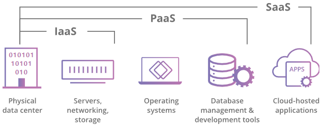

현재 개발하고 있는 Web 프로젝트에 AWS를 사용하기 위해 공부하게 되었다. 

## 클라우드란?
클라우드는 인터넷을 통해 엑세스할 수 있는 서버와 이러한 서버에서 작동하는 소프트웨어와 데이터베이스를 의미한다.
 

 

## 클라우드의 용도
클라우드를 통해 사용자는 거의 모든 장치에서 동일한 파일과 애플리케이션을 엑세스할 수 있다. 컴퓨팅과 저장이 사용자 장치에서 로컬로 실행되지 않고 데이터 센터의 서버에서 이루어지기 때문이다. 따라서 사용자는 이전 휴대전화가 고장난 후 새로운 휴대전화에서 Instagram 계정에 로그인해도 모든 사진, 동영상, 대화 이력이 그대로 계정에 유지되어 있는 것을 보게 된다.

## 클라우드 컴퓨팅이란?
클라우드 컴퓨팅은 인터넷(클라우드)를 통해 서버, 스토리지, 데이터베이스, 네트워킹, 소프트웨어, 분석, 인텔리전스 등의 컴퓨팅 서비스를 제공하는 것이다.  
사용자와 기업은 클라우드 컴퓨팅을 사용하여 직접 물리적 서버를 관리하거나 자체 서버에서 소프트웨어 어플리케이션을 실행하지 않아도 된다. 또한 일반적으로 사용한 클라우드 서비스에 대해서만 요금을 지불하므로, 운영 비용을 낮추고 인프라를 보다 효율적으로 운영할 수 있다.

## 클라우드 컴퓨팅의 작동 방식
클라우드 컴퓨팅은 가상화라는 기술 덕분에 가능하다. 가상화란, 실체성을 지닌 컴퓨팅 환경을 만드는 것이 아니라 가상의 컴퓨팅 환경을 만드는 것을 의미한다. 이러한 가상 컴퓨터를 전문 용어로 가상 머신이라 한다. 물리적으로 동일한 컴퓨터에서 여러 대의 가상 머신이 동시에 실행될 수 있다.

## 클라우드 컴퓨팅 서비스 모델
대부분의 클라우드 컴퓨팅 서비스는 다음 세 가지 범주로 나뉜다. 

  
**Infrastructure as a Service(IaaS)** 
이 모델에서 기업은 클라우드 제공 업체로부터 필요한 서버와 장소를 임대한다. 그리고 클라우드 인프라로 자체 어플리케이션을 구축한다. IaaS는 기업이 원하는 건물을 지을 수 있는 토지를 임대하는 것과 같다. 하지만 기업은 직접 건설 장비와 재료를 마련해야 한다. IaaS 제공 업체에는 DigitalOcean, Google Compute Engine, OpenStack이 있다.

**Platform as a Service(PaaS)** 
이 모델에서 기업은 자체 어플리케이션을 구축하는 데에 필요한 것들에 비용을 지불한다. PaaS 업체는 개발 도구, 인프라, 운영 체제를 포함한 어플리케이션 구축에 필요한 모든 것을 인터넷을 통해 제공한다. PaaS는 집을 임대하는 대신 집을 짓는 데 필요한 모든 도구와 장비를 빌리는 것과 비슷하다. PaaS의 예에는 Heroku와 Microsoft Azure가 있다.

**Software as a Service(SaaS)** 
사용자가 장치에 어플리케이션을 설치하는 대신, SaaS 어플리케이션이 클라우드 서버에 호스팅되고 사용자는 인터넷을 통해 어플리케이션에 액세스한다. SaaS는 집을 빌리는 것과 같다. 임대인이 집의 실소유주이지만 임차인이 소유주인 것처럼 집을 사용한다. SaaS 어플리케이션의 예로는 Slack, Salesforce, MailChimp가 있다.

## 클라우드 배포 유형
1. **퍼블릭 클라우드** : 인터넷을 통해 일반 사용자에게 리소스를 공유하고 서비스를 제공한다.
2. **프라이빗 클라우드** : 일반 사용자에게 리소스를 공유하지 않고 일반적으로 On-premise에 호스트된 개인 내부 네트워크를 통해 서비스를 제공한다.
3. **하이브리드 클라우드** : 목적에 따라 퍼블릭 클라우드와 프라이빗 클라우드 간에 서비스를 공유한다.
4. **멀티 클라우드** : 여러 벤더가 제공하는 동일한 유형(퍼블릭 또는 프라이빗)의 클라우드를 2개 이상 배포하는 것을 말한다.

**온프레미스 (On-premise)** 
온프레미스는 소프트웨어 등 솔루션을 클라우드 같이 원격 환경이 아닌 자체적으로 보유한 전산실 서버에 직접 설치해 운영하는 방식을 말한다.  

## AWS란?
아마존 웹 서비스(AWS)는 컴퓨터 분야에서 압도적으로 세계 1위의 점유율을 차지하고 있는 아마존 닷컴의 퍼블릭 클라우드 컴퓨팅 서비스이다. 

 

## EC2(Elastic Compute Cloud)
* AWS에서 가장 기본적이면서 널리 쓰이는 인프라로, 물리 환경의 컴퓨터처럼 컴퓨팅 리소스를 제공하는 서비스다.
* 마치 피시방에 가서 돈을 내고 컴퓨터를 이용하는 것과 비슷한 개념이다. 즉, 내가 사용한 만큼 비용을 지불하는 형태이다.
* 클라우드에서 컴퓨팅 파워의 규모를 자유자재로 변경할 수 있다. 
* 가상 머신으로 제공되며 인스턴스라고 불린다. (정말 많이 나오는 용어다)
* 안정성을 위해 여러 AWS 리전과 가용 영역에 걸쳐 배포 된다. (이 역시 정말 많이 나오는 기본 개념)

참고자료 

<a href="https://www.cloudflare.com/ko-kr/learning/cloud/what-is-the-cloud/">https://www.cloudflare.com/ko-kr/learning/cloud/what-is-the-cloud/ 
<a href="https://gywlsp.github.io/tech/1/">https://gywlsp.github.io/tech/1/ 
<a href="https://inpa.tistory.com/entry/AWS-%F0%9F%93%9A-%EC%95%84%EB%A7%88%EC%A1%B4-%EC%9B%B9-%EC%84%9C%EB%B9%84%EC%8A%A4-%EC%9A%A9%EC%96%B4-%EC%A2%85%EB%A5%98-%EC%A0%95%EB%A6%AC-EC2-EBS-RDB-S3-EBS-SES#%EC%BB%B4%ED%93%A8%ED%8C%85_%EC%84%9C%EB%B9%84%EC%8A%A4_(Computing_Service)">
https://inpa.tistory.com/entry/AWS-%F0%9F%93%9A-%EC%95%84%EB%A7%88%EC%A1%B4-%EC%9B%B9-%EC%84%9C%EB%B9%84%EC%8A%A4-%EC%9A%A9%EC%96%B4-%EC%A2%85%EB%A5%98-%EC%A0%95%EB%A6%AC-EC2-EBS-RDB-S3-EBS-SES#%EC%BB%B4%ED%93%A8%ED%8C%85_%EC%84%9C%EB%B9%84%EC%8A%A4_(Computing_Service)