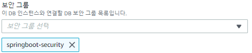
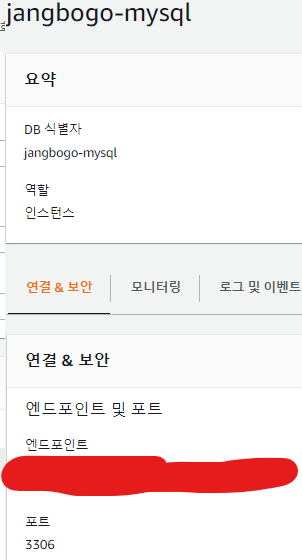

## **RDS(Relational Database Service)**
* 관계형 데이터베이스를 이용할 수 있는 서비스
* DB 설정, 패치, 백업 등 시간 소모적인 관리 작업을 AWS에서 처리
* RDBMS 클라우드 서비스 : Amazon Aurora, MySQL, MariaDB, PostgreSQL, Oracle 등을 지원
  

## **1. RDS Database 생성하기**
데이터베이스 생성 방식 : 표준 생성 
엔진 옵션 : MySQL 

 

템플릿 : 프리 티어 
설정 : 사용자 이름, 마스터 암호로 실제 DB에 접근하니 잘 기억해두자. 

 

DB 인스턴스 클래스 : 프리 티어 선택 시, 자동으로 버스터블 클래스로 설정된다. 
스토리지 : 프리 티어로 이용하기 때문에 최솟값인 20GB로 설정하고, 자동 조정 기능은 임계값 초과 시 요금이 발생할 수 있으니 비활성화 시켜준다.

 

연결 : 외부 컴퓨터로 접속 가능하게 "예"로 설정

 

데이터베이스 인증 : 암호 인증 
데이터베이스 옵션 : 초기 데이터베이스 이름을 설정해야 한다.

 

## **2. 보안 그룹 생성하기**
 1. 생성한 데이터베이스를 클릭해, 상세 화면으로 이동한다.
 2. VPC 보안 그룹을 클릭해, 보안 그룹페이지로 이동한다.

 3. "보안 그룹 생성"을 클릭합니다.

 4. 보안 그룹을 생성하고 누구나 접속 가능하게 설정해준다. (추후에 변경 예정)

 5. DB 인스턴스 수정 페이지에서 생성한 보안 그룹으로 변경한다.

 

## **3. Workbench에서 DB 연동하기**
 1. DB의 앤드포인트를 복사한다.

 2. 복사한 앤드포인트를 Hostname에 붙여 넣고 설정한 Username과 Password를 입력한뒤 연결한다.

 

## **Spring Boot에서 DB 연동하기**

  **1. application.properties 설정**

 

 **2. 프로젝트 실행**

 
Run(실행)했을 때 작동한다면 연동은 끝이다!

참고자료 
<a href="https://velog.io/@u-nij/Spring-Boot-AWS-RDS-MySQL-%EC%97%B0%EB%8F%99%ED%95%98%EA%B8%B0">https://velog.io/@u-nij/Spring-Boot-AWS-RDS-MySQL-%EC%97%B0%EB%8F%99%ED%95%98%EA%B8%B0 