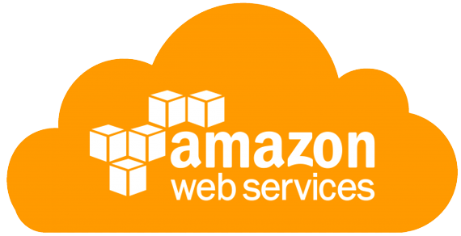
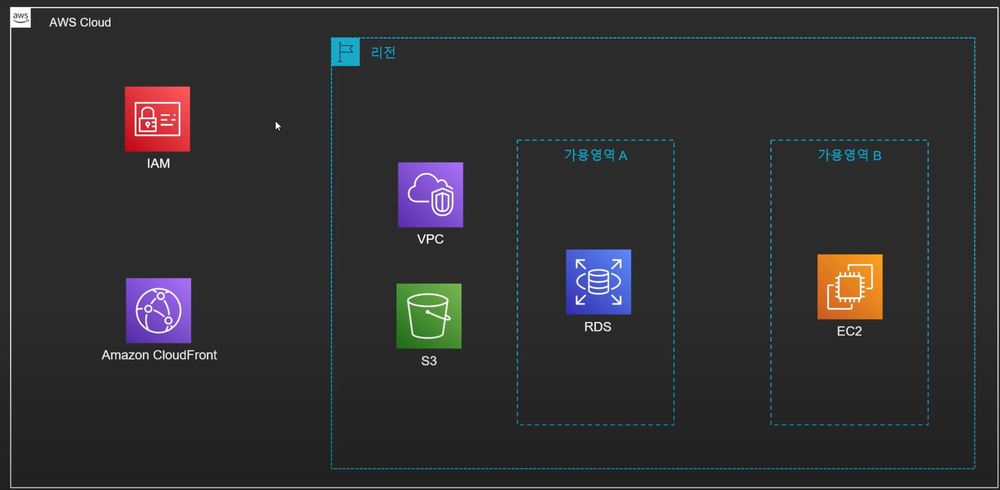
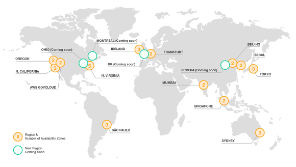
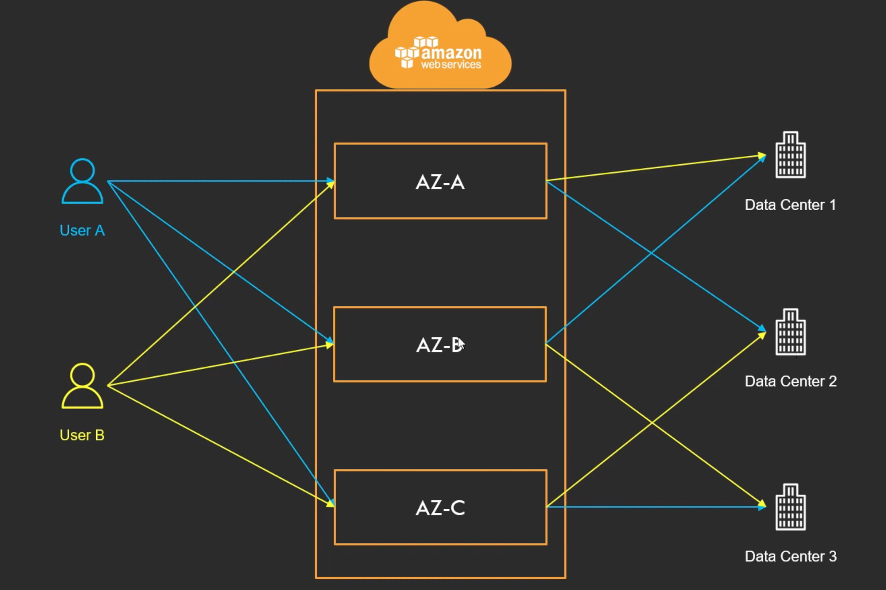
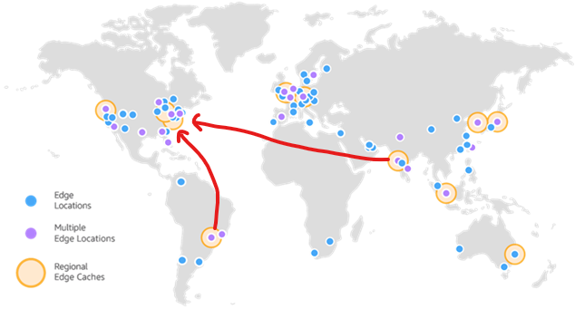

## **AWS란?**

 
Amazon Web Services(AWS)는 전 세계적으로 분포한 데이터 센터에서 200개가 넘는 기능의 서비스를 제공하는 클라우드 플랫폼이다.  
AWS는 클라우드 서비스 점유율 1위로 수많은 레퍼런스가 존재한다.  

## **AWS의 구조**

 
AWS의 서비스들은 크게 3가지로 나눠볼 수 있다. 

* AWS안에 존재하고 리전(Region)에 속해있지 않은 글로벌 서비스 
* 리전 안에 속해 있지만 가용 영역(Availability Zone)에 따르지 않은 서비스
* 가용영역 내에 상주하고 있는 서비스
  

## **Region 이란?**

 

* 리전은 AWS의 서비스가 제공되는 서버의 물리적(데이터 센터) 위치이다.
* 전 세계에 흩어져 있으며, 큰 구분(동남아, 유럽, 북아메리카 등)으로 묶여 있다.
* 각 리전에는 고유의 코드가 부여된다.
  * 서울 리전 : ap-northeast-2
  * 미국 동부(버지니아 북부) 리전 : us-east-1
* 리전 별로 가능한 서비스가 다르다.
  

리전을 선택할 때 고려할 점
* 지연 속도
* 법률(데이터, 서비스 제공 관련)
* 사용 가능한 AWS 서비스
  

## **가용 영역(Availability Zone) 이란?**
* 하나의 리전은 반드시 2개 이상의 가용 영역으로 구성 
* 가용 영역은 하나 이상의 데이터 센터로 구성
* 리전 간의 연결은 매우 빠른 전용 네트워크로 연결
* 반드시 물리적으로 일정 거리(몇 km 이상) 떨어져 있다.
  
 

AWS는 가용 영역을 각 계정의 이름에 매핑하여 리소스가 리전의 가용 영역 전체에 분산되도록 한다. 
예를 들어, AWS 계정의 가용 영역 `us-east-1a`가 다른 AWS 계정의 `us-east-1a`와 동일한 위치에 있지 않을 수 있다.  

## **Edge Location 이란?**

엣지 로케이션(Edge Location)은 Amazon의 **CDN 서비스인 CloudFront**를 위한 **캐시 서버(Cache Server)**들의 모음을 의미한다.  
CDN 서비스는 Content Delivery Network의 약자로, 콘텐츠(HTML, 이미지, 동영상, 기타 파일)를 **서버와 물리적으로 사용자들이 빠르게 받을 수 있도록 전세계 곳곳에 위치한 캐시 서버에 복제해주는 서비스**다.  
콘텐츠를 빠르게 받기 위해 물리적으로 멀리 떨어진 서버에서 다운로드하는 것보다, 가까운 서버에 접속하여 다운로드 받는 것이 속도가 훨씬 빠르기 때문에 CDN(Content Delivery Network) 서비스는 전세계 주요 도시에 캐시 서버를 구축해 놓는다.  

## **Global 서비스와 Region 서비스**
AWS에는 서비스가 제공되는 지역의 기반에 따라 글로벌 서비스와 리전 서비스로 분류된다.  
글로벌 서비스 : 데이터 및 서비스를 전 세계의 모든 인프라가 공유
* CloudFront, IAM, Route53, WAF 
  
지역 서비스 : 특정 리전을 기반으로 데이터 및 서비스를 제공
* 대부분의 서비스
* S3의 경우 전 세계에서 동일하게 사용할 수 있으나 데이터 자체는 리전에 종속
  

## **ARN 이란?**
ARN은 Amazon Resource Name의 약자로 AWS의 모든 리소스의 고유 아이디를 의미한다.  
**형식** 
`arn:partition:service:region:account-id:resource-type/resource-id`  
**`partition`** 
리소스가 있는 파티션이다. 파티션은 AWS 리전의 그룹이다.  각 AWS 계정은 하나의 파티션으로 범위가 지정된다. 
* `aws` - AWS 리전
* `aws-cn` - 중국 리전 

**`service`** 
서비스 네임스페이스  예 : `s3`, `iam` 등 

**`region`** 
리전 코드이다. 예 : `us-east-2` 미국 동부(오하이오) 

**`account-id`** 
aws 계정의 아이디 예 : `us-east-2` 미국 동부(오하이오) 

**`resource-id`** 
리소스 식별자로 리소스의 이름 또는 ID 또는 리소스 경로일 수 있다.  예 : IAM 사용자의 경우 `user/Bob`  

 

참고 자료 
<a href="https://www.youtube.com/watch?v=tvwDDM-Y-qE&list=PLfth0bK2MgIan-SzGpHIbfnCnjj583K2m&index=4">https://www.youtube.com/watch?v=tvwDDM-Y-qE&list=PLfth0bK2MgIan-SzGpHIbfnCnjj583K2m&index=4</a> 
<a href="https://docs.aws.amazon.com/ko_kr/general/latest/gr/aws-arns-and-namespaces.html">https://docs.aws.amazon.com/ko_kr/general/latest/gr/aws-arns-and-namespaces.html</a> 