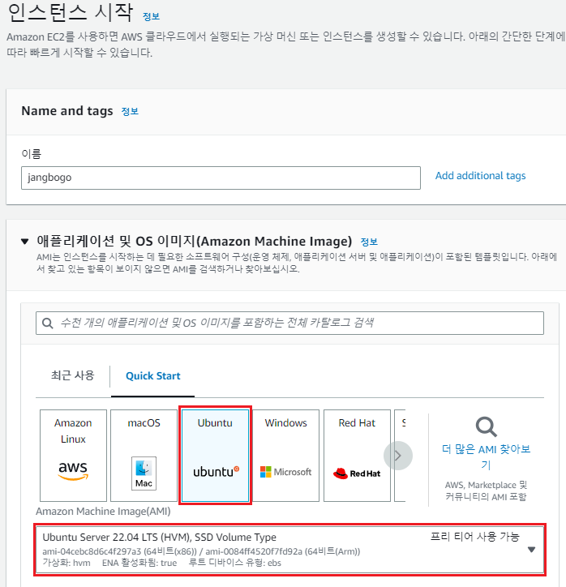
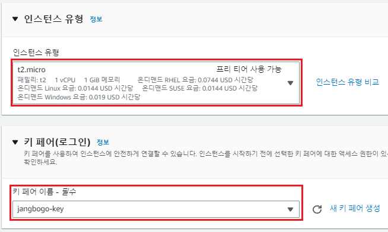
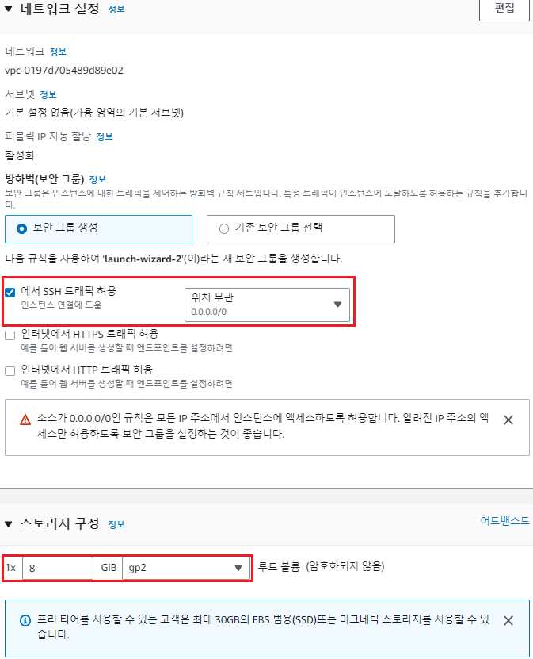
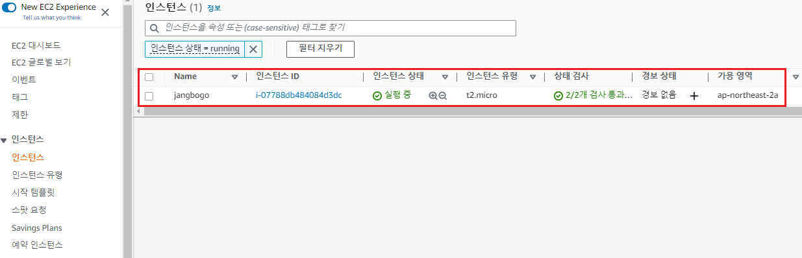
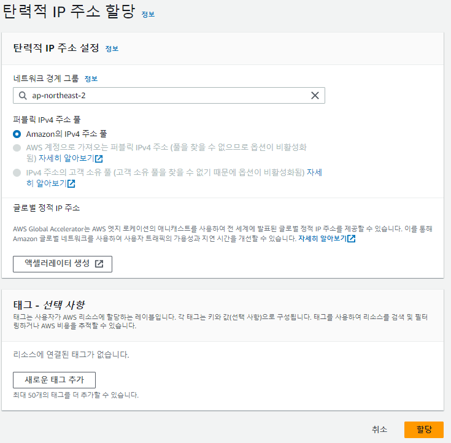
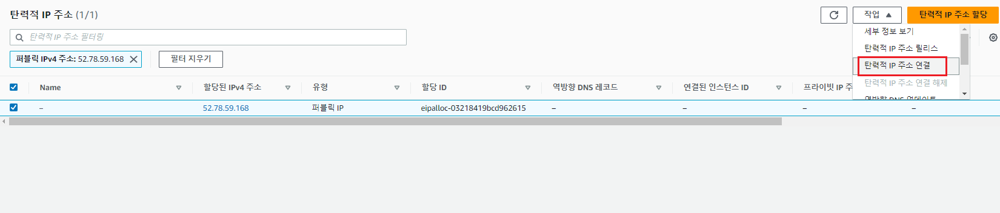
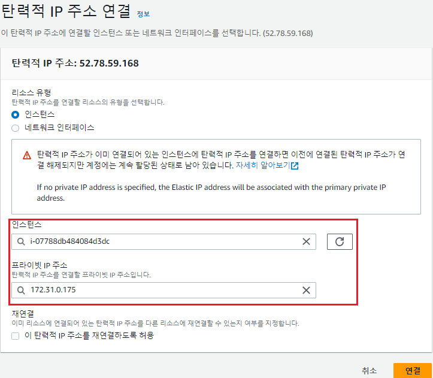
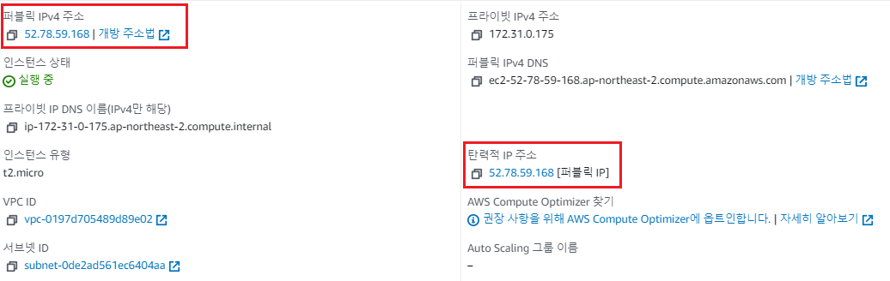
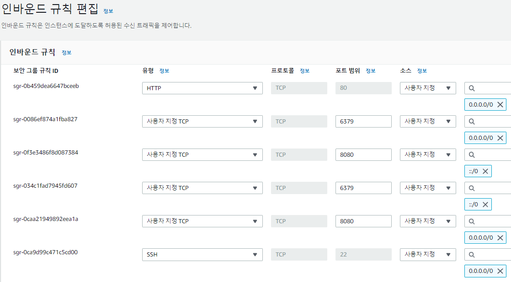

---
title: "[AWS + Spring Boot] Spring Boot 프로젝트 배포하기 (1) - EC2 인스턴스 생성 및 탄력적 IP"
excerpt: "EC2 인스턴스 생성 및 탄력적 IP를 할당해보자."

categories:
  - AWS
tags:
  - [AWS, Spring Boot]

published: true

permalink: /aws/springboot-ec2-deploy-instance-create/

toc: true
toc_sticky: true

date: 2023-03-29
last_modified_at: 2023-03-29

--- 

현재 진행중인 프로젝트가 거의 완성되어 AWS의 EC2를 이용해 배포를 해보기로 하였다.

 

## **1. 인스턴스 생성**

### **1. Amazon Machine Image(AMI) 선택**

 

 

AMI는 어떤 서버로 구성할지 선택하는 것이다. 
Ubuntu를 선택했고 포트폴리오용이기 때문에 프리 티어 버전을 선택했다.

  

### **2. 인스턴스 유형 선택과 키 페어**

 

 

인스턴스 유형은 프리 티어를 사용한다면 다른 선택권은 없다. 

키 페어는 EC2 서버에 SSH 접속을 위해 필수로 필요해서 생성해야 한다. 

키 페어 생성 버튼을 클릭하여 생성하면 자동으로 `키 페어 이름.pem` 파일이 다운되며, SSH 환경에 접속하기 위해서는 해당 키 파일이 존재하는 위치로 가서 `ssh` 명령어를 실행하면 된다. 

  

### **3. 네트워크 및 스토리지 선택**

 

 

네트워크는 나중에 보안 그룹을 별도로 설정할 예정이기 때문에 SSH 트래픽만 허용해준다. 

스토리지는 프리 티어를 사용 가능하면 최대 30GB까지 무료 사용이 가능하다.

 

3번까지 완료되었다면 "인스턴스 시작" 버튼을 클릭해 인스턴스를 생성한다. 

 

인스턴스가 생성된 것을 확인할 수 있다.

  

## **2. 탄력적 IP(Elastic IP)**

AWS EC2 **인스턴스의 Public IP**는 고정된 IP가 아니라 **유동적인 IP 주소**이다. 

EC2 인스턴스를 중지하고 중지 상태에서 새롭게 실행 상태로 변경하면, **기존에 할당받은 IP 주소가 변경**되어 버린다. 

만약 DNS 도메인에 EC2 인스턴스의 IP 주소를 연결해놓았는데, 이 IP 주소가 바뀌게 된다면 문제가 발생할 것이다. 

이를 해결하기 위해 AWS에서는 한 번 할당 받으면 바뀌지 않는 **Elastic IP**를 제공한다.

 

### **1. 탄력적 IP 할당**

 

탄력적 IP 주소를 할당해준다.

  

### **2. 탄력적 IP 주소 선택**

 

방금 생성한 탄력적 IP를 선택해서 연결을 시도한다.

  

### **3. 인스턴스 선택 및 연결**

 

설정 화면에 들어가면 현재 내 인스턴스 목록을 선택할 수 있고 연결된 프라이빅 IP까지 선택 가능하다.

  

### **4. 인스턴스 정보 확인**

 

탄력적 IP를 연결하고 다시 인스턴스 정보를 확인해보면 IP가 할당된 것을 볼 수 있다.

  

## **3. 보안 그룹 설정**

 

* **8080 Port** - Spring Boot에 내장되어 있는 Tomcat 서버의 포트 번호
* **6379 Port** - ElastiCache Redis를 사용하기 위한 Redis 포트 번호 

참고자료 
<a href="https://dev-chw.tistory.com/m/27">https://dev-chw.tistory.com/m/27</a> 
<a href="https://inpa.tistory.com/entry/AWS-%F0%9F%93%9A-%ED%83%84%EB%A0%A5%EC%A0%81-IP-Elastic-IP-EIP-%EB%9E%80-%EB%AC%B4%EC%97%87%EC%9D%B8%EA%B0%80">https://inpa.tistory.com/entry/</a>