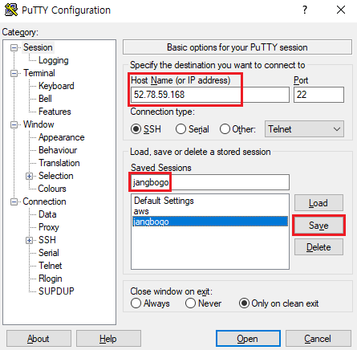
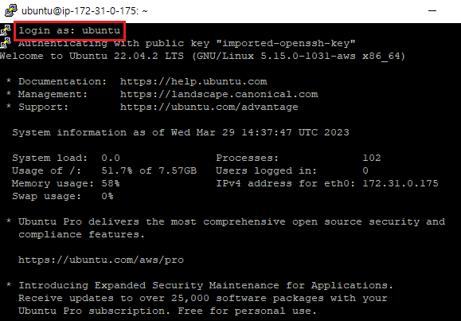
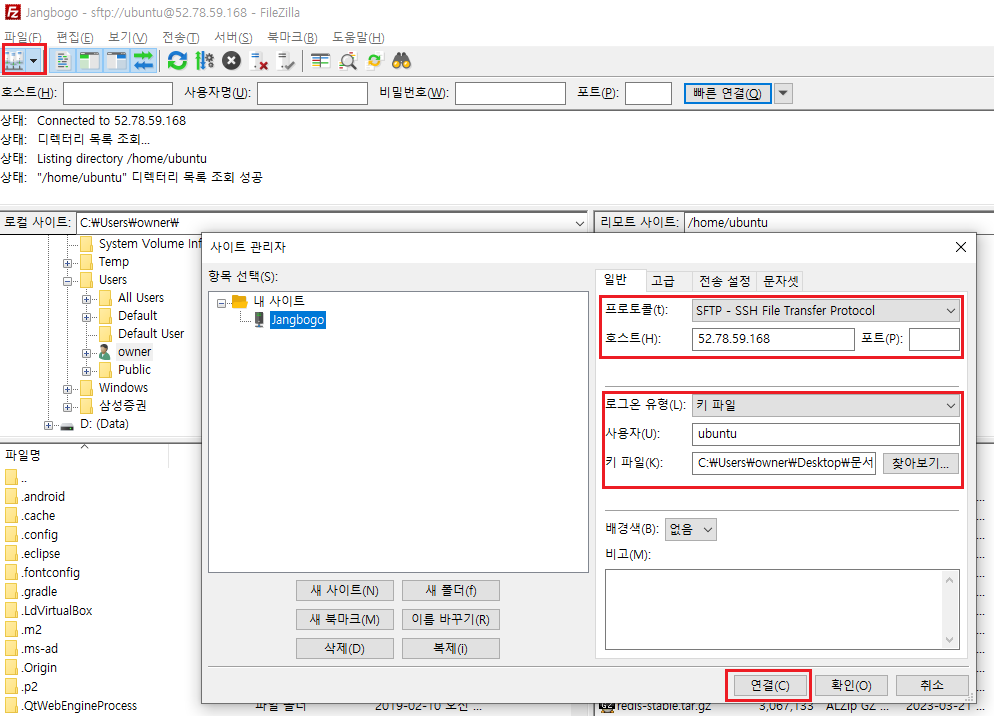
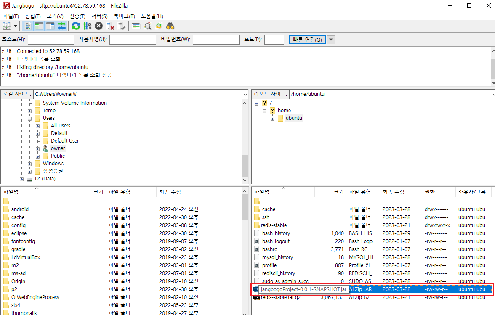
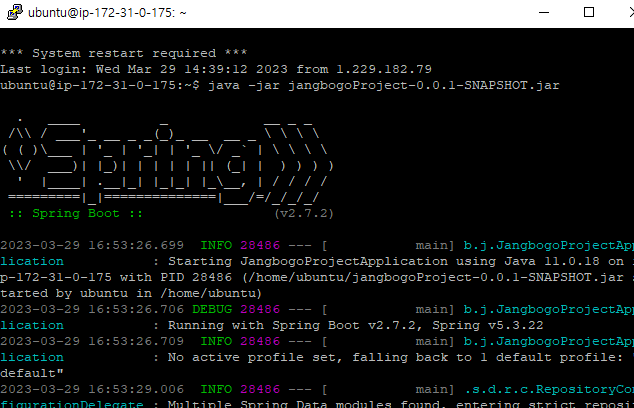

---
title: "[AWS + Spring Boot] Spring Boot 프로젝트 배포하기 (2) - Ubuntu에서 배포"
excerpt: "Ubuntu에서 빌드 파일을 배포해보자."

categories:
  - AWS
tags:
  - [AWS, Spring Boot]

published: true

permalink: /aws/springboot-ec2-deploy-ubuntu/

toc: true
toc_sticky: true

date: 2023-03-30
last_modified_at: 2023-03-30

--- 

배포를 위해 EC2 서버에 접속하기 위한 Putty와 인스턴스 서버로 빌드 파일을 옮기기 위해 FileZilla를 사용한다.

<br>

## **1. EC2 인스턴스 서버 세팅**
<hr />

### **1. 세션 생성후 접속**


<br>

EC2 인스턴스의 퍼블릭 IP 주소를 갖는 세션을 하나 생성한 뒤에 Open 버튼을 클릭한다.

<br><br>


<br>

인스턴스에 접근이 되었고, login을 한다.<br>
나는 Ubuntu로 설정했기 때문에 기본값은 **ubuntu**다.

<br><br>

### **2. 패키지 업데이트**

Ubuntu에서는 패키지 설치를 위해서 보편적으로 **apt(Advance Packging Tools)** 명령어를 사용한다.<br>

다음 구문은 시스템을 업데이트 하는 것이 아니라 실제 <span style="color:red">**설치 가능한 패키지 리스트를 최신화**</span>하는 것이다. 실제로 프로그램이 최신 버전으로 설치되거나 바뀌지는 않는다.
``` bash
$ sudo apt update
```

<br>

upgrade 명령어를 통해 <span style="color:red">**실제 업데이트**</span>를 할 수 있다.<br>

``` bash
$ sudo apt upgrade
```

<br><br>

### **3. JDK 설치**

Java의 JDK를 설치해야 한다.<br>

``` bash
$ sudo apt install -y openjdk-11-jdk
```

프로젝트에서 Java 11을 사용하기 때문에 11버전으로 설치한다.

<br><br>

## **2. 인스턴스 서버로 빌드 파일 옮기기**
<hr />

### **1. 인스턴스 연결**

<br>

왼쪽 상단에 위치한 버튼을 클릭 후 **새 사이트** 버튼을 누른다.<br>

프로토콜을 **SFTP**로 설정하고 연결하려는 **EC2 인스턴스의 퍼블릭 IP 주소**를 복사해서 호스트에 붙여넣는다.<br>

로그온 유형을 **키 파일** 유형으로 변경 후 키 파일의 경로를 설정해주고 연결 버튼을 누른다.

<br><br>

### **2. 빌드한 jar 파일 전송**


<br>

빌드한 jar 파일을 복사하여 전송한다.

<br><br>

## **3. 인스턴스 서버에서 실행**
<hr />

Putty로 인스턴스 서버에 접속 후 아래의 명렁어를 통하여 실행해준다.

``` bash
$ java -jar jangbogoProject-0.0.1-SNAPSHOT.jar
```

<br>


<br>

정상적으로 작동되는 것을 확인할 수 있다!<br>

프로젝트에서 MySQL과 React를 사용한다.<br>
DB는 RDS를 사용중이고 React는 통합 빌드를 해서 그런지 모르겠지만 따로 인스턴스 서버에서 다운 받지 않아도 정상적으로 작동하였는데 이 부분은 대해서는 더 알아봐야 겠다.<br>

다음 포스트에서는 **ElastiCache Redis**를 적용하는 방법을 알아보자.