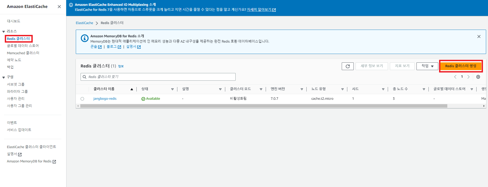
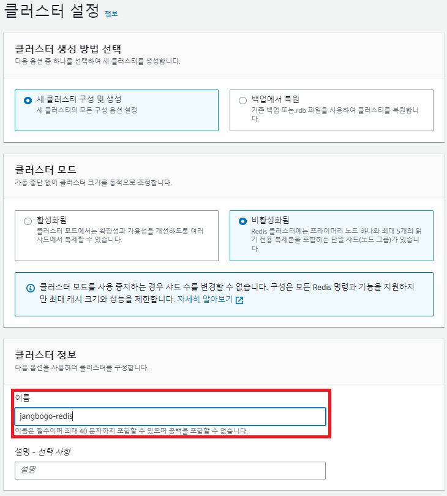
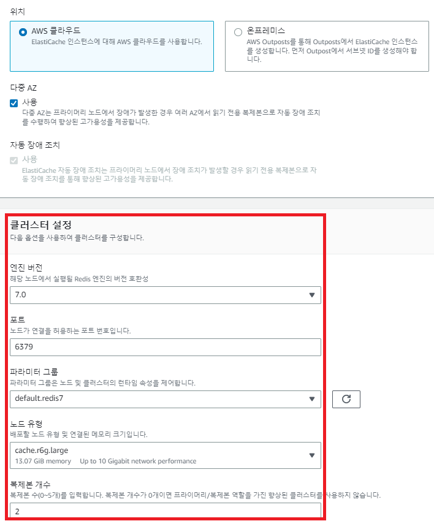
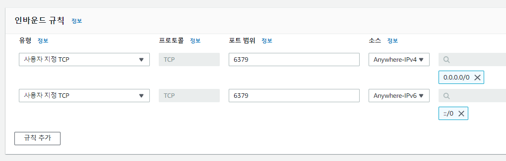
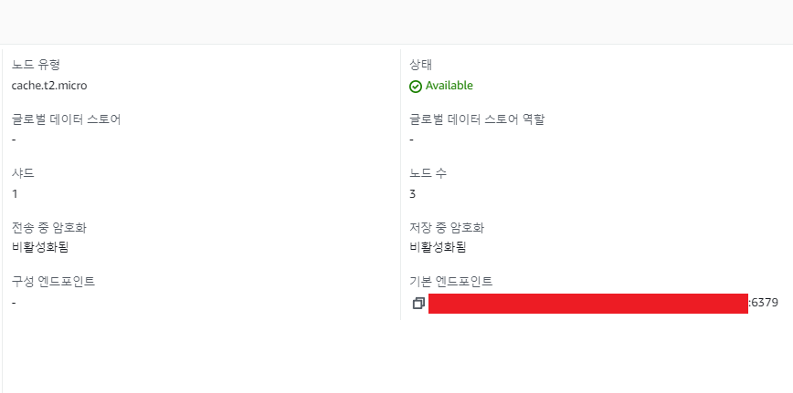

---
title: "[AWS + Spring Boot] Spring Boot 프로젝트 배포하기 (3) - ElastiCache Redis 연동"
excerpt: "AWS의 ElastiCache Redis을 연동해보자."

categories:
  - AWS
tags:
  - [AWS, Spring Boot]

published: true

permalink: /aws/springboot-ec2-deploy-elastiCache-redis/

toc: true
toc_sticky: true

date: 2023-03-31
last_modified_at: 2023-03-31

--- 

기존에는 프로젝트에서 로컬에 존재하는 Redis로 프로젝트를 진행했다.<br>

하지만 로컬에 존재하는 Redis는 사이트를 이용하는 사용자들의 컴퓨터에 Redis가 설치가 되어야하는 문제점이 존재한다. 때문에 AWS의 **ElastiCache Redis**을 사용하여 Spring Boot에서의 Redis 기능을 구현하기로 했다.

<br><br>


## **AWS ElastiCache 생성하기**
<hr />

Redis 클러스터 생성 버튼을 누른다.<br>


<br><br>

클러스터 이름을 설정해준다.<br>


<br><br>

포트를 6379로 솔정하고 프리 티어를 사용하려면 노드 유형을 cache.t2.micro(0.5Gib)로 바꾸면 된다.<br>

<br>
다음부터는 기본 설정들을 유지한 채 생성 버튼을 누르면 된다.

<br><br>

마지막으로 보안 그룹을 새로 추가하여 설정해준다.<br>



<br><br>

## **application.yml 설정**
<hr />

EC2에서 Redis에 접속하기 전에 우선 Spring Boot에 설정되어 있는 Redis의 Host를 아래와 같이 변경하자.<br>

``` yml
spring:
    redis:
      host: 자신의 엔드포인트
      port: 6379
```

<br>
엔드 포인트는 Redis 클러스터 세부 정보에서 확인할 수 있다.<br>


<br><br>

## **EC2 접속 후 redis-cli 설치하기**
<hr />

``` bash
# make 하기 위핸 gcc 다운
sudo yum install -y gcc

# redis-cli 설치 및 make
wget http://download.redis.io/redis-stable.tar.gz && tar xvzf redis-stable.tar.gz && cd redis-stable && make

# redis-cli를 bin에 추가해 어느 위치서든 사용 가능하게 등록
sudo cp src/redis-cli /usr/bin/
```

<hr />
참고자료<br>
<a href="https://ujin-dev.tistory.com/73">https://ujin-dev.tistory.com/73</a><br>