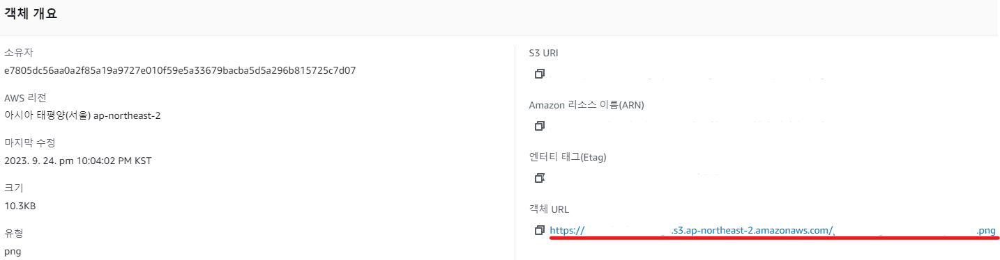

---
title: "[AWS] S3 + CloudFront"
excerpt: "S3 + CloudFront"

categories:
  - AWS
tags:
  - [AWS, S3, CloudFront]

published: true

permalink: /aws/s3-and-cloudfront/

toc: true
toc_sticky: true

date: 2023-10-31
last_modified_at: 2023-10-31

--- 

## **배경**

기존에는 아래와 같이 S3에 저장되어 있는 이미지를 각 객체의 URL을 그대로 프론트엔드에게 응답해주는 방법으로 이미지 조회 기능을 구현했었습니다. 

 

S3에 저장되어 있는 이미지들은 직접 Public URL을 통해 접근이 가능하기 때문에 보안적인 측면에서 안좋다고 생각했습니다. 

이번에는 AWS에서 제공하는 Contents Delivery Network(CDN)인 CloudFront를 사용하여 기존의 S3의 데이터를 직접 접근하는 방법보다 성능 및 보안을 높이는 방법에 대해 알아보겠습니다.  

  

## **S3를 CloudFront로 제공하는 이유**

 

위 그림처럼 기존에 퍼블릭 접근 권한으로 오픈 되어 있었던 S3 버킷을 외부에서 접근할 수 없게 차단하고, S3에는 CloudFront만 접근이 가능하게 설정합니다.

참고자료 
<a href="https://dingdingmin-back-end-developer.tistory.com/entry/S3%EB%A5%BC-CloudFront%EB%A1%9C-%EC%A0%9C%EA%B3%B5%ED%95%98%EA%B8%B0">https://dingdingmin-back-end-developer.tistory.com/entry/cloudfront</a> 
<a href="https://mattpy.tistory.com/entry/S3%EC%99%80-CloudFront%EB%A5%BC-%EC%9D%B4%EC%9A%A9%ED%95%9C-%EA%B0%9D%EC%B2%B4-%EB%B3%B4%EC%95%88-1">https://mattpy.tistory.com/entry/cloudfront</a> 