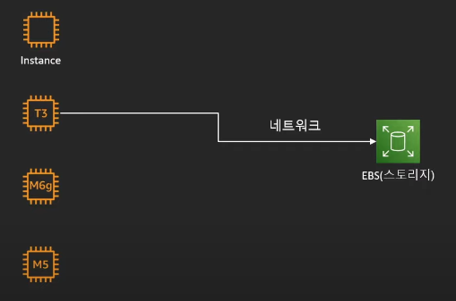
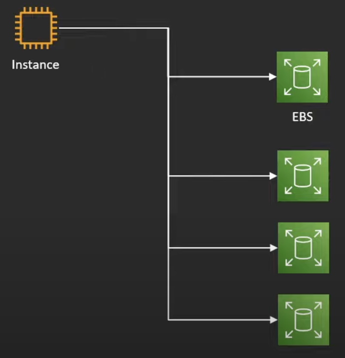
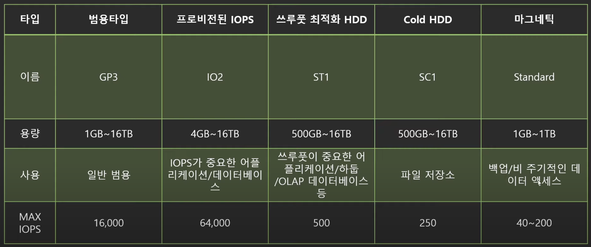
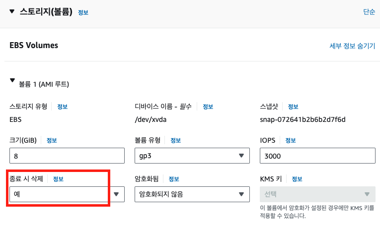
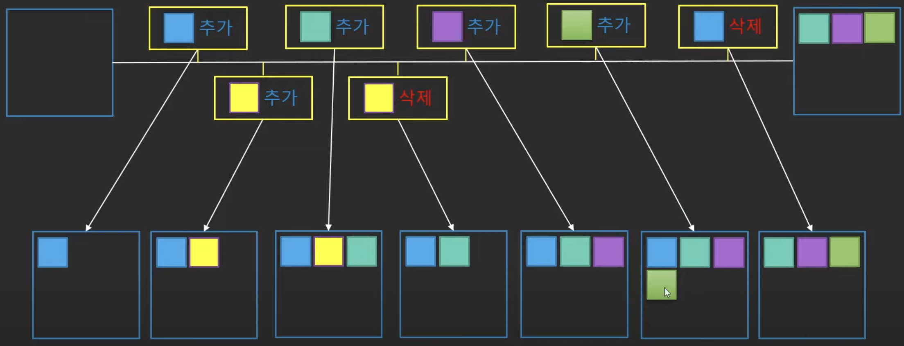
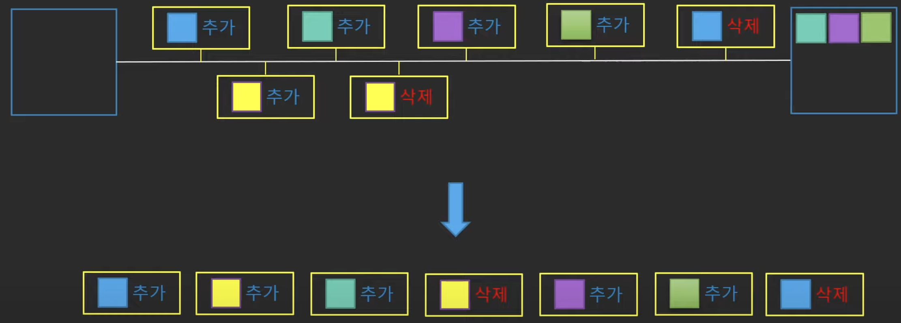
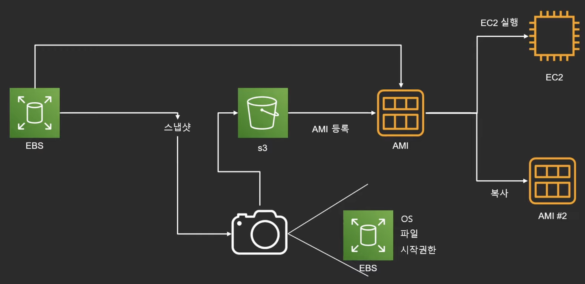
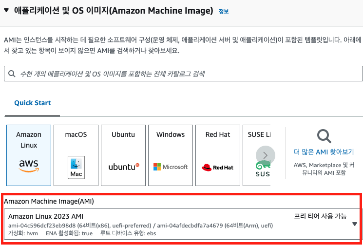
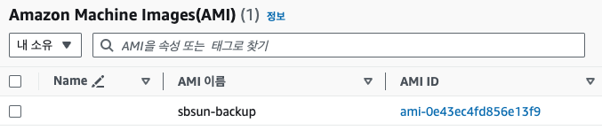
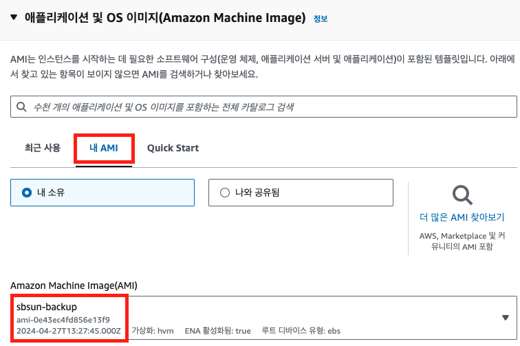

---
title: "[AWS] EBS, Snapshot, AMI 개념과 실습"
excerpt: "AWS의 EBS, Snapshot, AMI에 대한 포스팅입니다."

categories:
  - AWS
tags:
  - [AWS]

published: true

permalink: /aws/ebs/

toc: true
toc_sticky: true

date: 2024-04-27
last_modified_at: 2024-04-27

--- 

이떄까지 백엔드 개발자로 여러 팀 프로젝트에 참여하면서 AWS EC2를 사용하여 배포를 해왔지만, 배포할 때 설정한 요소들과 여러 AWS 서비스에 대해서 정확히 이해하지 못한 상태로 진행했습니다. 
또한 최근에 참석한 프로젝트 회의에서 현재 진행하고 있는 프로젝트의 AWS 아키텍처 구조를 볼 수 있었는데 처음 보는 AWS 서비스도 있었고, 아키텍처에 대한 상사분들의 대화를 들어도 클라우드 지식이 부족하여 이해하지 못했습니다.
클라우드 분야 역량은 백엔드 개발자의 필수 역량이라고 생각되기에 AWS의 기초 자격증인 **Cloud Practitioner** 자격증을 목표로 AWS 기초 지식부터 다시 학습하기 시작했습니다.

 

현재 유튜브에서 AWS 강의실님의 AWS 기초 강좌를 통해 학습을 하고 있고, 학습했던 내용을 글로 작성함으로써 복습효과와 동기 부여를 얻기 위해 포스팅을 하게 되었습니다. 
이전까지는 다른 포스팅들의 내용을 그대로 가져와서 해당 내용들을 이해하지 못한채로 포스팅한 경우가 많았지만, 이번부터는 학습해서 확실히 이해한 내용을 직접 정리하여 글을 작성해보도록 하겠습니다. 

금일은 AWS의 EBS에 대해서 학습해보겠습니다.

  

## **EBS의 개념과 EC2의 구조**

Amazon Elastic Block Storage(EBS)는 EC2 인스턴스에서 하드디스크의 역할을합니다. 

보통 하나의 컴퓨터에 CPU, RAM, HDD, SDD 등 장치들이 구성되어 있지만, EC2는 연산(CPU, RAM)을 담당하는 
인스턴스, 그리고 저장을(HDD) 담당하는 EBS가 서로 분리되어 있습니다. 

EBS는 하드디스크 역할을 하지만 인스턴스 내에 있지 않고, **EC2와 같은 가용영역**에서 네트워크로 묶여 있기 때문에
 가상의 하드디스크라고도 불리고, **인스턴스가 종료된다고 하더라도 EBS는 별개로 작동하기 때문에 계속 유지가 가능**합니다. 

네트워크로 연결하는 구조의 장점은 인스턴스 교체가 편리하다는 점입니다. 

</img> 

보통 컴퓨터의 CPU나 RAM을 교체하려고 한다면 본체를 열고 조립해야하지만 네트워크로 연결 되어있기 때문 단순히 인스턴스의 네트워크만 변경시켜주면
 업그레이드, 다운그레이드가 가능합니다. 
 
</img> 

또한 하나의 컴퓨터에 여러 저장 장치들을 연결할 수 있는 것처럼 인스턴스도 여러 개의 하드 디스크(EBS)를 가질 수 있습니다. 

그리고 하나의 EBS를 여러 EC2에 연결하여 공용 하드디스크로 사용할 수 있는 EBS Multi Attach 기능도 제공합니다. 

인스턴스를 정지하거나 종료하면 인스턴스에 대한 비용은 발생하지 않지만, EBS만 따로 존속 가능하게 설정했다면 EBS는 계속 유지되어 
비용이 발생하기 때문에 이 점을 주의해야 합니다.

 

### **EBS 종류**

</img>

 

EBS의 종류로는 5가지가 존재하는데 GP3와 IO2는 SSD이고, 나머지는 HDD입니다. 

표의 MAX IOPS(초당 입출력 처리량) 수치를 보면 SSD인 타입들과 HDD 타입간의 IOPS 수치가 확실히 차이나는 것을 볼 수 있습니다. 

GP3 타입은 프리 티어로 사용할 수 있습니다.

</img> 

  

## **Snapshot**

스냅샷은 EBS를 저장하는 효율적인 방법으로, 특정 시간의 EBS 상태를 사진으로 찍어두어 
필요할 때 해당 스냅샷을 통해 **특정 시간의 EBS를 복구**하는 방법입니다. 

스냅샷은 S3에 **증분시 저장 방법**으로 저장합니다. 

</img> 

EBS를 8GB라고 가정하고, 사진과 같이 특정 시간의 EBS 상태를 그대로 스냅샷을 생성하여 데이터를 백업한다면
8GB씩 7번, 총 56GB가 필요합니다. 

하지만 EBS의 전체 데이터를 저장하는 것이 아니라 특정 시간에 **변화한 데이터들만 저장**한다면 굉장히 
효율적으로 데이터를 저장할 수 있습니다. 

만약 1GB 데이터를 추가했다면 변화한 1GB만 스냅샷을 통해 S3에 저장되는 방법입니다. 

</img>

  

## **AMI**

Amazon Machine Image(AMI)는 EC2 인스턴스를 실행하기 위해 필요한 정보를 모은 단위를 뜻합니다. 

OS, 아키텍처 타입, EBS 정보, 현재 인스턴스에 설치되어 있는 소프트웨어(Nginx, Java..) 
등을 저장하여 EC2를 복제하거나 다른 리전 또는 계정으로 전달할 수 있습니다. 

**AMI 구성** 

* 1개 이상의 EBS 스냅샷
* 인스턴스 루트 볼륨에 대한 템플릿(OS, 애플리케이션 서버)
* 사용 권한
* 블록 디바이스 맵핑(EC2 인스턴스를 위한 볼륨 정보 = EBS가 무슨 용량으로 몇 개 붙는지)

 

**AMI 생성 과정** 

</img>

1. EBS 스냅샷 생성
2. S3에 스냅샷 저장
3. 저장된 스냅샷을 기반으로 AMI 생성
4. AMI으로 EC2를 실행하거나 복사해서 공유한다.

EC2 인스턴스를 생성할 때, 처음 선택하는 것이 AMI입니다. 

</img> 

 

아래와 같이 AMI를 생성했다면 

</img> 

인스턴스를 생성할 때, 생성한 AMI를 선택하여 생성한다면 원본 인스턴스 내에 설치되어 있던 애플리케이션 서버, 소프트웨어들을 똑같이 사용할 수 있습니다.

</img>

참고자료 
<a href="https://www.youtube.com/watch?v=N8TB_6AbaM4&list=PLfth0bK2MgIan-SzGpHIbfnCnjj583K2m&index=11">쉽게 설명하는 AWS 기초 강좌 10: EC2(4)-EBS,Snapshot,AMI-</a> 