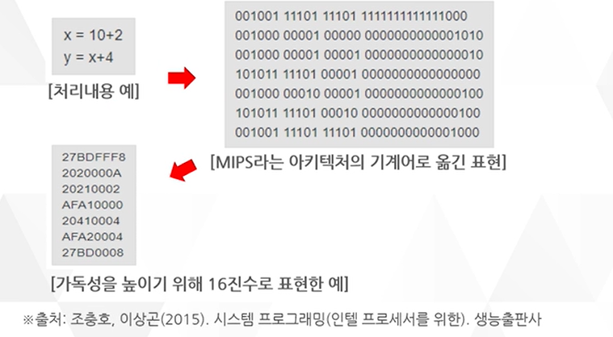
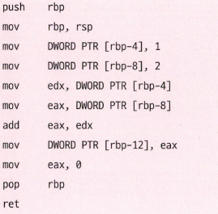
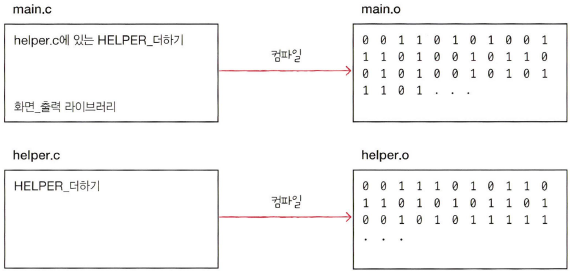
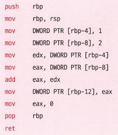
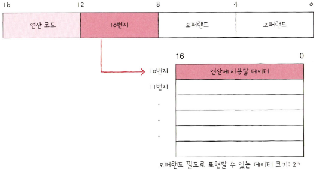
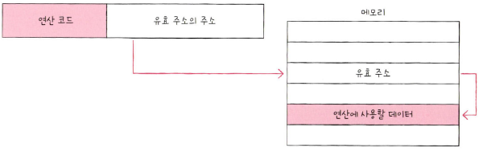
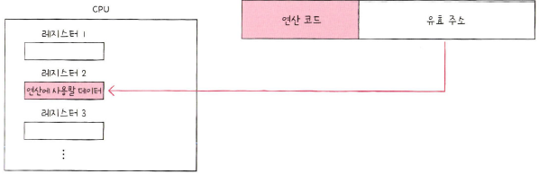
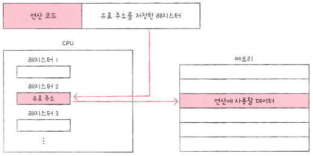

개발자가 프로그래밍 언어로 작성한 소스 코드는 컴퓨터 내부에서 명령어가 되어 실행된다. 이 과정을 공부해보자.  

## **고급 언어와 저급 언어**

컴퓨터는 C, Java, Python과 같은 프로그래밍 언어를 이해하지 못한다. 

프로그램을 만들 때 사용하는 프로그래밍 언어는 사람이 이해하고 작성하기 쉽게 만들어진 언어이기 때문이다. 이를 **고급 언어**라고 한다. 

반대로 컴퓨터가 직접 이해하고 실행할 수 있는 언어를 **저급 언어**라고 한다. 컴퓨터가 이해하고 실행할 수 있는 언어는 오직 저급 언어이기 때문에, 고급 언어로 작성된 소스 코드가 실행되려면 반드시 저급 언어, 즉 명령어로 변환되어야 한다. 

저급 언어는 기계어와 어셈블리어, 두 종류가 있다. 

**기계어**란 0과 1의 명령어 비트로 이루어진 언어이다. 

 

컴퓨터는 0과 1로 이루어진 이 기계어를 이해하고 실행한다. 다만, 기계어를 2진수로 나열하면 너무 길어지기 때문에 가독성을 위해 16진수로 표현하기도 한다. 

기계어는 컴퓨터만을 위해 만들어진 언어이기 때문에 사람이 읽으면 그 의미를 이해하기 어렵다. 그래서 등장한 저급 언어가 **어셈블리어**이다.  

 

어셈블리어는 기계어를 읽기 편한 형태로 번역한 저급 언어이기 때문에, 우리가 아는 프로그래밍 언어와는 사뭇 다르다. 때문에 개발자가 어셈블리어를 이용해 복잡한 프로그램을 만들기란 쉽지 않다. 

보통 하드웨어와 밀접하게 맞닿아 있는 프그램을 개발하는 임베디드 개발자, 게임 개발자, 정보 보안 분야 등의 개발자는 어셈블리어를 많이 이용한다.  

## **컴파일 언어와 인터프리터 언어**

개발자들이 고급 언어로 작성한 소스 코드는 어떻게 저급 언어로 변환될까? 여기에는 크게 두 가지, 컴파일 방식과 인터프리트 방식이 있다. 컴파일 방식으로 작동하는 프로그래밍 언어를 **컴파일 언어**, 인터프리트 방식으로 작동하는 프로그래밍 언어를 **인터프리터 언어**라고 한다.  

### **컴파일 언어**

**컴파일 언어**는 컴파일러에 의해 소스 코드 전체가 저급 언어로 변환되어 실행되는 고급 언어로 대표적인 컴파일 언어로는 C 계열 언어들이 있다. 컴파일 언어로 작성된 소스 코드는 코드 전체가 저급 언어로 변환되는 과정을 **컴파일**이라고 한다. 그리고 컴파일을 수행해 주는 도구를 **컴파일러**라고 한다. 

컴파일러는 소스 코드 전체를 흝어보며 문법적인 오류는 없는지, 실행 가능한 코드인지, 실행하는 데 불필요한 코드는 없는지 등을 따지며 소스 코드 전체를 저급 언어로 컴파일한다. 이때 컴파일러가 소스 코드 내에서 오류를 하나라도 발견하면 해당 소스 코드는 컴파일에 실패한다. 

컴파일이 성공적으로 수행되면 개발자가 작성한 소스 코드는 컴퓨터가 이해할 수 있는 저급 언어로 변환된다. 이렇게 컴파일러를 통해 저급 언어로 변환된 코드를 **목적 코드**라고 한다.  

### **인터프린터 언어**

**인터프리터 언어**는 인터프리터에 의해 소스 코드가 한 줄씨 실행되는 고급 언어로 대표적인 인터프리터 언어로는 Python, JavaScript, SQL 등이 있다. 그리고 소스 코드를 한 줄씩 저급 언어로 변환하여 실행해 주는 도구를 **인터프리터**라고 한다. 인터프리터 언어는 소스 코드를 한 줄씩 실행하기 때문에 소스 코드 전체를 저급 언어로 변환하는 시간을 기다릴 필요가 없다. 

인터프리터는 소스 코드를 한 줄씩 실행하기 때문에 소스 코드 N번째 줄에 문법 오류가 있더라도 N-1번째 줄까지는 수행된다.  

## **목적 파일과 실행 파일**

목적 코드로 이루어진 파일을 **목적 파일**, 실행 코드로 이루어진 파일을 **실행 파일**이라고 부른다. 
윈도우의 `.exe` 확장자를 가진 파일이 대표적인 실팽 파일이다. 

목적 파일이 실행 파일이 되기 위해서는 **링킹**이라는 작업을 거쳐야 한다. 

예를 들어 컴파일 언어로 `helper.c`와 `main.c`라는 두 개의 소스 코드를 작성했다고 가정해보자.

1. `helper.c` 안에는 'HELPER_더하기'라는 기능이 구현되어 있다.
2. `main.c`는 `helper.c`에 구현된 'HELPER_더하기' 기능과 프로그래밍 언어가 기본적으로 제공하는 '화면_출력'이라는 기능을 가져다 사용한다.

이들을 컴파일하면 각각의 소스 코드로부터 목적 코드 `helper.o`, `main.o`가 생성된다. 

 

`main.o`는 저급 언어이지만 바로 실행할 수 없다. `main.o`는 `main.c` 내용이 그대로 저급 언어로 변환된 파일일 뿐 `main.c`에 없는 'HELPER_더하기'나 '화면_출력'은 어떻게 실행되는지 알지 못하기 때문이다. 따라서 `main.o`가 실행되면 `main.o`에 없는 외부 기능들을 `main.o`와 연결 짓는 작업이 필요하다. 이러한 연결 작업이 **링킹**이다. 링킹 작업까지 거치면 비로소 하나의 실행 파일이 만들어진다.  

## **명령어의 구조**

**명령어**는 연산 코드와 오퍼랜드로 구성되어 있다. 연산 코드는 연산자, 오퍼랜드는 피연산자라고 부른다. 

붉은 글씨가 연산 코드, 검은 글씨가 오퍼랜드이다. 
  

### **오퍼랜드**

**오퍼랜드**는 '연산에 필요한 데이터' 또는 '연산에 필요한 데이터가 저장된 위치'를 의미한다. 오퍼랜드 필드에는 숫자와 문자 등을 나타내는 데이터 또는 메모리나 레지스터 주소가 올 수 있다. 다만 숫자나 문자와 같이 연산에 사용할 데이터를 직접 명시하기보다는, 많은 경우 연산에 사용할 데이터가 저장된 위치, 즉 메모리 주소나 레지스터 이름이 담긴다. 그래서 오퍼랜드 필드를 **주소 필드**라고 부르기도 한다.  

### **연산 코드**

**연산 코드**는 '명령어가 수행할 연산'을 의미한다. 
연산 코드 종류는 매우 많지만, 가장 기본적인 연산 코드 유형은 크게 네 가지로 나눌 수 있다. 

1. 데이터 전송
2. 산술/논리 연산
3. 제어 흐름 변경
4. 입출력 제어

명령어의 종류와 생김새는 CPU마다 다르기 때문에 연산 코드의 종류와 생김새 또한 CPU마다 다른다. 위의 4가지 종류는 CPU가 공통으로 이해하는 대표적인 연산 코드의 종류 정도로만 이해하자!  

## **주소 지정 방식**

왜 오퍼랜드 필드와 연산 코드 필드 처럼 각각 공간을 나누는 걸까? 

이는 명령어 길이 때문이다. 
하나의 명령어가 n비트로 구성되어 있고, 그중 연산 코드 필드가 m비트라고 가정해보자. 이때 오퍼랜드 필드에 가장 많은 공간을 할당할 수 있는 1-주소 명령어라 할지라도 오퍼랜드 필드의 길이는 연산 코드만큼의 길이를 뺀 n-m비트가 된다. 

가령 명령어의 크기가 16비트, 연산 코드 필드가 4비트인 2-주소 명령어에서는 오퍼랜드 필드당 6비트 정도밖에 남지 않는다. 즉, 하나의 오퍼랜드 필드로 표현할 있는 정보의 가짓수는 `2^6`개밖에 되지 않는다. 

 

하지만 만약 오퍼랜드 필드 안에 메모리 주소가 담긴다면 표현할 수 있는 데이터의 크기는 하나의 메모리 주소에 저장할 수 있는 공간만큼 커진다. 

예를 들어 한 주소에 16비트를 저장할 수 있는 메모리가 있다고 가정해 보자. 이 메모리 안에 데이터를 저장하고, 오퍼랜드 필드 안에 해당 메모리 주소를 명시한다면 표현할 수 있는 정보의 가짓수가 `2^16`으로 확 커진다. 

 

연산 코드에 사용할 데이터가 저장된 위치, 즉 연산의 대상이 되는 데이터가 저장된 위치를 **유효 주소**라고 한다. 위 그림의 경우 유효 주소는 10번지가 된다. 

오퍼랜드 필드에 데이터가 저장된 위치를 명시할 때 연산에 사용할 데이터 위치를 찾는 방법을 **주소 지정 방식**이라고 한다.  

### **즉시 주소 지정 방식**
**즉시 주소 지정 방식**은 연산에 사용할 데이터를 오퍼랜드 필드에 직접 명시하는 방식이다. 앞에서 설명했듯이 이런 방식은 표현할 수 있는 데이터의 크기가 작아지는 단점이 있지만, 연산에 사용할 데이터를 메모리나 레지스터로부터 찾는 과정이 없기 때문에 다음에 설명할 주소 지정 방식들보다 빠르다.  

### **직접 주소 지정 방식**
**직접 주소 지정 방식**은 오퍼랜드 필드에 유효 주소를 직접적으로 명시하는 방식이다. 오퍼랜드 필드에서 표현할 수 있는 데이터의 크기는 즉시 주소 지정 방식보다 더 커졌지만, 여전히 유효 주소를 표현할 수 있는 범위가 연산 코드의 비트 수만큼 줄어든다. 다시 말해 표현할 수 있는 오퍼랜드 필드의 길이가 연산 코드의 길이만큼 짧아져 표현할 수 있는 유효 주소에 제한이 생길 수 있다.  

### **간접 주소 지정 방식**
**간접 주소 지정 방식**은 유효 주소의 주소를 오퍼랜드 필드에 명시하는 방식이다. 직접 주소 지정 방식보다 표현할 수 있는 유효 주소의 범위는 넓어졌지만 두 번의 메모리 접근이 필요하기 때문에 앞서 설명한 주소 지정 방식들보다 일반적으로 느린 방식이다. 

  

### **레지스터 주소 지정 방식**

**레지스터 주소 지정 방식**은 직접 주소 방식과 비슷하게 연산에 필요한 데이터를 저장한 레지스터를 오퍼랜드 필드에 직접 명시하는 방식이다. 

일반적으로 CPUd 외부에 있는 메모리에 접근하는 것보다 CPU 내부에 있는 레지스터에 접근하는 것이 더 빠르다. 그러므로 직접 주소 지정 방식보다 빠르게 데이터를 접근할 수 있다. 다만, 직접 주소 지정 방식과 비슷하게 표현할 수 있는 레지스터 크기에 제한이 생길 수 있다. 

  

### **레지스터 간접 주소 지정 방식**

**레지스터 간접 주소 지정 방식**은 연산에 사용할 데이터를 메모리에 저장하고, 그 유효 주소를 저장한 레지스터를 오퍼랜드 필드에 명시하는 방식이다. 

유효 주소를 찾는 과정이 간접 주소 지정 방식과 비슷하지만, 메모리에 접근하는 횟수가 한 번으로 줄어든다는 장점이 있다. 

  

각 주소 지정 방식이 오퍼랜드 필드 값에 명시하는 값 정리 
* 즉시 주소 지정 방식 : 연산에 필요한 데이터
* 직접 주소 지정 방식 : 유효 주소(메모리 주소)
* 간접 주소 지정 방식 : 유효 주소의 주소
* 레지스터 주소 지정 방식 : 유효 주소(레지스터 이름)
* 레지스터 간접 주소 지정 방식 : 유효 주소를 저장한 레지스터

참고자료 
<a href="https://www.hanbit.co.kr/store/books/look.php?p_code=B9177037040">혼자 공부하는 컴퓨터구조 + 운영체제 - 한빛 미디어</a> 
