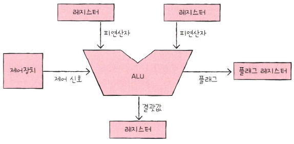
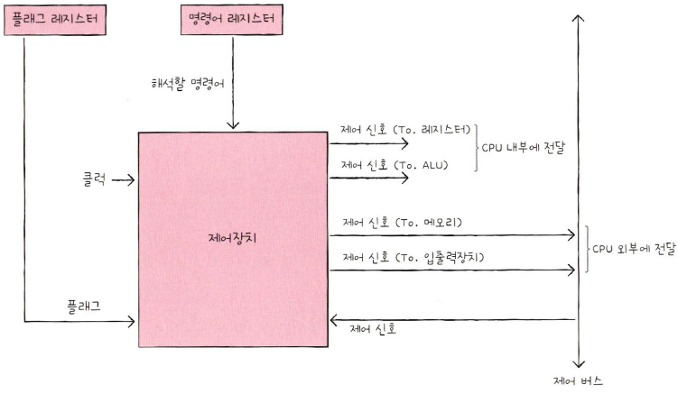
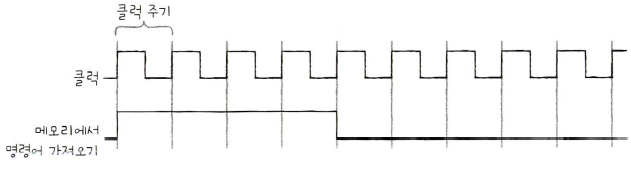

## **ALU**

ALU는 Arithmetic and Logical Unit의 약자로 CPU에서 **CU(제어장치)로부터 명령을 받아 CPU로 들어온 모든 데이터들을 산술 및 논리 연산**하는 부품이다. 

 

ALU가 계싼을 하기 위해서는 피연산자와 수행할 연산이 필요하다. 

그래서 ALU는 레지스터를 통한 **피연산자**를 받아들이고, 제어장치로부터 수행할 연산을 알려주는 **제어 신호**를 받아들여 산술 연산, 논리 연산 등 다양한 연산을 수행한다. 

연산을 수행한 결과는 특정 숫자나 문자가 될 수 있고, 메모리 주소가 될 수도 있다. 그리고 이 **결괏값은 바로 메모리에 저장되지 않고 일시적으로 레지스터에 저장**된다. 

**CPU가 메모리에 접근하는 속도는 레지스터에 접근하는 속도보다 훨씬 느리다.** ALU가 연산할 때마다 결과를 메로리에 저장한다면 CPU가 메모리에 자주 접근하게 되고, 이는 **CPU가 프로그램 실행 속도를 늦출 수 있기 때문에 레지스터에 우선 저장한다.**  

### **플래그**

ALU는 계산 결과와 더불어 **플래그**를 내보낸다. 

ALU는 결괏값뿐만 아니라 **연산 결과에 대한 추가적인 정보**를 내보내야 할 때가 있다. 연산 결과가 음수일 때 ALU는 '방금 계산한 결과가 음수'라는 추가 정보를 내보낸다. 혹은 연산 결과가 연산 결과를 담을 레지스터보다 클 때 ALU는 '결괏값이 너무 크다'라는 추가 정보를 내보낸다. 

이러한 연산 결과에 대한 추가적인 상태 정보를 **플래그**라고 한다. 

플래그들은 **플래그 레지스터**에 저장된다. 
플래그 레지스터는 플래그 값들을 저장하는 레지스터이다. 이 레지스터를 읽으면 연산 결과에 대한 추가적인 정보를 얻을 수 있다.  

## **제어 장치(Control Unit)**

**제어 장치**는 제어 신호를 내보내고, 명령어를 해석하는 부품이다. 그리고 **제어 신호**는 컴퓨터 부품들을 관리하고 작동시키기 위한 일종의 전기 신호다. 

 

제어 장치가 받아들이는 정보들을 알아보자. 

**첫째, 클럭 신호를 받아들인다.** 

**클럭**이란 컴퓨터의 모든 부품을 일사분란하게 움직일 수 있게 하는 시간 단위다. 클럭의 "똑-딱-똑-딱" 주기에 맞춰 한 레지스터에서 다른 레지스터로 데이터가 이동되거나, ALU에서 연산이 수행되거나, CPU가 메모리에 저장된 명령어를 읽어 들인다. 

다만, "컴퓨터의 모든 부품이 클럭 신호에 맞춰 작동한다"라는 말은 "컴퓨터의 모든 부품이 한 클럭마다 작동한다"라는 말이 아니다. 부품들은 클럭이라는 박자에 맞춰 작동할 뿐 한 박자마다 작동하는 건 아니다. 다음 그림처럼 하나의 명렁어가 여러 클럭에 걸쳐 실행될 수 있다. 

  

**둘째, 해석해야 할 명령어를 받아들인다.** 

CPU가 해석해야 할 명령어는 **명령어 레지스터**라는 특별한 레지스터에 저장된다. 제어 장치는 이 명령어 레지스터로부터 해석할 명령어를 받아들이고 해석한 뒤, 제어 신호를 발생시켜 컴퓨터 부품들에 수행해야 할 내용을 알려준다.  

**셋째, 플래그 레지스터 속 플래그 값을 받아들인다.** 

제어 장치는 플래그 레지스터로부터 플래그 값을 받아들이고 이를 참고하여 제어 신호를 발생시킨다.  

**넷째, 제어 버스로 전달된 제어 신호를 받아들인다.** 

제어 신호는 CPU뿐만 아니라 입출력장치를 비롯한 CPU 외부 장치도 발생시킬 수 있다. 제어 장치는 제어 버스를 통해 외부로부터 전달된 제어 신호를 받아들이기도 한다.  

이제 **제어 장치가 내보내는 정보**를 알아보자. 
여기에는 크게 CPU 외부에 전달하는 제어 신호와 CPU 내부에 전달하는 제어 신호가 있다. 

제어 장치가 CPU 외부에 제어 신호를 전달한다는 말은 곧, 제어 버스로 제어 신호를 내보낸다는 말과 같다. 이러한 제어 신호에는 크게 메모리에 전달하는 제어 신호와 입출력장치에 전달하는 제어 신호가 있다. 

제어 장치가 메모리에 저장된 값을 읽거나 메모리에 새로운 값을 쓰고 싶다면 메모리에 제어 신호를 내보낸다. 그리고 입출력장치의 값을 읽거나 입출력장치에 새로운 값을 쓰고 싶을 때는 입출력장치로 제어 신호를 내보낸다. 

제어 장치가 CPU 내부에 전달하는 제어 신호에는 크게 ALU에 전달하는 제어 신호와 레지스터에 전달하는 제어 신호가 있다. ALU에는 수행할 연산을 지시하기 위해, 레지스터에는 레지스터 간에 데이터를 이동시키거나 레지스터에 저장된 명령어를 해석하기 위해 제어 신호를 내보낸다.

참고자료 
<a href="https://www.hanbit.co.kr/store/books/look.php?p_code=B9177037040">혼자 공부하는 컴퓨터구조 + 운영체제 - 한빛 미디어</a> 
