프로그램 속 명령어와 데이터는 실행 전후로 반드시 레지스터에 저장된다. 따라서 레지스터에 저장된 값만 잘 관찰해도 프로그램의 실행 흐름을 파악할 수 있다. 

상용화된 CPU 속 레지스터들은 CPU마다 이름, 크기, 종류가 매우 다양하기 때문에 많은 CPU가 공통으로 포함하고 있는 여덟 개의 레지스터를 알아보자.

  

## **반드시 알아야 할 레지스터**

### **프로그램 카운터(Program Counter)**

**프로그램 카운터**는 메모리에서 가져올 명령어의 주소, 즉 메모리에서 읽어 들일 명령어의 주소를 저장한다. 
프로그램 카운터를 **명령어 포인터**라고 부르는 CPU도 있다.

 

### **명령어 레지스터(Instruction Register)**

**명령어 레지스터**는 해석할 명령어, 즉 방금 메모리에서 읽어 들인 명령어를 저장하는 레지스터다. 
제어장치는 명령어 레지스터 속 명령어를 받아들이고 이를 해석한 뒤 제어 신호를 내보낸다.\

 

### **메모리 주소 레지스터(Memory Address Register)**

**메모리 주소 레지스터**는 메모리의 주소를 저장하는 레지스터다. 
CPU가 읽어 들이고자 하는 주소 값을 주소 버스로 보낼 때 메모리 주소 레지스터를 거치게 된다.

 

### **메모리 버퍼 레지스터(Memory Buffer Register)**

**메모리 버퍼 레지스터**는 메모리와 주고받을 값(데이터와 명령어)을 저장하는 레지스터다. 
즉, 메모리에 쓰고 싶은 값이나 메모리로부터 전달받은 값은 메모리 버퍼 레지스터를 거친다. CPU가 주소 버스로 내보낼 값이 메모리 주소 레지스터를 거친다면, 데이터 버스로 주고받을 값은 메모리 버퍼 레지스터를 거친다.

 

이제 메모리에 저장된 프로그램을 실행하는 과정에서 프로그램 카운터, 명령어 레지스터, 메모리 주소 레지스터, 메모리 버퍼 레지스터에 어떤 값들이 담기는지 알아보자.

 

**1. CPU로 실행할 프로그램이 1000번지부터 1500번지까지 저장되어 있다고 가정하자. 그리고 1000번지에는 1101(2)이 저장되어 있다고 가정하자.** 

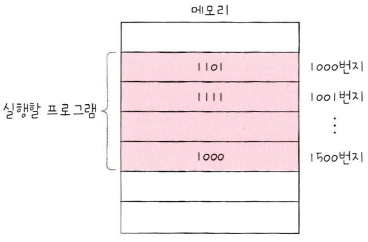

 

**2. 프로그램을 처음부터 실행하기 위해 프로그램 카운터에는 1000이 저장된다. 이는 메모리에서 가져올 명령어가 1000번지에 있다는 걸 의미한다.** 

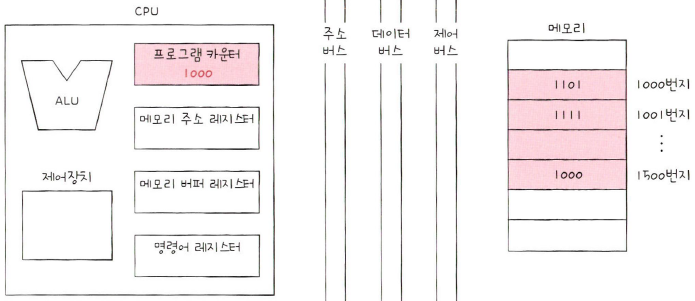

 

**3. 1000번지를 읽어 들이기 위해서는 주소 버스로 1000번지를 내보내야 한다. 이를 위해 메모리 주소 레지스터에는 1000이 저장된다.** 

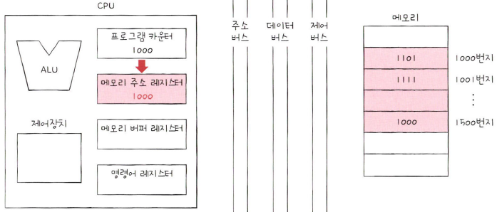

 

**4. '메모리 읽기' 제어 신호와 메모리 주소 레지스터 값이 각각 제어 버스와 주소 버스를 통해 메모리로 보내진다.** 

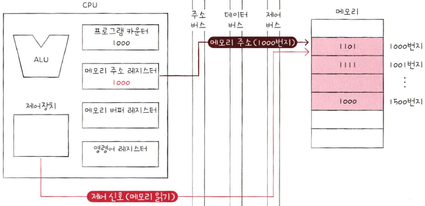

 

**5. 메모리 1000번지에 저장된 값은 데이터 버스를 통해 메모리 버퍼 레지스터로 전달되고, 프로그램 카운터는 증가되어 다음 명령어를 읽어 들일 준비를 한다.** 

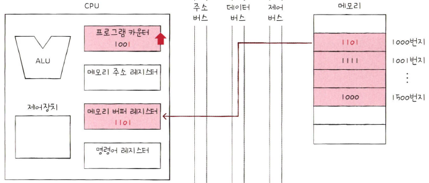

 

**6. 메모리 버퍼 레지스터에 저장된 값은 명령어 레지스터로 이동한다.** 

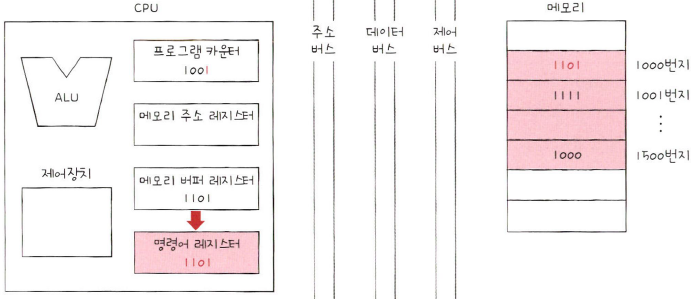

 

**7. 제어장치는 명령어 레지스터의 명렁어를 해석하고 제어 신호를 발생시킨다.**

 

5단계에서 프로그램 카운터 값이 증가한 것을 확인했다. 프로그램 카운터 값이 증가했으니 1000번지 명령어 처리가 끝나면 CPU는 다음 명령어(1001번지)를 읽어 들인다. 

이처럼 프로그램 카운터는 지속적으로 증가하며 계속해서 다음 명령어를 잃어 들일 준비를 한다. 이 과정이 반복되면서 CPU는 프로그램을 차례대로 실행해 나간다. 결국 **CPU가 메모리 속 프로그램을 순차적으로 읽어 들이고 실행해 나갈 수 있는 이유는 CPU 속 프로그램 카운터가 꾸준히 증가하기 때문**이다.

  

### **범용 레지스터(General Purpose Register)**

**범용 레지스터**는 이름 그대로 다양하고 일반적인 상황에서 자유롭게 사용 할 수 있는 레지스터다. 
메모리 버퍼 레지스터는 데이터 버스로 주고받을 값만 저장하고, 메모리 주소 레지스터는 주소 버스로 내보낼 주소값만 저장하지만, 범용 레지스터는 데이터와 주소를 모두 저장할 수 있다. 

일반적으로 CPU 안에는 여러 개의 범용 레지스터들이 있고, 현재 대다수 CPU는 모두 범용 레지스터를 가지고 있다.

 

### **플래그 레지스터(Flag Register)**

**플래그 레지스터**는 연산 결과 또는 CPU 상태에 대한 부가적인 정보를 저장하는 레지스터다.

  

## **스택 주소 지정 방식**

프로그램 카운터, 그리고 스택 포인터와, 베이스 레지스터는 주소 지정에 사용될 수 있는 특별한 레지스터다. 

**스택 포인터**는 스택 주소 지정 방식에 사용되고, 프로그램 카운터와 베이스 레지스터는 변위 주소 지정 방식에 사용된다. 

**스택 주소 지정 방식**은 스택과 스택 포인터를 이용한 주소 지정 방식이다. 
스택은 LIFO(Last In First Out) 방식이기 때문에 가장 최근에 저장한 값부터 꺼낼 수 있다. 여기서 **스택 포인터**란 스택의 꼭대기를 가리켜 스택에 마지막으로 저장한 값의 위치를 저장하는 레지스터다. 

예를 들어 보자. 다음과 같이 위에서부터 주소가 매겨져 있고 아래부터 차곡차곡 데이터가 저장되어 있는 스택이 있다고 가정하자. 이때 스택 포인터는 스택의 제일 꼭대기 주소, 4번지를 저장하고 있다. 스택 포인터는 스택의 어디까지 데이터가 채워져 있는지에 대한 표시라고 보면 된다. 

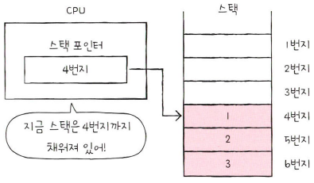

 

스택은 메모리 안에 있다. 정확히는 메모리 안에 스택처럼 사용할 영역이 정해져있는데 이를 **스택 영역**이라고 한다. 
이 영역은 다른 주소 공간과는 다르게 스택처럼 사용하기로 암묵적으로 약속된 영역이다. 

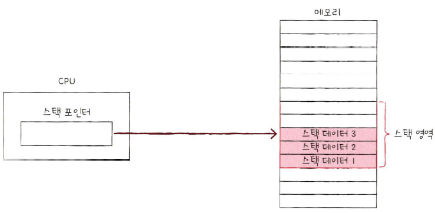

  

## **변위 주소 지정 방식**

명렁어의 오퍼랜드 필드에는 메모리의 주소가 담길 때도 있다. **변위 주소 지정 방식**은 오퍼랜드 필드의 값(변위)과 특정 레지스터의 값을 더하여 유효 주소를 얻어내는 주소 지정 방식이다. 

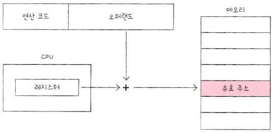

 

그래서 변위 주소 지정 방식을 사용하는 명령어는 다음 그림과 같이 연산 코드 필드, 어떤 레지스터의 값과 더할지를 나타내는 레지스터 필드, 그리고 주소를 담고 있는 오퍼랜드 필드가 있다. 

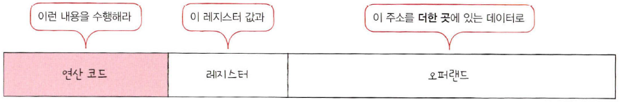

 

이때, 변위 주소 지정 방식은 오퍼랜드 필드의 주소와 어떤 레지스터를 더하는지에 따라 **상대 주소 지정 방식**, **베이스 레지스터 주소 지정 방식** 등으로 나뉜다. 변위 주소 지정 방식에는 CPU의 종류에 따라 다양한 방식들이 있지만, 대표적인 두 가지 방식만 알아보자.

  

### **상대 주소 지정 방식**
**상대 주소 지정 방식**은 오퍼랜드와 프로그램 카운터의 값을 더하여 유효 주소를 얻는 방식이다. 

프로그램 카운터에는 읽어 들일 명령어의 주소가 저장되어 있다. 만약 오퍼랜드가 음수 -3이었다면 CPU는 읽어 들이기로 한 명령어로부터 '세 번째 이전' 번지로 접근한다. 실행하려는 명령어의 세 칸 이전 번지 명령어를 실행하는 것이다. 

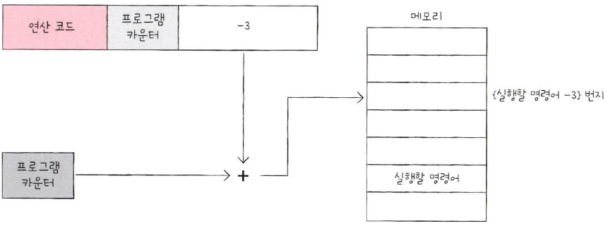

  

### **베이스 레지스터 주소 지정 방식**
**베이스 레지스터 주소 지정 방식**은 오퍼랜드와 베이스 레지스터의 값을 더하여 유효 주소를 얻는 방식이다. 

베이스 레지스터는 '기준 주소', 오퍼랜드는 '기준 주소로부터 떨어진 거리'로서의 역할을 한다. 
즉, 베이스 레지스터 주소 지정 방식은 베이스 레지스터 속 기준 주소로부터 얼마나 떨어져 있는 주소에 접근할 것인지를 연산하여 유효 주소를 얻어내는 방식이다. 

예를 들어, 베이스 레지스터에 200이라는 값이 있고 오퍼랜드가 40이라면 이는 "기준 주소 200번지로부터 40만큼 떨어진 240번지로 접근하라"를 의미한다. 

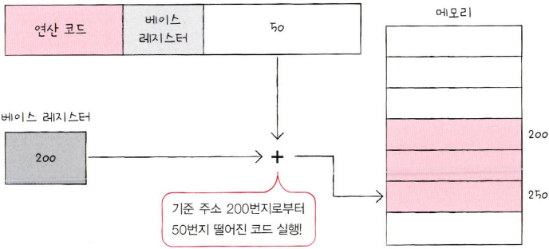

참고자료 
<a href="https://www.hanbit.co.kr/store/books/look.php?p_code=B9177037040">혼자 공부하는 컴퓨터구조 + 운영체제 - 한빛 미디어</a> 
