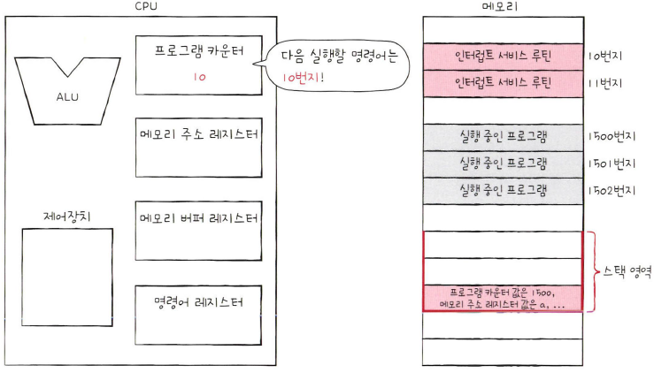

## **명령어 사이클**

**명령어 사이클**은 하나의 명령어를 처리하는 정형화된 흐름이다. 
프로그램 속 각각의 명령어들은 명령어 사이클이 반복되며 실행된다.

 

### **인출 사이클**

메모리에 저장된 명령어를 실행하기 위해서는 먼저 명령어를 메모리에서 CPU로 가져와야 한다. 
이게 명령어 사이클의 첫 과정이다. 메모리에 있는 명령어를 CPU로 가져 오는 단계를 **인출 사이클**이라고 한다.

 

### **실행 사이클**

명령어 사이클의 두 번째 과정으로 CPU로 가져온 명령어를 실행하는 단계를 **실행 사이클**이라고 한다. 제어장치가 명령어 레지스터에 담긴 값을 해석하고, 제어 신호를 발생시키는 단계다.

 

프로그램을 이루는 수많은 명령어는 일반적으로 인출과 실행 사이클을 반복하며 실행된다. 

하지만 명령어를 인출하여 CPU로 가져왔다 하더라도 곧바로 실행할 수 없는 경우도 있다. 
예를 들어, 간접 주소 지정 방식은 오퍼랜드 필드에 유효 주소의 주소를 명시하기 때문에 명령어를 인출하여 CPU로 가져왔다 하더라도 바로 실행 사이클에 돌입할 수 없다. 명령어를 실행하기 위해서는 메모리 접근을 한 번 더 해야 하기 때문이다. 이 단계를 **간접 사이클**이라고 한다. 
 

명령어 사이클 도식은 아래와 같다. 

  

## **인터럽트**

인터럽트는 영어로 interrupt이며, '방해하다, 중단시키다'를 의미한다. 
즉, CPU가 수행 중인 작업은 방해를 받아 잠시 중단될 수 있는데, 이렇게 CPU의 작업을 방해하는 신호를 **인터럽트**라고 한다.

 

인터럽터의 종류에는 크게 동기 인터럽트와 비동기 인터럽트가 있다.

 

### **동기 인터럽트**

**동기 인터럽트**는 CPU에 의해 발생하는 인터럽트다. 
CPU가 명령어들을 수행하다가 예상치 못한 상황에 마주쳤을 때, 가령 CPU가 실행하는 프로그래밍상의 오류와 같은 예외적인 상황에 마주쳤을 때 발생하는 인터럽트가 동기 인터럽트다. 이런 점에서 **예외(Exception)**라고 부른다.

 

### **비동기 인터럽트**

**비동기 인터럽트**는 주로 입출력장치에 의해서 발생하는 인터럽트다. 
일반적으로 비동기 인터럽트를 인터럽트라 칭하기도 하고 **하드웨어 인터럽트**라고도 한다.

 

**하드웨어 인터럽트**는 알림과 같다. 

CPU가 프린터에 출력을 명령했다고 가정해보자. 입출력장치는 CPU보다 속도가 현저히 느리기 때문에 CPU는 입출력 작업의 결과를 바로 받아볼 수 없다. 이때 하드웨어 인터럽트를 사용하지 않는다면 CPU는 프린터가 언제 프린트를 끝낼지 모르기 때문에 주기적으로 프린터의 완료 여부를 확인해야 한다. 이로 인해 **CPU는 다른 생산적인 일을 할 수 없으니 CPU 사이클 낭비가 발생**한다.
 

하지만 하드웨어 인터럽트를 이용하면 CPU는 주기적으로 프린트 완료 여부를 확인할 필요가 없다. CPU는 프린터로부터 프린트 완료 인터럽트를 받을 때까지 다른 작업을 처리할 수 있다.

 

### **하드웨어 인터럽트 처리 순서**
 1. 입출력장치는 CPU에 **인터럽트 요청 신호**를 보낸다.
 2. CPU는 실행 사이클이 끝나고 명령어를 인출하기 전 항상 인터럽트 여부를 확인한다.
 3. CPU는 인터럽트 요청을 확인하고 **인터럽트 플래그**를 통해 현재 인터럽트를 받아들일 수 있는지 여부를 확인한다.
 4. 인터럽트를 받아들일 수 있다면 CPU는 지금까지의 작업을 백업한다.
 5. CPU는 **인터럽트 벡터**를 참조하여 **인터럽트 서비스 루틴**을 실행한다.
 6. 인터럽트 서비스 루틴 실행이 끝나면 백업해 둔 작업을 복구하여 실행을 재개한다.

 

**인터럽트 요청 신호** 

인터럽트는 CPU의 정상적인 실행 흐름을 끊는 것이기에 다른 누군가가 인터럽트하기 전에 "지금 끼어들어도 되나요?" 하고 CPU에 물어봐야 하는데 이때 보내는 신호가 **인터럽트 요청 신호**이다.

 

**인터럽트 플래그** 

CPU가 인터럽트 요청을 수용하기 위해서는 플래그 레지스터의 **인터럽트 플래그**가 활성화되어 있어야 한다. 인터럽트 플래그는 말 그대로 **하드웨어 인터럽트를 받아들일지, 무시할지 결정하는 플래그**다. 

만약 인터럽트 플래그가 '불가능'으로 설정되어 있으면 인터럽트 요청을 무시하고 '가능'으로 설정되어 있다면 CPU는 인터럽트 요청 신호를 받아들이고 인터럽트를 처리한다.

 

다만, 모든 하드웨어 인터럽트를 인터럽트 플래그로 막을 수는 없다. 무시할 수 없는 하드웨어 인터럽트는 **가장 우선순위가 높은, 반드시 가장 먼저 처리해야 하는 인터럽트**로 정전이나 하드웨어 고장으로 인한 인터럽트를 말한다.

 

**인터럽트 서비스 루틴** 

CPU가 인터럽트 요청을 받아들이기로 했다면 인터럽트를 처리하기 위한 프로그램인 **인터럽트 서비스 루틴을 실행**한다. 
인터럽트 서비스 루틴은 어떤 인터럽트가 발생했을 때 해당 인터럽트를 어떻게 처리하고 작동해야 할지에 대한 정보로 이루어진 프로그램이다. 

'CPU가 인터럽트를 처리한다'는 말은 '인터럽트 서비스 루틴을 실행하고, 본래 수행하던 작업으로 다시 되돌아온다'라는 말과 같다  

 

**인터럽트 벡터** 

**인터럽트 벡터**는 인터럽트 서비스 루틴을 식별하기 위한 정보다. 인터럽트를 처리하는 방법은 입출력장치마다 다르므로 각기 다른 인터럽트 서비스 루틴을 가지고 있다. 즉, **메모리에는 여러 개의 인터럽트 서비스 루틴이 저장**되어 있다. 인터럽트 벡터를 알면 인터럽트 서비스 루틴의 시작 주소를 알 수 있기 때문에 CPU는 특정 인터럽트 서비스 루틴을 처음부터 실행할 수 있다.
 

CPU가 작업을 수행하는 도중 키보드 인터럽트가 발생한 경우라면 CPU는 인터럽트 벡터를 참조하여 키보드 인터럽트 시버스 루틴의 시작 주소를 알아내고, 이 시작 주소부터 실행해 나간다. 

 

CPU는 인터럽트 서비스 루틴을 실행하기 전에 프로그램 카운터 값 등 **현재 프로그램을 재개하기 위해 필요한 모든 내용을 스택에 백업**한다. 그러고 나서 인터럽트 서비스 루틴의 시작 주소가 위치한 곳으로 프로그램 카운터 값을 갱신하고 인터럽트 서비스 루틴을 실행한다. 

 

참고자료 
<a href="https://www.hanbit.co.kr/store/books/look.php?p_code=B9177037040">혼자 공부하는 컴퓨터구조 + 운영체제 - 한빛 미디어</a> 
