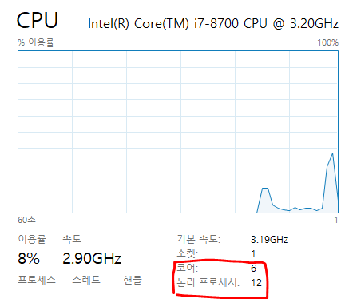
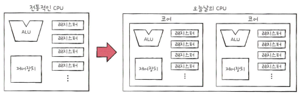
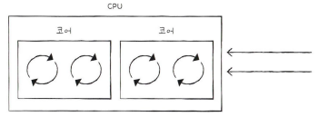
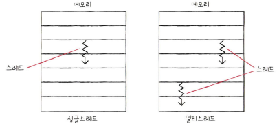
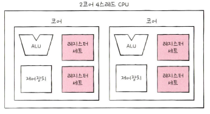

CPU의 성능을 높이는 방법 중 하나인 멀티 코어와 멀티 스레드에 대해 공부해보자.

  

## **코어와 멀티 코어**

CPU의 정의는 **명령어를 실행하는 부품**이다. 
하지만 이 정의는 오늘날 **코어**라는 용어로 사용된다. 

CPU에 코어가 한 개 있다는 것. 즉, **싱글 코어**는 한 명이 컴퓨터에서 일하고 있다는 것을 의미한다. 
한 명만 일하고 있으니 동시에 두 가지 일을 못하고 한번에 한 가지 일만 할 수 있다. 하지만 싱글 코어 CPU라도 그림판, 음악, 인터넷을 동시에 할 수 있다.  

여기서 의문점이 들었다. 분명 한번에 한 가지 일만 할 수 있다고했는데 어떻게 여러 작업을 동시에 할 수 있을까? 

정답은 CPU가 매우 빠르기 때문이다 
한번에 하나의 작업을 진행하는 것은 맞지만 작업하는 프로그램 전환을 아주 빠른 속도로 CPU가 하고 있기 때문에 사람들은 알아차릴 수가 없다. 이 부분은 스레드를 알아야 하기 때문에 일단 넘어가자. 

1980년도에는 사용자가 원하는 프로그램이 동작하기에 싱글 코어 CPU로 충분했다. 만약 느리다 싶으면 CPU의 클럭을 높이면 되었다. 

2000년대 초반까지 CPU의 하나의 코어를 지속적으로 성능을 높여 계산 속도를 향상시켰지만 열을 잡지 못해 CPU가 타버리는 문제가 발생했다. 

그래서 Intel은 2005년에 멀티 코어 CPU를 출시했다. 

 

위 사진은 현재 내가 사용하고 있는 CPU 정보인데 코어가 6개, 논리 프로세서가 12개라고 나와있다. 
6 코어는 CPU 안에 6개의 계산하는 독립적인 코어가 있다는 것이고, 12 논리 프로세서는 **하드웨어 스레드**가 12개가 존재한다는 것이다.

 

 

왼쪽 CPU가 싱글 코어, 오른쪽 CPU가 멀티 코어 CPU이다. 
오른쪽 CPU처럼 코어를 여러개 포함하고 있는 CPU를 **멀티 코어 CPU** 또는 **멀티 코어 프로세서**라고 부른다. 

또한 오늘날 CPU는 `명령어를 실행하는 부품`에서 `명령어를 실행하는 부품을 여러 개 포함하는 부품`으로 명칭의 범위가 확장되었다.

  

## **스레드와 멀티 스레드**

그렇다면 코어에 대해서는 알겠는데 스레드는 무엇이고 또, 하드웨어 스레드는 무엇인지 이어서 알아보자. 

**스레드**의 사전적 의미는 '실행 흐름의 단위'이다. 
스레드에는 CPU에서 사용되는 **하드웨어 스레드**가 있고, 프로그램에서 사용되는 **소프트웨어 스레드**가 있다.

 

### **하드웨어 스레드**

스레드를 하드웨어적으로 정의하면 `하나의 코어가 동시에 처리하는 명령어 단위`를 의미한다. 
보통 CPU에서 사용하는 스레드라는 용어는 CPU 입장에서 정의된 **하드웨어 스레드**를 의미한다. 

1코어 1스레드 CPU는 명령어를 실행하는 부품이 하나 있고, 한 번에 하나씩 명령어를 실행하는 CPU를 가정했다. 
반면, 여러 스레드를 지원하는 CPU는 하나의 코어로도 여러 개의 명령어를 동시에 실행할 수 있다. 

예를 들어 2코어 4스레드 CPU는 아래 그림처럼 코어를 2개 포함하고, 한 번에 4개의 명령어를 처리할 수 있는 CPU를 의미한다. 

 

이처럼 하나의 코어로 여러 명령어를 동시에 처리하는 CPU를 **멀티스레드 프로세서** 또는 **멀티스레드 CPU**라고 한다. 

가장 위에 있는 사진 속 CPU는 6코어 12스레드이다. 이는 명령어를 실행하는 부품을 6개 포함하고, 한 번에 12개의 명령어를 처리할 수 있다는 뜻이다.

 

### **소프트웨어 스레드**

소프트웨어적으로 정의된 스레드는 `하나의 프로그램에서 독립적으로 실행되는 단위`를 의미한다. 

하나의 프로그램은 실행되는 과정에서 한 부분만 실행될 수 있지만, 프로그램의 여러 부분이 동시에 실행될 수도 있다. 

 

예를 들어, 채팅 프로그램을 개발한다고 가정하고 아래의 기능들이 동시에 수행되기를 원한다. 

1. 메세지 전송 기능
2. 새 메세지 수신 기능
3. 화면에 메세지를 출력하는 기능 

각 기능들의 코드를 각각의 스레드로 만들어 동시에 실행할 수 있다. 

한 번에 하나씩 명령어를 처리하는 1코어 1스레드 CPU도 소프트웨어적 스레드를 수십 개 실행할 수 있다.

  

## **멀티스레드 프로세서**

멀티스레드 프로세서는 하나의 코어로 여러 명령어를 동시에 처리하는 CPU라고 했는데 어떻게 가능한 것일까? 

가장 큰 핵심은 레지스터이다. 하나의 코어로 여러 명령어를 동시에 처리하도록 만들려면 프로그램 카운터, 스택 포인터, 데이터 버퍼 레지스터, 데이터 주소 레지스터와 같이 하나의 명령어를 처리하기 위해 꼭 **필요한 레지스터를 여러 개 가지고 있으면 된다.** 

한 개의 명령어를 처리하기 위해 필요한 레지스터들을 '레지스터 세트'라고하자. 
레지스터 세트가 한 개인 CPU는 한 개의 명령어를 처리하기 위한 정보들을 기억할 뿐이지만, 레지스터 세트가 두 개인 CPU는 두 개의 명령어를 처리하기 위한 정보들을 기억할 수 있다. 여기서 ALU와 제어장치가 두 개의 레지스터 세트에 저장된 명령어를 해석하고 실행하면 하나의 코어에서 두 개의 명령어가 동시에 실행된다. 

 

2코어 4스레드 CPU는 한 번에 4개의 명령어를 처리할 수 있는데, 프로그램 입장에서는 한 번에 하나의 명령어를 처리하는 CPU가 4개 있는 것처럼 보인다. 그래서 하드웨어 스레드를 **논리 프로세서**라고도 한다.

 

### **하이퍼스레딩이란?**

하이퍼스레딩은 인텔의 멀티스레딩 기술로 하나의 물리적 코어가 동시에 두 개의 독립적인 작업(스레드)을 처리할 수 있도록 한다. 

해당 기술을 활성화하면 CPU는 물리적 코어 당 두 개의 실행 컨텍스트를 노출하는데. 이는 하나의 물리적 코어가 다른 소프트웨어 스레드를 처리할 수 있는 두 개의 "논리적 코어"처럼 작동한다는 것을 의미한다. 

참고자료 
<a href="https://www.hanbit.co.kr/store/books/look.php?p_code=B9177037040">혼자 공부하는 컴퓨터구조 + 운영체제 - 한빛 미디어</a> 
<a href="https://www.intel.co.kr/content/www/kr/ko/gaming/resources/hyper-threading.html">https://www.intel.co.kr/content/www/kr/ko/gaming/resources/hyper-threading.html</a> 