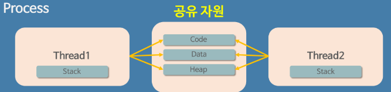

## **프로그램과 프로세스**

### **정적 프로그램(Static Program)**

컴퓨터에서 실행할 수 있는 파일로 윈도우의 경우 `*.exe`가 붙어있는 파일들을 프로그램이라고 한다. 
단, 아직 **파일을 실행하지 않은 상태**이기 때문에 정적 프로그램, 줄여서 프로그램이라고 부른다.

 

### **프로세스(Process)**

프로그램 자체는 실행시키기 전에는 그저 코드가 구현되어 있는 파일일 뿐이다. 
**프로세스**는 프로그램을 실행 시켜 정적인 프로그램이 동적으로 변하여 **컴퓨터에서 실행 중인 프로그램**을 말한다. 

 

위 사진과 같이 익숙한 작업 관리자에서 실행중인 프로그램들을 확인할 수 있다. 

모든 프로그램은 운영체제가 실행되기 위한 메모리 공간을 할당해 줘야 실행될 수 있다. 그래서 프로그램을 실행하는 순간 파일은 메모리에 올라가게 되고, 운영체제로부터 시스템 자원(CPU)을 할당받아 프로그램을 실행시킨다.

 

### **프로세스의 한계**
 

과거에는 파일을 다운받는 작업, 마우스나 키보드로부터 입력을 받는 작업, 브라우저로 사이트를 돌아다니는 작업 등 여러 작업을 동시에 하지 못하고 한 번에 하나씩만 할 수 있었다. 

현재처럼 게임을 하면서 음악도 들을 수 있는 것처럼 여러 작업들이 동시에 실행되는 건 운영체제가 여러 개의 프로세스를 함께 돌리고 있기 때문이다. 

하지만 여러 프로세스를 함께 실행시키는 것만으로 충분할까? 브라우저로 예시를 들어보자. 

브라우저도 하나의 프로그램이기 때문에 하나의 프로세스가 진행되고 있다. 그런데 브라우저에서 파일을 다운로드 받는 동시에 다른 페이지들을 돌아다닐 수 있어야 하고 유튜브에서 영상의 데이터를 받아오면서 받아진 데이터로 영상을 실행할 수도 있어야 한다. 

하나의 프로세스 내에서도 여러 갈래의 작업들이 동시에 진행될 필요가 있는 것이다. 
이 갈래를 **스레드**라고 부른다.

 

## **스레드**

스레드는 하나의 **프로세스 내에서 동시에 진행되는 작업 갈래, 흐름의 단위** 를 말한다. 
전 포스팅에서도 스레드에 알아보았는데 현재 포스팅에서 말하는 스레드는 **소프트웨어적 스레드**이다. 

 

현재 브라우저 내에서 다양한 작업들이 동시에 가능한 것은 하나의 프로세스 내에서 **여러가지 작업들 흐름이 동시에 진행**되기 때문에 가능한 것인데, 이를 멀티 스레드라고 부른다.

  

## **프로세스와 스레드의 메모리**

### **프로세스의 자원 구조**

프로그램이 실행되어 프로세스가 생성되면 4가지의 메모리 영역으로 구성되어 할당 받게 된다. 

 

* Stack 영역 : 함수의 호출과 관계되는 지역 변수와 매개변수가 저장되는 영역이다. 함수의 호출과 함께 할당되며, 함수의 호출이 완료되면 소멸한다. 만일 Stack 영역을 초과하면 Stack Overflow 에러가 발생한다.
* Heap 영역 : 생성자, 인스턴스와 같은 동적으로 할당되는 데이터들을 위해 존재하는 영역이다. 사용자에 의해 메모리 공간이 동적으로 할당되고 해제된다.
* Data 영역(BSS, GVAR) : 프로그램이 실행될 때 생성되고, 종료될 때 반환되는 영역으로 전역변수, 정적(Static)변수, 배열, 구조체 등이 저장된다.
  * BSS : 전역 변수, 초기값 없는 전역변수. 배열, static으로 선언된 변수가 들어간다.
  * GVAR : 전역 변수, 초기값 있는 전역 변수. 배열, static으로 선언된 변수가 들어간다.
* Code(Text) 영역 : 프로그래머가 작성한 프로그램 함수들의 코드가 CPU가 해석 가능한 기계어 형태로 저장되어 있다.
  
 

### **스레드의 자원 공유**

스레드는 프로세스가 할당 받은 자원을 이용하는 실행의 단위로서, 스레드끼리 프로세스의 자원을 공유하면서 프로세스 실행 흐름의 일부가 되기 때문에 동시 작업이 가능한 것이다. 

스레드는 프로세스의 4가지 영역 중 Stack 영역만 할당받아 복사하고 다른 영역들은 프로세스 내의 다른 스레드들과 공유된다. 독립적인 스택을 가지면 독립적인 함수 호출이 가능하므로 스레드는 독립적인 실행 흐름을 가질 수 있게 되는 것이다. 

 

이렇게 구성한 이유는 하나의 프로세스를 다수의 실행 단위인 스레드로 구분하여 자원을 공유하고, 자원의 생성과 관리의 중복성을 최소화하여 수행 능력을 올리기 위해서다.

  

## **프로세스 & 스레드의 동시 실행 원리**

우리가 음악을 들으면서, 게임을 하고, 메신저의 메세지를 확인할 수 있는 이유는 컴퓨터 내부적으로 프로세스와 스레드를 동시에 처리하는 멀티 태스킹 기술 덕분이다. 

하지만 여기서 동시에 처리한다는 것이 CPU가 프로그램들을 동시에 실행하는 것으로 생각했지만, 내부적으로 복잡한 원리에 의해 처리가 된다는 것을 알았다. 

현재 나는 6코어 12스레드 CPU를 사용하고 있는데 수십, 수백개의 프로세스들을 12개의 논리 프로세서로 어떻게 처리하는 것일까?

 

### **병렬성(Parallelism)**

병렬성은 **동일한 시간에 독립적인 작업을 실행**할 수 있음을 의미한다. 여러 작업을 다른 코어, 다른 프로세스에서 동시에 실행할 수 있어서 성능 향상에 필수적이라고 한다.

 

### **동시성(Concurrency)**

동시성은 **둘 이상의 작업이 동시에 실행**되는 것을 의미한다. 
**동시**라는 단어에서 병렬성과 동시성을 헷갈릴 수 있다. 병렬성은 물리적으로 동시에 실행하는 것이라고 하면, 동시성은 동시에 실행하는 것처럼 보이게 하는 것이다. 

위 사진처럼 작업들을 아주 잘게 나누어 조금씩만 작업을 수행하고 다음 작업으로 넘어가는 식으로 동작된다. 이렇게 하면 동시에 처리하는 것처럼 보이게 만들어, 사용자에게 더 빠른 반응성을 제공하기 위해서다. 그리고 이렇게 진행 중인 작업들을 A -> B -> C -> D로 번갈아 바꾸는 것을 **Context Switching**이라고 부른다.

 

### **동시성이 필요한 이유**
동시성은 프로세스가 동시에 돌아가는 것이 아니기 때문에 작업 시간은 거의 차이가 없을 것이다. 그렇다면 왜 작업들을 스위칭하며 처리하는 것일까?? 

첫 번째는 **하드웨어적 한계** 때문이다. CPU 발열 때문에 클럭으로만 성능을 올리기에는 한계가 존재하여 코어를 여러개 탑재된 멀티 코어 CPU들이 출시 되고 있다. 하지만 아무리 코어를 많이 넣어도 수십개의 코어를 넣을수는 없으니 결국 하드웨어적 제한이 걸리게 되고 수십, 수백게의 프로세스를 돌리기 위해선 결국 동시성이 필요한 것이다. 

두 번째는 **논리적인 효율**적인 이유다. 6코어 12스레드의 CPU 환경에서 총 24개의 작업이 있다고 가정해보자. 논리 프로세서가 12개이기 때문에 최대 12개의 작업을 동시에 실행할 수 있는데, 만약 해당 작업들이 오래걸리는 작업이라면 나머지 12개의 작업들은 **현재 작업들이 다 끝날때까지 기다려야 할 것이다.** 이러한 비효율적인 면을 개선하기 위해서 **작업을 아주 작게 나누어 번갈아 가면서 처리**하는 동시성 개념을 채택한 것이다.

  

참고자료 
<a href="https://inpa.tistory.com/entry/%F0%9F%91%A9%E2%80%8D%F0%9F%92%BB-%ED%94%84%EB%A1%9C%EC%84%B8%EC%8A%A4-%E2%9A%94%EF%B8%8F-%EC%93%B0%EB%A0%88%EB%93%9C-%EC%B0%A8%EC%9D%B4#%ED%94%84%EB%A1%9C%EA%B7%B8%EB%9E%A8_%EA%B3%BC_%ED%94%84%EB%A1%9C%EC%84%B8%EC%8A%A4">https://inpa.tistory.com/entry/</a> 