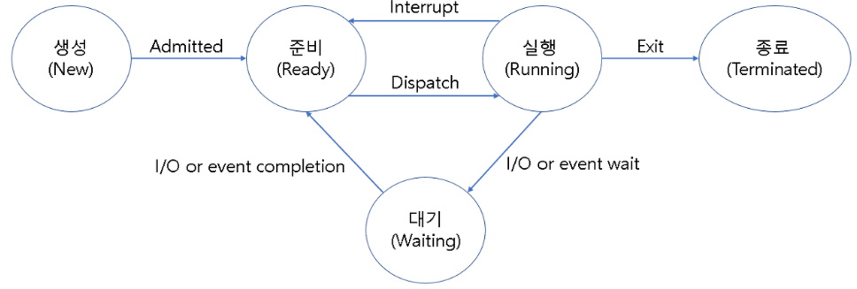
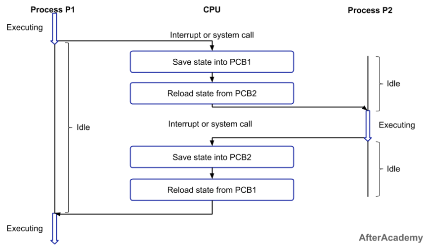
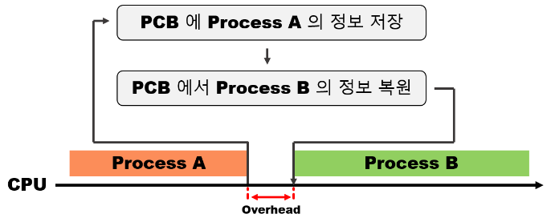
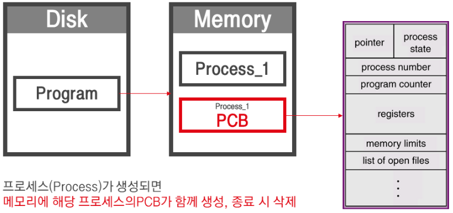

## **프로세스 생명 주기**

### **프로세스 상태**
프로세스는 생성되고 실행하기 까지 여러가지의 상태를 갖게 되고, 상태의 변화에 따라 프로세스가 동작된다. 프로세스는 일반적으로 다음과 같은 5가지 상태를 가진다.

* 생성(new)
  * 프로세스가 생성되고 아직 준비가 되지 않은 상태
* 준비(ready)
  * 프로세스가 실행을 위해 기다리고 있는 상태
  * CPU를 할당받을 수 있는 상태이며, 언제든지 실행될 준비가 되어있다.
* 실행(running)
  * 프로세스가 CPU를 할당받아 실행되는 상태
* 대기(waiting)
  * 프로세스가 특정 이벤트(입출력 요청 등)가 발생하여 대기하는 상태
  * CPU를 할당받지 못하며, 이벤트가 발생하여 다시 준비 상태로 전환될 때까지 기다린다.
* 종료(terminated)
  * 프로세스가 실행을 완료하고 종료된 상태로 메모리에서 제거된다.

 

### **프로세스 상태 전이**
프로세스는 실행되는 동안 OS에 의해 상태가 변경된다. OS는 프로세스의 상태를 기반으로 프로세스 스케줄링을 통해 프로세스를 관리하고 제어한다. 

 

1. Addmitted(new -> ready)
   * 보조기억장치에 있는 프로그램을 사용자가 실행하여 메모리에 프로세스가 생성되는 단계
2. Dispatch(ready -> running)
   * 준비 상태에 있는 프로세스들 중 하나가 스케줄러에 의해 실행된다.
3. Interrupt(running -> ready)
   * 타임아웃이나 예기치 않은 이벤트가 발생하여 현재 실행 중인 프로세스를 준비 상태로 전환하고, 해당 작업을 먼저 처리한다.
4. I/O or event wait (running -> wainting)
   * 실행 중인 프로세스가 입출력이나 이벤트를 처리해야 하는 경우, 입출력이나 이벤트가 끝날 때까지 대기 상태로 전환한다.
5. I/O or event completion (waiting -> ready)
   * 입출력이나 이벤트가 끝난 프로세스를 다시 준비 상태로 만들어 스케줄러에 의해 다시 실행될 수 있는 상태로 전환한다.

 

### **프로세스 컨텍스트 스위칭**

컨텍스트 스위칭(Context Switching)은 CPU가 한 프로세스에서 다른 프로세스로 전환할 때 발생하는 일련의 과정을 말한다. 여러 개의 프로세스들을 번갈아가며 실행하여 CPU 활용률을 높이기 위해 필요하다. 

컨텍스트 스위칭은 동작 중인 프로세스를 대기 상태로 변환시켜 해당 프로세스의 상태(Context)를 보관하고, **스케줄러에 의해 결정된 다음 프로세스가 동작하면서 이전에 저장해 두었던 PCB 값으로 프로세스 상태를 복구**하는 작업이다. 컨텍스트 스위칭을 하는 주체는 스케줄러이다.

 

#### **Context Switching 과정**

 

1. CPU는 Process P1을 실행한다. (Executing)
2. Interrupt 또는 system call이 발생하여 현재 실행 중인 P1의 상태를 PCB1에 저장한다. (Save state into PCB1)
3. 스케줄러에 의해 다음으로 실행할 Process P2를 선택하고 P2의 상태를 PCB2에서 불러온다. (Reload state from PCB2)
4. CPU는 P2를 실행한다. (Executing)
5. Interrupt 또는 system call이 발생하여 현재 실행 중인 P2의 상태를 PCB2에 저장한다. (Save state into PCB2)
6. P1의 상태를 PCB1에서 불러온다. (Reload state from PCB1)
7. CPU는 P1을 중간 시점 부터 실행한다. (Executing)

 

#### **오버헤드(Overhead)로 인한 성능 저하**

컨텍스트 스위칭이 잦게 발생할수록 오버헤드(Overhead) 비용이 발생하여 성능이 떨어진다. 

컨텍스트 스위칭은 빠른 반응성과 동시성을 제공하지만, 실행되는 프로세스의 변경 과정에서 프로세스의 상태, 레지스터 값 등이 저장되고 불러오는 등의 작업이 수행되기 때문에 시스템에 많은 부담을 주게된다. 

위의 컨텍스트 스위칭 과정 그림을 보면 P1이 Execute에서 Idle이 될 때 P2가 Idle 상태에 조금 있다가 Execute가 된다. 그 이유는 프로세스 P1의 상태를 PCB1에 저장하고 프로세스 P2의 상태를 PCB2에서 가져와야 하기 때문이다. 그리고 그 간극이 바로 **컨텍스트 스위칭 오버헤드**이다. 

 

#### **PCB (Process Control Block)**

PCB(프로세스 제어 블럭)는 운영체제에서 프로세스를 관리하기 위해 해당 프로세스의 상태 정보를 담고 있는 자료구조이다. 

프로세스를 컨텍스트 스위칭 할때 기존 프로세스의 상태를 어딘가에 저장해 둬야 다음에 다시 작업을 이어서 할 수 있을 것이고, 새로 작업해야 할 프로세스의 상태 또한 알아야 어디서부터 다시 작업을 시작할지 결정할 수 있을 것이다. 즉, PCB는 **프로세스 스케줄링에 위해 프로세스에 관한 모든 정보를 저장하는 임시 저장소**다. 

 

PCB는 프로세스가 생성되면 메모리에 함께 PCB가 생성되고 종료 시 제거된다. 

운영체제는 PCB에 담긴 프로세스 고유 정보를 통해 프로세스를 파악하여 우선순위 조정 및 스케줄링을 수행한다. 

* Pointer : 프로세스의 현재 위치를 저장
* Process State : 프로세스의 상태에 대한 정보를 저장
* Process ID(PID) : 프로세스를 식별하는 고유한 ID
* Program Counter : 프로세스가 다음 실행해야 하는 명령어의 주소
* Register : 누산기, 베이스, 레지스터 및 범용 레지스터를 포함하는 CPU 레지스터에 있는 정보
* Memory Limits : 운영체제에서 사용하는 메모리 관리 시스템에 대한 정보
* List of open files : 프로세스를 위해 열린 파일 목록

참고자료 
<a href="https://inpa.tistory.com/entry/%F0%9F%91%A9%E2%80%8D%F0%9F%92%BB-%ED%94%84%EB%A1%9C%EC%84%B8%EC%8A%A4-%E2%9A%94%EF%B8%8F-%EC%93%B0%EB%A0%88%EB%93%9C-%EC%B0%A8%EC%9D%B4#%ED%94%84%EB%A1%9C%EA%B7%B8%EB%9E%A8_%EA%B3%BC_%ED%94%84%EB%A1%9C%EC%84%B8%EC%8A%A4">https://inpa.tistory.com/entry/</a> 