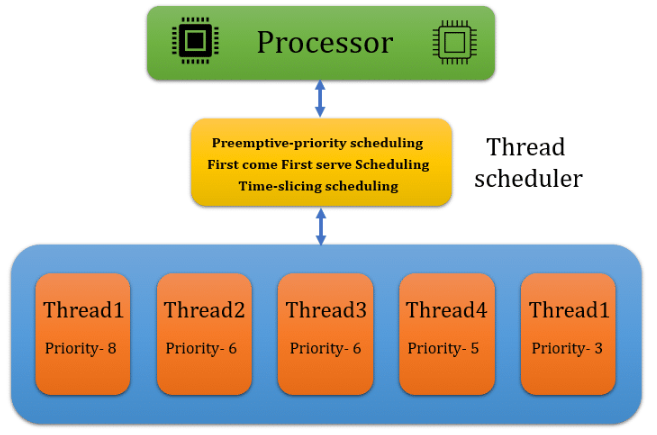
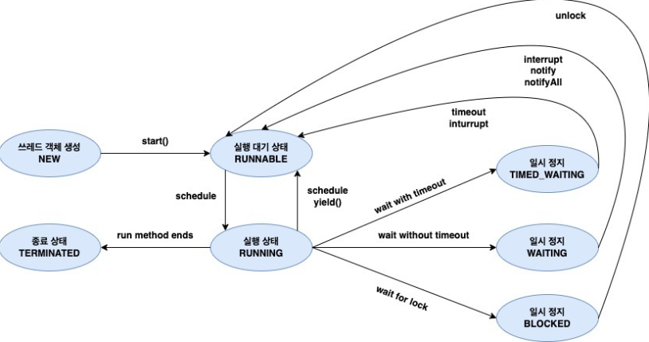
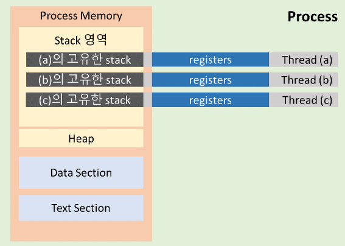
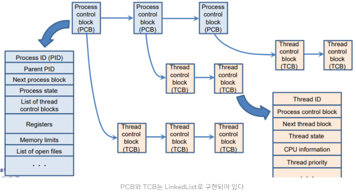

## **스레드 스케줄링**

스레드 스케줄링(Thread Scheduling)은 프로세스 스케줄링과 마찬가지로 운영체제에서 다중 스레드를 관리하며, 
CPU를 사용할 수 있는 스레드를 선택하고, CPU를 할당하는 작업이다. 

스케줄링 알고리즘에 따라 CPU를 사용할 수 있는 스레드를 선택하는 부분은 프로세스 스케줄링과 같지만 스레드
스케줄링은 **하나의 프로세스 내에서 다수의 스레드가 동작**하는 형태이기 때문에, 스레드 간의 상호작용과
동기화 문제를 고려해야 한다는 차이점이 존재한다. 

 

  

## **스레드 생명 주기**

### **스레드 상태**
스레드는 일반적으로 크게 5가지 상태를 가진다.

 

**쓰레드 생성 - NEW**
  * 스레드가 생성되고 아직 준비가 되지 않은 상태
  * 아직 `start()` 메서드가 호출되지 않음
  
**실행 대기 - RUNNABLE**
  * CPU를 할당받을 수 있는 상태이며, 언제든지 실행될 준비가 되어있는 상태
  * 스레드가 생성된 후에 `start()` 메서드를 호출하면 RUNNABLE 상태로 이동하게 된다.
  
**실행 - RUNNING**
  * CPU를 할당받아 실행하는 상태이며, RUNNABLE 상태에서 스레드 스케줄러 의해 RUNNING 상태로 이동된다.
  * 스케줄러는 RUNNABLE 상태의 스레드 중 하나를 선택해서 실행한다.
  
**일시 정지**
  * **WAITING**
    * 다른 스레드가 특정 작업을 수행하기를 기다리는 상태
  * **TIMED_WAITING**
    * 지정된 대기 시간 동안 대기하는 상태
  * **BLOCKED**
    * 스레드가 특정 이벤트(입출력 요청 등)가 발생하여 대기하는 상태
    * CPU를 할당받지 못하며, 이벤트가 발생하여 다시 RUNNABLE 상태로 전환될 때까지 대기한다.

**종료 - TERMINATED**
  * 스레드가 실행을 완료하고 종료된 상태
  * 더 이상 실행될 수 없으며, 메모리에서 제거된다.

 

### **스레드 컨텍스트 스위칭**
스레드 컨텍스트 스위칭은 멀티 스레드 환경에서 하나의 프로세스 내에 존재하는 스레드 간의 실행을 전환하는 기술이다. 

 

 

### **TCB (Thread Control Block)**
TCB(스레드 제어 블록)는 각 스레드마다 운영 체제에서 유지하는 스레드에 대한 정보를 담고 있는 자료구조다. 아래 그림에서 볼 수 있듯이 스레드가 프로세스 내에 위치한 것 처럼 TCB는 PCB 안에 들어있다. 

 

스레드의 상태 정보, 스레드 ID, 스레드 우선순위, 스케줄링 정보 등 다양한 정보를 저장한다. TCB도 스레드가 생성될 때 운영 체제에 의해 생성되며, 스레드가 실행을 마치고 소멸될 때 함께 소멸된다.

참고자료 
<a href="https://inpa.tistory.com/entry/%F0%9F%91%A9%E2%80%8D%F0%9F%92%BB-%ED%94%84%EB%A1%9C%EC%84%B8%EC%8A%A4-%E2%9A%94%EF%B8%8F-%EC%93%B0%EB%A0%88%EB%93%9C-%EC%B0%A8%EC%9D%B4#%ED%94%84%EB%A1%9C%EA%B7%B8%EB%9E%A8_%EA%B3%BC_%ED%94%84%EB%A1%9C%EC%84%B8%EC%8A%A4">https://inpa.tistory.com/entry/</a> 