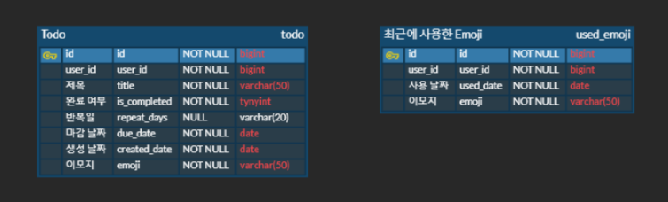

새로 시작한 TodoList 프로젝트에서 Todo 기능을 맡았다. 

API 명세서를 작성하기 전에 Todo 테이블을 설계해보자.

  

## **요구 사항 분석**

### **Todo**

1. 사용자는 원하는 날짜에 여러 Todo를 등록할 수 있다.  
2. 새로운 Todo를 등록하려면 제목(필수), 이모지(필수), 반복 요일(선택)을 입력해야 한다.
3. 사용자는 Todo의 제목, 반복 요일, 완료 여부, 이모지를 수정할 수 있다.

 

### **Used_Emoji**

Used_Emoji 테이블은 아래 사진과 같이 사용자가 최근에 사용한 이모지 데이터를 저장하는 테이블이다.
 
 

1. 사용자가 Todo 등록/수정에 사용한 이모지를 등록한다.
2. 사용자가 사용한 이모지들을 설정한 최대 갯수만큼 저장하여 최근에 사용한 이모지 목록을 제공한다.

  

## **ERD 설계**

 

아직 다른 도메인에 대한 설계가 진행되지 않아서 앞으로 업데이트 할 예정이다.
