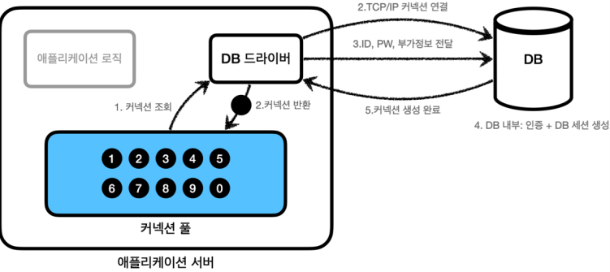
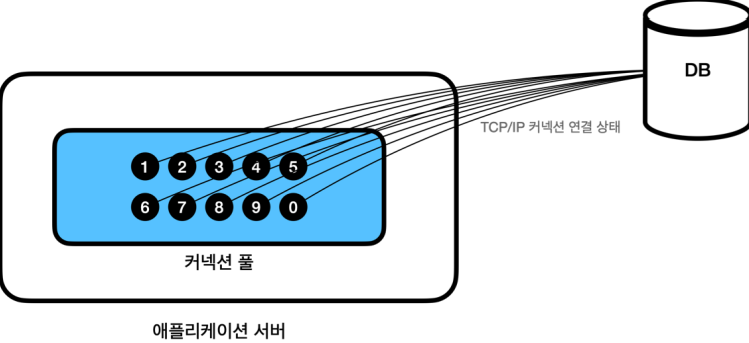
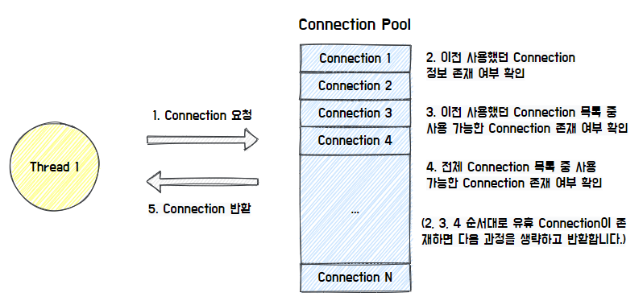
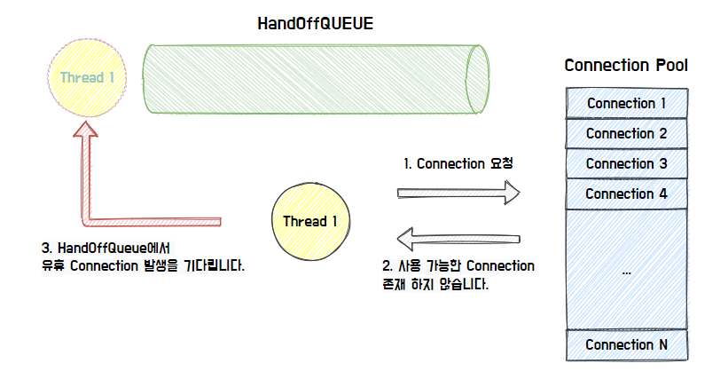
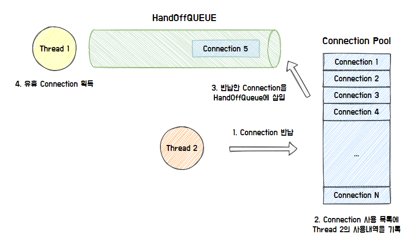

## **Connection Pool 이해**
<hr />

데이터베이스 커넥션을 획득할 때는 다음과 같은 복잡한 과정을 거친다.<br>

1. DB 드라이버를 통해 커넥션을 조회한다.
2. DB 드라이버는 DB와 `TCP/IP` 커넥션을 연결한다. 이 과정에서 3 way handshake 같은 네트워크 동작이 발생한다.
3. DB 드라이버는 `TCP/IP` 커넥션이 연결되면 ID, PW와 기타 부가정보를 DB에 전달한다.
4. DB는 ID, PW를 통해 내부 인증을 완료하고, 내부에 DB 세션을 생성한다.
5. DB는 커넥션 생성이 완료되었다는 응답을 보낸다.
6. DB 드라이버는 커넥션 객체를 생성해서 클라이언트에 반환한다.

<br>

``` java
// 1. 변수 세팅 및 실행할 SQL문 만들기
String sql = "INSERT INTO member(member_id, money) VALUES (?, ?)";

Connection connection = null;
PreparedStatement pstmt = null;
int result = 0;

try{
    // 2. Connection 객체 생성
    connection = getConnection();

    // 3. Statement 객체 생성
    pstmt = connection.prepareStatement(sql);
    pstmt.setString(1, member.getMemberId());
    pstmt.setInt(2, member.getMoney());

    // 4. SQL문을 전달하면서 실행 및 결과 받기
    result = pstmt.executeUpdate();
    return member;
} catch (SQLException e){
    log.error("db error", e);
    throw e;
} finally {
    // 5. 자원 반납
    close(connection, pstmt, null);
}
```

위의 코드와 같이 매번 사용자가 요청할 때마다 드라이버를 로드하고 커넥션 객체를 생성하여 연결하는 것은 과정도 복잡하고 시간도 많이 소모된다.<br>
DB는 물론이고 애플리케이션 서버에서도 `TCP/IP` 커넥션을 새로 생성하기 위한 리소스를 매번 사용해야하기 때문에 비효율 적이다.<br>
또한 고객이 애플리케이션을 사용할 때, SQL을 실행하는 시간 뿐만 아니라 커넥션을 새로 생성하여 연결하는 시간이 추가되기 때문에 결과적으로 응답 속도에 영향을 준다.<br>

이런 문제를 한번에 해결하는 아이디어가 바로 커넥션을 미리 생성해두고 사용하는 **커넥션 풀**이라는 방법이다.

<br>

### **Connection Pool의 개념**
애플리케이션을 시작하는 시점에 Connection Pool은 일정량의 Connection 객체를 미리 만들어서 pool에 저장했다가, 클라이언트 요청이 오면 Connection Pool에서 Connection 객체를 받아와 작업을 진행하고, 작업이 끝나면 Connection Pool에 다시 반납하는 프로그래밍 기법이다.

<br>

### **Connection Pool의 동작 원리**
대표적인 Connection Pool 오픈 소스는 `commons-dbcp2`, `tomcat-jdbc pool`, `Hikari CP` 등이 존재하는데, 성능과 사용의 편리함 측면에서 최근에는 `Hikari CP`를 주료 사용한다고 한다.<br>
또한 Spring Boot 2.0 부터는 기본 Connection Pool로 `Hikari CP`를 제공한다.<br>

**Connection Pool 초기화**<br>
<br>
애플리케이션을 시작하는 시점에 Connection 객체를 만들어서 pool에 보관한다.<br>
서비스의 특징과 서버 스펙에 따라 다르지만 기본 값은 보통 10개이다.

<br>

**Connection Pool의 연결 상태**<br>
<br>
Connection Pool에 들어 있는 Connection은 TCP/IP로 DB와 연결되어 있는 상태이기 때문에 언제든지 즉시 SQL을 DB에 전달할 수 있다.

<br>

**Connection Pool 사용**<br>
<br>

* 애플리케이션 로직에서 이제는 DB 드라이버를 통해 새로운 Connection을 획득하는 것이 아닌, Connection Pool을 통해 이미 생성되어 있는 것을 가져다 쓰면 된다.
* Thread가 Connection을 요청하면 Connection Pool 각자의 방식에 따라 유휴 Connection을 찾아서 반환한다. Hikari CP의 경우, 이전에 사용했던 Connection이 존재하는지 확인하고, 이를 우선적으로 반환하는 특징이 있다.

<br>

**반환 가능한 Connection이 존재하지 않는 경우**<br>
<br>

* 반환 가능한 Connection이 존재하지 않으면, HandOffQueue를 Polling하면서 다른 Thread가 Connection을 반납하기를 기다린다. (지정한 TimeOut 시간까지 대기하다가 시간이 만료되면 예외를 던진다.)

<br>

**Connection 반납**<br>
<br>

* 최종적으로 사용한 Connection을 반납하면 Connection Pool이 Connection 사용 내역을 기록하고, HandOffQueue에 반납된 Connection을 삽입한다.
* 이를 통해 HandOffQueue를 Polling하던 Thread는 Connection을 획득하고 작업을 이어나간다.

<br>

### **Connection Pool의 장점**

* DB 접속 설정 객체(커넥션)를 미리 만들어 연결하여 메모리 상에 등록해 놓기 때문에 불필요한 작업(커넥션 생성, 삭제)이 사라지므로 클라이언트가 빠르게 DB에 접속 가능하다.<br>
* DB Connection 수를 제한할 수 있어서 과도한 접속으로 인한 서버 자원 고갈 방지가 가능하다.
* DB 접속 모듈을 공통화하여 DB 서버의 환경이 바뀔 경우 쉬운 유지 보수가 가능하다.
* 연결이 끝난 Connection을 재사용함으로써 새로 객체를 만드는 비용을 줄일 수 있다.

<br>

### **Connection Pool의 유의 사항**

**동시 접속자가 많을 경우**<br>
너무 많은 DB 접근이 발생할 경우에는 커넥션은 한정되어 있기 때문에 커넥션이 반납될 때까지 기다려야 한다. 그렇다고 커넥션을 많이 생성할 시에는 커넥션 또한 객체이므로 많은 메모리를 차지하게 되고, 프로그램의 성능을 떨어트리는 원인이 된다.<br>

즉, WAS에서 커넥션 풀을 크게 설정하면 메모리 소모가 큰 대신 많은 사용자가 대기 시간이 줄어 들고, 반대로 작게 설정하면 그 만큼 대기 시간이 길어진다. 따라서 서비스의 특징과 애플리케이션 서버 스펙, DB 서버 스펙에 따라 다르기 때문에 성능 테스트를 통해서 정해야 한다.

<br>

**Connection Pool이 커지면 성능은 무조건 좋아질까?**<br>
그렇지 않다. Connection의 주체는 Thread이므로 함께 고려해야 한다.<br>

* Thread Pool 크기 < Connection Pool 크기
  * Thread Pool에서 트랜잭션을 처리하는 Thread가 사용하는 Connection 외에 남은 Connection은 실질적으로 메모리 공간만 차지하게 된다.
* Thread Pool 크기와 Connection Pool 모두 크기 증가
  * Thread 증가로 인해 더 많은 Context Switching이 발생한다.

Connection이 많다는 의미는 DB 서버가 Thread를 많이 사용한다는 것을 의미하고, 이에 따라 Context Switching으로 인한 오버헤드가 더 많이 발생하기 때문에 Connection Pool을 늘리더라도 성능적인 한계가 존재한다.


<hr />
참고자료<br>
<a href="https://www.inflearn.com/course/%EC%8A%A4%ED%94%84%EB%A7%81-db-1/dashboard">https://www.inflearn.com</a><br>
<a href="https://steady-coding.tistory.com/564">https://steady-coding.tistory.com/564</a><br>