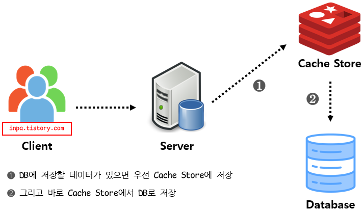

작심삼칩 프로젝트의 RefreshToken과 이메일 인증 번호를 RDB가 아닌 Redis에 저장하여 관리하는 방법으로 구현해 보려고 합니다. 

RefreshToken과 이메일 인증 번호 데이터들은 일정 시간 이후에 만료되어야 한다는 특징을 가지고 있습니다. 해당 데이터들을 RDB에 저장한다면 스케줄러를 사용하여 주기적으로 만료된 RefreshToken, 인증 번호를 만료 처리하거나 제거해야 하는 불편함이 존재합니다. Redis는 기본적으로 데이터의 유효 시간을 지정할 수 있고 데이터를 RAM에 저장하므로 빠른 엑세스 속도를 보장받을 수 있기 때문에 Redis를 사용하는게 적합하다고 생각했습니다. 

그리고 데이터의 유효 시간 지정 외에도 추후에 자주 조회되는 데이터, 결과값이 자주 변동되지 않고 일정한 데이터 등을 캐싱해두는 캐싱 전략을 적용해 볼 예정입니다.

  

## **Redis(Remote Dictionary Server)**

Redis는 **Remote**에 위치하고, **Dictionary(key-value)** 구조의 데이터를 저장할 수 있는  In-Memory DB입니다. 사용 용도로는 대표적으로 캐시 또는 세션 클러스터링 목적으로 사용되는데, 작심삼칩 프로젝트는 서버가 1대로 운영되기 때문에 캐시 용도로 Redis를 사용하려고 합니다. 

또한 Redis는 key-value 구조로 단순하게 데이터를 저장하고, 메모리에서 데이터를 처리하기 때문에 RDB 보다 데이터의 읽기 및 쓰기 작업 속도가 매우 빨라 캐시로 사용하기 좋습니다. 

 

**특징** 

* NoSQL(비관계형 데이터베이스)로 분류되며 **In-Memory** 기반의 **key-value 구조**를 가진 DBMS
* 메모리에 데이터를 저장하기 때문에 저장, 조회 작업이 매우 빠르다.
* **다양한 자료구조**를 지원한다. (Strings, Set, Sorted-Set, Hashes, List ...)
* 메모리 기반이지만 **영속적인 데이터 보존**이 가능하다. (메모리는 원래 휘발성)
* Redis는 싱글 스레드이지만 자료구조 자체가 Atomic하기 때문에 Race Condition에서 유리하다.

  

## **캐싱 전략(Caching Strategies)**

Redis를 캐시로 사용할 때, 어떻게 배치하는지가 시스템의 성능에 큰 영향을 끼칩니다. 이를 캐싱 전략이라고 하며, 데이터의 유형과 해당 데이터에 대한 엑세스 패턴을 잘 고려해서 선택해야 합니다. 

이전까지는 프로젝트에서 RDBMS만을 사용하여 데이터 저장과 조회를 처리했기 때문에 **데이터 정합성** 문제가 발생하지 않았지만 캐시를 사용한다면 데이터 정합성 문제가 발생할 수 있습니다. 

데이터 정합성이란, 어느 한 데이터가 캐시와 DB 두 곳에서 같은 데이터임에도 불구하고 데이터 정보 값이 서로 다른 현상을 말합니다. 

예를 들어, 캐시에는 특정 게시글의 좋아요 갯수가 10개로 저장되어 있는데 DB에는 7개로 저장 되어있을 경우 정보 불일치가 발생합니다. 

따라서 적절한 **캐시 읽기 전략**과 **캐시 쓰기 전략**을 선택해야 합니다.

 

### **캐시 읽기 전략(Read Cache Strategy)**

#### **Look Aside(Lazy Loading)**

Redis를 캐시로 사용할 때, 가장 일반적으로 사용하는 방법입니다. 

데이터를 찾을때 먼저 캐시에 데이터가 존재하는지 확인하는 전략입니다. 
Redis에 찾는 key가 있으면(Cache Hit) 캐시에서 데이터를 조회하는 작업을 반복하고, 만약 Redis에 찾는 Key가 없다면(Cache Miss) 애플리케이션은 DB에 접근해서 데이터를 직접 조회하여 다시 Redis에 저장하는 과정을 거쳐야 합니다. 

**Cache Hit** 
 

**Cache Miss** 
 

따라서 캐시는 찾는 데이터가 없을 때에만 입력되기 때문에 이를 **Lazy Loading**이라고도 불립니다. 이 구조는 Redis가 다운되더라도 바로 장애로 이어지지 않고, DB에서 데이터를 가지고 올 수 있습니다. 대신 캐시에 붙어있던 connection이 많았다면, connection이 모두 DB로 붙기 때문에 많은 부하가 몰릴 수 있습니다. 

캐시를 새로 투입하거나, 캐시에서 찾는 데이터가 DB에만 저장되어 있다면 처음에 Cache Miss가 많이 발생해서 성능의 저하가 올 수 있습니다. 이럴 때에는 미리 DB에서 캐시로 데이터를 넣어주는 **Cache Warming** 작업을 할 수 있습니다. 

작심삼침 프로젝트를 예시로 한다면, 배포 전에 작심 그룹들에 대한 정보를 미리 DB에서 캐시로 넣어주는 작업을 하면 되는 것입니다. 

**특징** 

* 찾는 데이터가 캐시에 없으면 DB에서 조회.
* 반복적인 읽기가 많은 호출에 적합.
* 캐시와 DB가 분리되어 가용되기 때문에 원하는 데이터만 별도로 구성하여 캐시에 저장.

 

#### **Read Through**

캐시에서만 데이터를 조회하는 전략입니다. 
데이터 조회를 전적으로 캐시에만 의존하므로, redis가 다운될 경우 서비스 이용에 차질이 생길 수 있습니다. 또한 데이터가 캐시에 존재하지 않을 경우, 캐시에서 DB에 데이터를 조회하여 자체 업데이트 후에 데이터를 반환해 주기 때문에 데이터를 조회하는 전체적인 속도가 느립니다. 

 

Read Through 방식은 Look Aside 방식과 비슷하지만, **Cache Store에 저장하는 주체가 Server이냐 또는 Data Store 자체**이냐에서 차이점이 있습니다. 그리고 이 전략 또한 서비스 운영 초반에 Cache Warming을 수행하는 것이 좋습니다.

  

### **캐시 쓰기 전략(Write Cache Strategy)**

#### **Write Around**

DB에만 데이터를 저장하는 전략입니다. 
Cache miss가 발생하는 경우에만 캐시에 데이터를 저장합니다. 

 

Cache Miss가 발생하기 전에 DB에 저장된 데이터가 수정되었을 때, 사용자가 조회하는 캐시와 DB 간의 데이터 불일치가 발생하게 되는 문제점이 있습니다. 

따라서 DB에 저장된 데이터가 수정, 삭제될 때마다, 캐시 또한 삭제하거나 변경해야 합니다. 

Write Around 전략은 데이터가 한 번 쓰여지고, 덜 자주 읽히거나 읽지 않는 상황에서 좋은 성능을 제공합니다.

 

#### **Write Through**

데이터를 저장할 때, 먼저 캐시에 저장한 다음에 바로 DB에 저장하는 전략입니다. 

 

캐시와 DB가 항상 동기화 되어 있어 항상 **데이터를 최신 상태로 유지**한다는 장점이 있지만, 데이터를 저장할때마다 2단계 과정을 거치기 때문에 상대적으로 느리며, 무조건 캐시에 데이터를 저장하기 때문에 캐시에 데이터를 저장만 하고 사용하지 않을 가능성이 있어서 **리소스 낭비**가 발생할 수 있습니다.

  

## **마치며**

작심삼칩 프로젝트에서는 우선 RefreshToken과 이메일 인증 기능 데이터를 Redis에만 저장하는 방식으로 구현을 해보려고합니다. 

추후에는 위에 전략들을 프로젝트 상황에 맞게 사용해보겠습니다.  