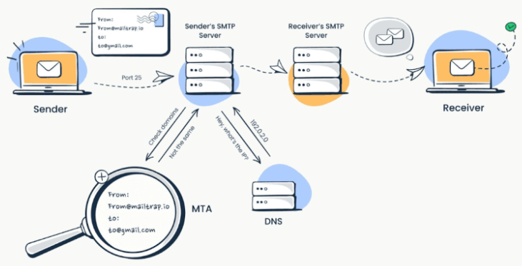
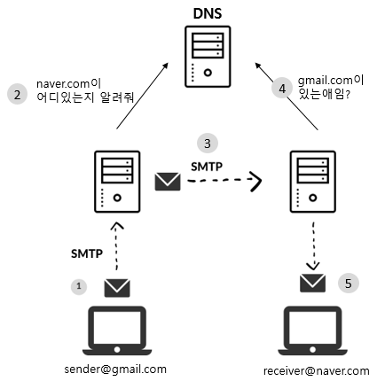

---
title: "[Network] SMTP란"
excerpt: "SMTP(Simple Mail Transfer Protocol)에 대해서 알아보자."

categories:
  - Network
tags:
  - [Network, Protocol]

published: true

permalink: /network/smtp/

toc: true
toc_sticky: true

date: 2023-09-28
last_modified_at: 2023-09-28

--- 

작심삼칩 프로젝트 진행 중, 이메일 인증 기능을 구현하게 되어서 기능 구현 전에 먼저 SMTP에 대해 알아보도록 하겠습니다.

  

## **SMTP(Simple Mail Transfer Protocol)**

SMTP는 **인터넷에서 이메일을 보낼 때 사용되는 프로토콜**입니다. 작성한 이메일은 SMTP를 통해서 상대방의 메일함까지 전송됩니다. 

이메일은 편지에 비유할 수 있고, SMTP는 편지를 전송하는 과정에서 사용되는 기술을 의미합니다. 

 

### **SMTP 서버**

SMTP 프로토콜에 따라서 **이메일 전달 과정을 처리해 주는 이메일 서버**가 SMTP 서버입니다.

 
(출처: <a href="https://mailtrap.io">https://mailtrap.io</a>) 

위의 그림과 같이 SMTP 서버는 우체국과 같은 역할을 수행합니다. 
발신자로부터 이메일을 수신하고, 발신자 주소를 확인하고, 수신자 주소를 인증하고, 수신자의 메일 서버로 이메일을 전송합니다. 

이메일을 보내는 sender@gmail.com은 **SMTP 클라이언트**, gmail.com 주소는 이메일을 송수신하는 **SMTP 서버**로 불립니다.

 

### **SMTP & DNS**

 

SMTP를 사용해서 이메일을 전송할 때, DNS를 거치게 됩니다. 
발신자가 SMTP 서버로 접근을 하게 되면, SMTP 서버는 DNS를 통해 받는 사람의 주소를 알 수 있습니다.

  

## **SMTP 서버 구성 요소**

 

**MUA(Mail User Agent)** 
사용자가 이메일을 작성하고 내려 받을 수 있게 하는 프로그램입니다. 예를 들어 Gmail, Outlook express 등이 여기에 해당 됩니다. 

**MSA(Mail Submission Agent)** 
MUA에서 이메일을 최초로 전달 받으며 MTA로 전달합니다. 

**MTA(Mail Transfer Agent)** 
MTA는 MSA 또는 다른 메일 서버의 MTA와 통신하여 이메일 전달을 담당합니다. 
발신자의 메일 서버에서 수신자의 메일 서버로 이메일을 전송하기 위해 SMTP 명령어를 사용합니다. 

**MDA(Mail Delivery Agent)** 
MTA로부터 받은 이메일을 최종적으로 수신자의 메일함에 넣어놓는 역할을 합니다.

  

SMTP의 개념과 기본 작동 방식에 대해 알아보았습니다. 다음에는 Spring Boot에서 이메일 인증 기능을 구현해보도록 하겠습니다.

참고자료 
<a href="https://www.ranktracker.com/ko/blog/what-is-smtp-server-an-in-depth-guide-to-email-delivery-in-2023/">https://www.ranktracker.com/ko/blog/what-is-smtp-server-an-in-depth-guide-to-email-delivery-in-2023/</a> 
<a href="https://nordvpn.com/ko/blog/smtp-protocol/">https://nordvpn.com/ko/blog/smtp-protocol/</a> 
<a href="https://mutpp.tistory.com/4">https://mutpp.tistory.com/4</a>