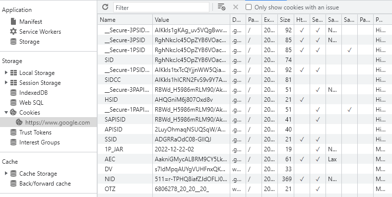
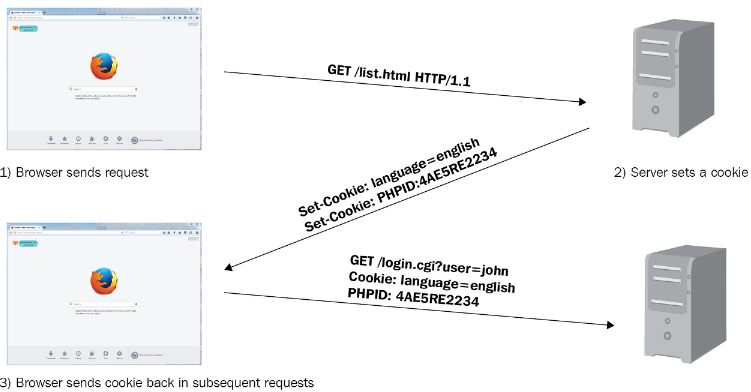
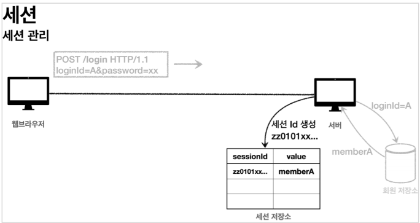
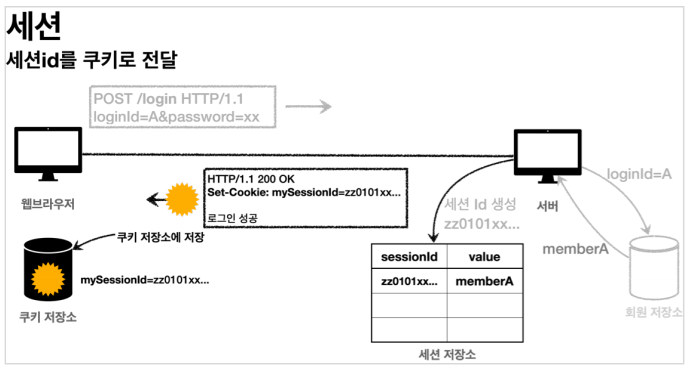
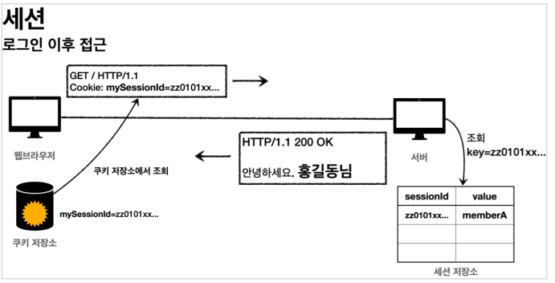
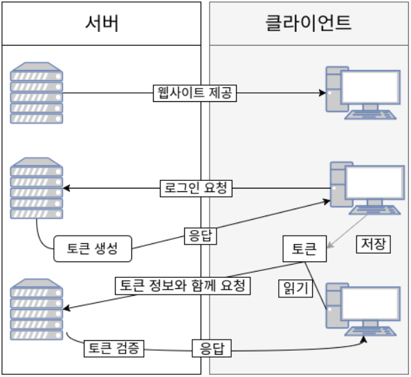

---
title: "[Web] Web 인증(Authentication) 방식 종류"
excerpt: "Web에서 사용되는 인증 방식 종류들에 대해 알아보자"

categories:
  - Web
tags:
  - [Web, Authentication]

permalink: /web/web-authentication/

toc: true
toc_sticky: true

date: 2022-12-22
last_modified_at: 2022-12-22
--- 

## **인증 방식 종류(Cookie, Session, Token)**
보통 서버가 클라이언트 인증을 확인하는 방식은 대표적으로 **쿠키, 세션, 토큰 3가지 방식**이 있다.  

 **Cookie 인증**   
쿠키는 **Key-Value 형식의 문자열** 덩어리다. 
클라이언트가 어떠한 웹 사이트를 방문할 경우, 그 사이트가 사용하고 있는 서버를 통해 **클라이언트의 브라우저에 설치되는 작은 기록 정보 파일**이다. 
각 사용자마다의 브라우저에 정보를 저장하여 고유 정보 식별이 가능하다.

 

 **Cookie 인증 방식**  

1. 브라우저(클라이언트)가 서버에 요청(접속)을 보낸다. 
2. 서버는 클라이언트의 요청에 대한 응답을 작성할 때, 클라이언트 측에 저장하고 싶은 정보를 응답 헤더의 Set-Cookie에 담는다. 
3. 이후 해당 클라이언트는 요청을 보낼 때마다, 매번 저장된 쿠키를 오쳥 헤더의 Cookie에 담아 보낸다. 서버는 쿠키에 담긴 정보를 바탕으로 해당 요청의 클라이언트가 누군지 식별하거나 정보를 바탕으로 추천 광고를 띄우거나 한다.  

 **Cookie 인증 방식의 단점** 
* 가장 큰 단점은 **보안에 취약**하다는 점이다. 
  요청 시 쿠키의 값을 그대로 보내기 때문에 유출 및 조작 당할 위험이 존재한다.
* 쿠키에는 **용량 제한**이 있어 많은 정보를 담을 수 없다.
* 웹 브라우저마다 쿠키에 대한 지원 형태가 다르기 때문에 **브라우저간 공유가 불가능**하다.
* 쿠키의 사이즈가 커질수록 네트워크에 부하가 심해진다.
  

 **Session 인증**   
이러한 쿠키의 보안적인 이슈 때문에, 세션은 비밀번호 등 클라이언트의 민감한 인증 정보를 브라우저가 아닌 **서버 측에 저장하고 관리**한다. 
서버의 메모리에 저장하기도 하고, 서버의 로컬 파일이나 데이터베이스에 저장하기도 한다.  

 **Session 인증 방식** 

 1. 유저가 웹 사이트에서 로그인하면 세션이 서버 메모리(혹은 데이터베이스) 상에 저장된다. 
  이때, 세션을 식별하기 위한 Session Id를 기준으로 정보를 저장한다. 

 2. 서버에서 브라우저의 쿠키에 Session Id를 저장한다.

 3. 쿠키에 정보가 담겨있기 때문에 브라우저는 해당 사이트에 대한 모든 Request에 Session Id를 쿠키에 담아 전송한다.
 4. 서버는 클라이언트가 보낸 Session Id와 서버 메모리로 관리하고 있는 Session Id를 비교하여 인증을 수행한다.

 

 **Session 인증 방식의 단점** 
* 쿠키를 포함한 요청이 외부에 노출되더라도 세션 Id 자체는 유의미한 개인정보를 담고 있지 않는다. 
  그러나 해커가 세션 Id를 탈취하여 클라이언트인척 위장할 수 있다.
* 서버에서 세션 저장소를 사용하므로 요청이 많아지면 서버에 부하가 심해진다.
  

 **Token 인증**   
토큰 기반 인증 시스템은 클라이언트가 서버에 접속을 하면 서버에서 해당 클라이언트에게 인증되었다는 의미로 **'토큰'을 부여**한다. 

이 토큰은 **유일**하며 토큰을 발급 받은 클라이언트는 또 다시 서버에 요청을 보낼 때 요청 헤더에 토큰을 심어서 보낸다.  

그러면 서버에서는 클라이언트로부터 받은 토큰을 서버에서 제공한 토큰과의 일치 여부를 체크하여 인증 과정을 처리하게 된다.  

기존의 세션 기반 인증은 서버가 파일이나 데이터베이스에 세션 정보를 가지고 있어야 하고, 이를 조회하는 과정이 필요하기 때문에 많은 오버헤드가 발생한다. 

하지만 토큰은 세션과는 달리 서버가 아닌 클라이언트에 저장되기 때문에 메모리나 스토리지 등을 통해 세션을 관리했던 서버의 부담을 덜 수 있다. 

토큰 자체에 데이터가 들어있기 때문에 클라이언트에서 받아 위조되었는지 판별만 하면 된다.  

 **Token 인증 방식**   

1. 사용자가 아이디와 비밀번호로 로그인 한다.
2. 서버 측에서 사용자(클라이언트)에게 **유일한 토큰을 발급**한다.
3. 클라이언트는 서버 측에서 전달 받은 토큰을 쿠키나 스토리지에 저장해 두고, 서버에 요청을 할 때마다 해당 토큰을 HTTP 요청 헤더에 포함시켜 전달한다.
4. 서버는 전달받은 토큰을 검증하고 요청에 응답한다.  토큰에는 요청한 사람의 정보가 담겨있기에 서버는 DB를 조회하지 않고 누가 요청했는지 알 수 있다.
  

 **Token 인증 방식의 단점** 

* 쿠키/세션과 다르게 토큰 자체의 데이터가 길어, 인증 요청이 많아질수록 네트워크 부하가 심해질 수 있다.
* Payload 자체는 암호화 되지 않기 때문에 유저의 **중요한 정보는 담을 수 없다.**
* 토큰을 탈취당하면 대처하기 어렵다. (따라서 사용 기간 제한을 설정하는 식으로 극복한다.)

 

참고 자료 
<a href="https://inpa.tistory.com/entry/WEB-%F0%9F%93%9A-JWTjson-web-token-%EB%9E%80-%F0%9F%92%AF-%EC%A0%95%EB%A6%AC">https://inpa.tistory.com/entry/WEB-%F0%9F%93%9A-JWTjson-web-token-%EB%9E%80-%F0%9F%92%AF-%EC%A0%95%EB%A6%AC</a> 
<a href="https://velog.io/@rlfrkdms1/%EC%BF%A0%ED%82%A4%EC%99%80-%EC%84%B8%EC%85%98%EC%9D%98-%EB%8F%99%EC%9E%91-%EC%9B%90%EB%A6%AC%EC%99%80-%EC%84%B8%EC%85%98%EC%9D%98-%EA%B5%AC%EC%A1%B0">https://velog.io/@rlfrkdms1/%EC%BF%A0%ED%82%A4%EC%99%80-%EC%84%B8%EC%85%98%EC%9D%98-%EB%8F%99%EC%9E%91-%EC%9B%90%EB%A6%AC%EC%99%80-%EC%84%B8%EC%85%98%EC%9D%98-%EA%B5%AC%EC%A1%B0</a> 