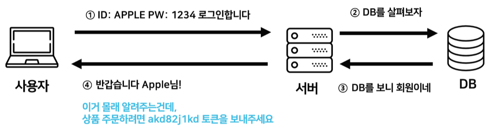
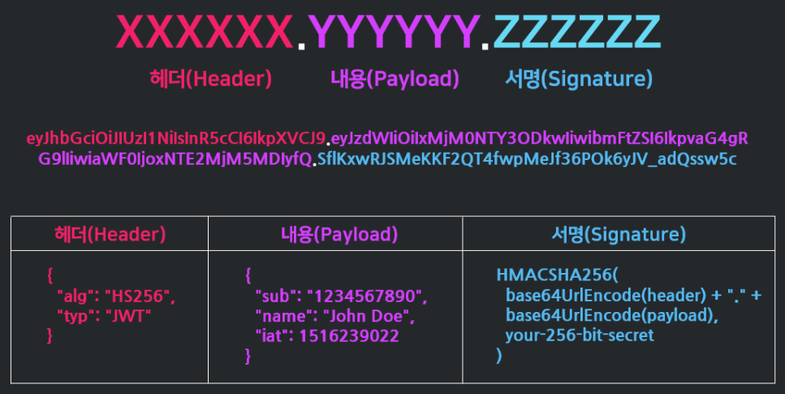
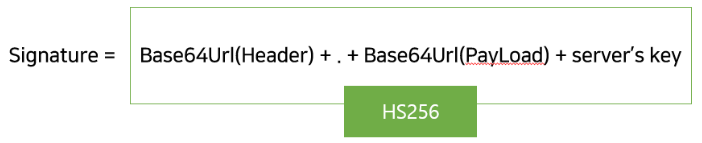

---
title: "[Web] JWT(JSON Web Token) 토큰 인증"
excerpt: "JWT 토큰 인증 방식에 대해서 알아보자"

categories:
  - Web
tags:
  - [Web, JWT]

permalink: /web/jwt/

toc: true
toc_sticky: true

date: 2022-12-22
last_modified_at: 2022-12-22
--- 

## **JWT(JSON Web Token)**  
<p align="center"></p>

JWT(JSON Web Token)란 **인증에 필요한 정보들을 암호화시킨 JSON 토큰**을 의미한다.<br>

그리고 JWT 기반 인증은 JWT 토큰(Access Token)을 HTTP 헤더에 실어 서버가 클라이언트를 식별하는 방식이다.<br><br>

JWT는 JSON 데이터를 Base64 URL-safe Encode를 통해 인코딩하여 직렬화한 것이며, 토큰 내부에는 위변조 방지를 위해 개인키를 통한 전자서명도 들어있다.<br>

따라서 사용자는 JWT를 서버에 전송하면 서버는 서명을 검증하는 과정을 거치게 되며, 검증이 완료되면 요청한 응답을 돌려준다.<br>  
```
Base64 URL-safe Encode 는 일반적인 Base64 Encode 에서 URL 에서 오류없이 사용하도록 '+', '/' 를 각각 '-', '_' 로 표현한 것이다.
```
<br>

## **JWT 구조**

<br>JWT는 **`.`** 을 구분자로 세 가지 문자열의 조합이다.<br>
**`.`** 을 기준으로 좌측부터 Header, Payload, Signature를 의미한다.
<p align="center"></p>

<span style="font-size:140%"> **Header** </span><br>

토큰의 타입(기본값으로는 JWT)과 JWT를 서명하는데 사용한 알고리즘을 명시한다.<br>
대표적으로 사용되는 알고리즘에는 `HMAC`, `SHA256`, `RSA`, `HS256 or RS256` 등이 있다.<br><br>

<span style="font-size:140%"> **Payload** </span><br>

서버에서 첨부한 사용자 권한 정보와 데이터가 담겨있다.<br>

여기에 담은 정보의 한 조각을 Claim이라고 부르고, `name/value`의 한 쌍으로 이루어져 있다.<br>
토큰에는 여러개의 클레임을 넣을 수 있고, 클레임의 종류는 크게 세 분류로 나뉘어져 있다.<br><br>

<span style="font-size:120%"> **등록된(Registered) 클레임** </span><br>

등록된 클레임들은 서비스에서 필요한 정보들이 아닌, 토큰에 대한 정보들을 담기 위하여 이름이 이미 정해진 클레임들이다.<br>
등록된 클레임의 사용은 모두 선택적(Optional)이며, 이에 포함된 클레임 이름들은 다음과 같다.
* `Issuer(iss)` : 토큰 발급자
* `Subject(sub)` : 토큰 제목
* `Audience(aud)` : 토큰 대상자
* `Expiration time(exp)` : 토큰의 만료 시간, 시간은 NumericDate 형식이어야 한다. (예 : 1480849147370)
* `Not Before(nbf` : 토큰의 활성 날짜와 비슷한 개념이다. 이 날짜가 지나기 전까지는 토큰이 처리되지 않는다.
* `Issued at(iat)` : 토큰이 발급된 시간
* `jti` : JWT의 고유 식별자로서, 주로 중복적인 처리를 방지하기 위하여 사용된다. 일회용 토큰에 사용하면 유용하다.

<br>

<span style="font-size:120%"> **공개(Public) 클레임** </span><br>

공개 클레임은 사용자 정의 클레임으로 공개용 정보를 위해 사용되며 충돌 방지를 위해 URI 포맷을 이용한다.<br>
```c
{
	"https://naver.com": true
}
```
<br>

<span style="font-size:120%"> **비공개(Private) 클레임** </span><br>

사용자 정의 클레임으로 서버와 클라이언트 사이에 임의로 지정한 정보를 저장한다.<br>
```c
  "username": "sun"
```

<br>

<span style="font-size:140%"> **Signature** </span><br>

서명의 구조는 (Header + Payload)와 서버가 갖고 있는 유일한 key 값을 합친 것을 헤더에서 정의한 알고리즘으로 암호화한다.<br>

서버에서 토큰의 정보가 서버로부터 생성된 것인지 증명하기 위해 사용된다.<br>
<p align="center"></p>
<hr/>
참고 자료<br>

<a href="https://inpa.tistory.com/entry/WEB-%F0%9F%93%9A-JWTjson-web-token-%EB%9E%80-%F0%9F%92%AF-%EC%A0%95%EB%A6%AC">https://inpa.tistory.com/entry</a><br>
<a href="https://velopert.com/2389">https://velopert.com/2389</a>