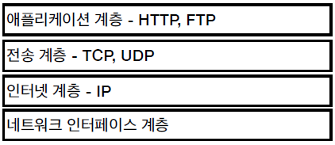

---
title: "[Web] 인터넷 네트워크"
excerpt: "인터넷 네트워크에 대해서 알아보자"

categories:
  - Web
tags:
  - [Web, Network]

permalink: /web/internet-network/

toc: true
toc_sticky: true

date: 2023-01-04
last_modified_at: 2023-01-04
--- 

## **인터넷 통신**

**인터넷에서 컴퓨터 둘은 어떻게 통신할까?** 

클라이언트와 서버가 바로 옆에 붙어있다면 케이블을 연결해서 통신하면 된다.
 
 
통신하려는 PC가 다른 도시 또는 나라에 있다면 인터넷을 통해 통신해야한다.
  

## **IP(인터넷 프로토콜)**

**IP 주소 부여** 

클라이언트인 컴퓨터와 통신하려는 컴퓨터에 IP 주소가 있어야 한다.
 

**IP 역할** 

* 지정한 IP 주소(IP Address)에 데이터 전달
* 패킷(Packet)이라는 통신 단위로 데이터 전달

**IP 패킷 정보** 
출발지 IP, 목적지 IP, 전송할 데이터 
 

**클라이언트 패킷 전달** 

패킷을 인터넷 망에 전송시키면 IP 프로토콜에 의해서 목적지로 도착하게 된다.

 

**서버 패킷 전달** 

서버에서 패킷을 받으면 똑같이 패킷을 만들어서 클라이언트에게 전송한다.

 

**IP 프로토콜의 한계** 

IP 프로토콜만으로는 아래와 같은 상황에서 해결할 수 있는 방법이 없다. 

**비연결성** 
* 패킷을 받을 대상이 없거나 서비스 불능 상태여도 패킷 전송 
  
 

**비신뢰성** 
* 중간에 패킷이 사라지면? 
  
 

* 패킷이 순서대로 안오면? 

 

**프로그램 구분** 
* 같은 IP를 사용하는 서버에서 통신하는 애플리케이션이 둘 이상이면 어떻게 구분할까?  

## **TCP, UDP**

**인터넷 프로토콜 스택의 4계층** 
 

**프로토콜 계층** 
전송하려는 데이터에 TCP 정보를 씌우고, 또 IP와 관련된 정보를 씌워 IP 패킷을 생성한다. 
 

**TCP/IP 패킷** 
TCP는 출발지와 목적지 PORT, 전송 제어, 순서에 대한 정보를 가지고 있어 IP만으로 해결이 안됐던 문제들이 해결된다. 
 

**TCP 특징** 

**전송 제어 프로토콜(Transmission Control Protocol)**
* 연결지향 - TCP 3 way handshake(가상 연결)
  * 클라이언트와 서버를 연결한 뒤에 데이터를 보낸다.
* 데이터 전달 보증
  * 패킷이 중간에 누락되면 알 수 있다.
* 순서 보장

**TCP 3 way handshake** 
1. 클라이언트가 서버에 접속 요청
2. 서버가 요청을 수락하고 서버도 클라이언트에게 접속 요청
3. 클라이언트가 서버의 요청을 수락하고 데이터 전송

**실제로 연결된 것이 아닌 논리적으로만 연결된 것이다.** 
 

**순서 보장** 
 

**UDP 특징** 

**사용자 데이터그램 프로토콜(User Datagram Protocol)**
* 하얀 도화지에 비유(기능이 거의 없음)
* 연결지향, 데이터 전달 보증, 순서 보장 X
* 데이터 전달 및 순서가 보장되지 않지만, 단순하고 빠르다.
* IP와 거의 같다. + PORT + 체크섬 정도만 추가, 애플리케이션에서 추가 작업이 필요하다.
  

## **PORT**

**한번에 둘 이상 연결해야 한다면?** 

* 클라이언트가 PC가 여러개의 프로그램을 실행하면 여러개의 서버와 통신해야 한다.
* 서버에서 클라이언트로 패킷을 전송할 텐데 이 패킷이 게임에서 필요한 패킷인지, 화상 통화에서 필요한 패킷인지, 웹 브라우저에서 필요한 패킷인지 알 수 없다.
  
 

**PORT란** 
IP는 목적지 서버를 찾는 것, 서버 안에서 돌아가는 애플리케이션을 구분하는 것이 **PORT**이다.
* 0 ~ 65535 할당 가능
* 0 ~ 1023 : 잘 알려진 포트, 사용하지 않는 것이 좋다.
  * FTP - 20, 21
  * TELNET - 23
  * HTTP - 80
  * HTTPS - 443
  
 

**같은 IP 내에서 프로세스 구분** 

프로세스마다 포트번호로 구분하여 어느 프로세스로 패킷을 전달할지 구분한다. 
1. 목적지의 IP와 PORT 번호 정보를 가지고 있는 웹 브라우저 요청 패킷을 서버에게 보낸다.
2. 서버가 받은 패킷의 출발지 IP와 PORT 번호로 응답 패킷을 보낸다.

  

## **DNS**

**도메인 네임 시스템(Domain Name System)** 

* 전화번호부
* 도메인 명을 IP 주소로 변환

IP는 기억하기 어렵고 변경될 수 있다. 
 
DNS 서버에 도메인 명과 IP를 등록해 놓고 DNS 서버에서 도메인 명으로 IP를 가져올 수 있다.
 

참고 자료 
<a href="https://www.inflearn.com/course/http-%EC%9B%B9-%EB%84%A4%ED%8A%B8%EC%9B%8C%ED%81%AC/dashboard">https://www.inflearn.com/course/http-%EC%9B%B9-%EB%84%A4%ED%8A%B8%EC%9B%8C%ED%81%AC/dashboard</a> 