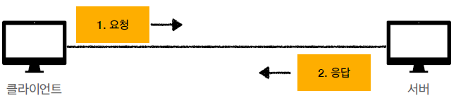
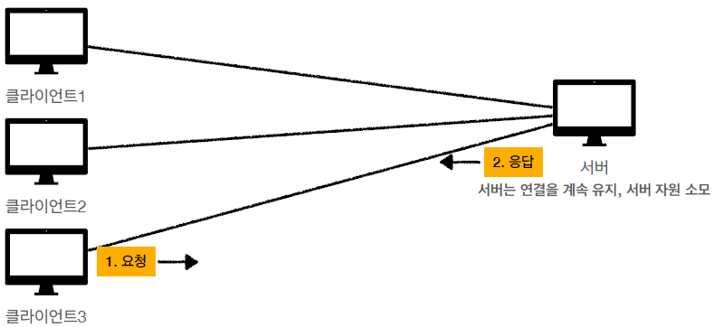
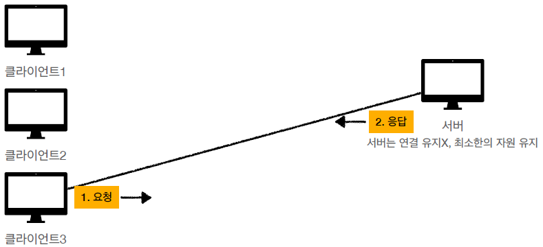
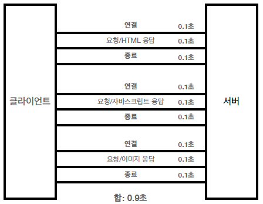
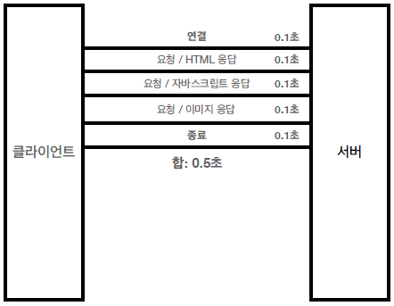
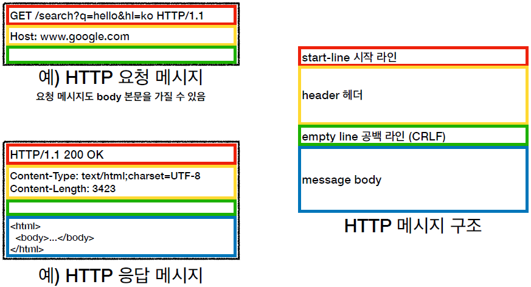
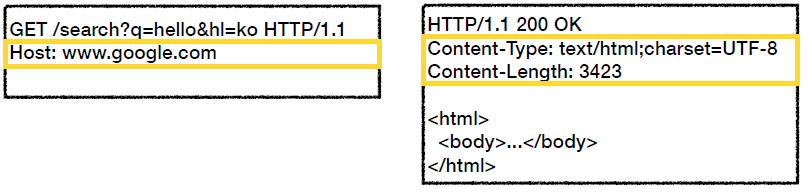
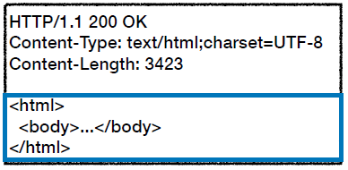

---
title: "[Web] HTTP 기본"
excerpt: "HTTP에 대해서 알아보자"

categories:
  - Web
tags:
  - [Web, HTTP]

permalink: /web/http/

toc: true
toc_sticky: true

date: 2023-01-05
last_modified_at: 2023-01-05
--- 

## **HTTP(Hyper Text Transfer Protocol)**

요즘은 모든 것을 HTTP 메시지에 담아서 전송한다.

* HTML, Text
* Image, 음성, 영상, 파일
* JSON, XML(API)

거의 모든 형태의 데이터들을 전송 가능하고, 서버간에 데이터를 주고 받을 때도 대부분 HTTP를 사용한다. 

**기반 프로토콜** 

**TCP** : `HTTP/1.1`, `HTTP/2` 
**UDP** : `HTTP/3` 

현재는 `HTTP/1.1`을 주로 사용하지만, `HTTP/2`와 `HTTP/3`의 사용률이 점점 증가하고 있다. 

**HTTP 특징** 

* 클라이언트 서버 구조
* 무상태 프로토콜(Stateless)
* HTTP 메시지
* 단순함, 확장 가능

 

## **클라이언트 서버 구조**

* Request Response 구조
* 클라이언트는 서버에 요청을 보내고, 응답을 대기한다.
* 서버가 요청에 대한 결과를 만들어서 응답한다.
  
  

## **무상태 프로토콜(Stateless)**

* 서버가 클라이언트의 상태를 보존하지 않는다.
* 장점 : 서버 확장성이 높다.
* 단점 : 클라이언트가 추가 데이터 전송 

 **Stateful** 

**세션이 종료될 때까지, 클라이언트의 세션 정보를 저장하는 네트워크 프로토콜**이다. 

**예제** 
  * TCP 프로토콜
    * TCP는 클라이언트와 서버간 3-way handshaking(연결 확정, 데이터 전송, 연결 종결)로 이루어져 있다.
    * 클라이언트와 서버간 연결 확정 후, 데이터를 전송하고, 데이터 전송이 끝나면 연결이 종결된다.
  * 온라인 뱅킹
    * 은행(서버)은 고객(클라이언트)의 인증 정보(세션 상태)와 결제 내역(세션 정보)을 가지고 있다. 
  
**장점**
* 서버는 클라이언트의 세션 정보를 저장하므로, 갑자기 통신이 중단되더라도 중단된 곳부터 다시 시작할 수 있다.
  
**단점**

* 확장성이 좋지 않다.
  * 클라이언트의 세션 정보가 새로 scale out 된 서버에 저장 되어 있지 않다.
  * 따라서, scale out 시, 클라이언트의 세션 정보를 새로운 서버에 옮겨주는 등의 부수적인 관리가 요구되므로, 확장성이 좋지 않다.

 **Stateful 추가 예제** 

자전거를 구매하려는 `클라이언트 A`와 자전거를 판매하는 `서버 B`가 있다고 가정해보자. 
* A : 자전거를 구매하려고 합니다.
* B : 자전거 커스텀 재료를 골라주세요. (자전거를 구매하려는 것을 기억한다.)
* A : 휠과 핸들은 검정색, 바디와 안장은 흰색으로 해주세요.
* B : 배송은 어디로 해드릴까요? (자전거를 구매하려는 것을 기억하고 있다.)
* A : 집으로 보내주세요.
* B : 결제는 무엇으로 해드릴까요? (자전거를 사려했다는 것, 커스텀 정보를 알고 있다.)
* A : 카드로 결제할게요.
* B : 결제 완료 되었습니다. (사용자가 요구했던 사항들을 모두 기억하고 있다.)

지극히 정상적인 대화로 보이며, 자전거를 판매하는 `서버 B`는 사용자의 이전 요청을 모두 기억하며 진행된다는 것을 알 수 있다. 

이것이 바로 `상태 유지(Stateful)`이다. 

만약, 대규모의 트래픽이 몰려들어서 서버를 긴급하게 늘렸다고 가정해보자. 
그러면, 판매자가 `서버 B`가 아닌 증가된 어떤 `서버 C`가 될 수도 있다. 

* A : 자전거를 구매하려고 합니다.
* B : 자전거 커스텀 재료를 골라주세요.
* A : 휠과 핸들은 검정색, 바디와 안장은 흰색으로 해주세요.
* B : 예?
* A : 집으로 보내주세요.
* B : 예?
* A : 카드로 결제할게요.
* B : 예?

**이게 바로 상태 유지의 문제이다. 이를 해결하기 위해 무상태(Stateless)가 등장한다.**

 

**Stateless** 

**서버가 클라이언트의 세션 상태 및 세션 정보를 저장하지 않는 네트워크 프로토콜**이다. 
* 즉, 요청에 대한 응답만 처리하는 방식이다.
* 각 통신은 선행되거나 후속으로 따라오는 통신과 관련이 없다.
* 클라이언트가 송신하려 했던 모든 데이터가 서버쪽에 수신 되었는지 확인하지 않는다.
  
**예제** 
* UDP 프로토콜
  * UDP는 서버가 클라이언트의 세션 상태 및 세션 정보 없이, 요청에 대한 응답만을 수행하는 네트워크 프로토콜이다.
* 온라인 검색(검색창에 질문을 입려하고 엔터키를 누르는 형식)
  * 검색창에 질문을 입력하다가 요청이 중단되어도, 다시 검색하면 된다.

**장점** 
* 확장성이 좋다.
  * 서버가 클라이언트의 세션 상태 및 세션 정보를 저장하기 않기 때문에, 확장성이 좋다.

**단점** 
* 서버가 세션 상태 및 세션 정보를 저장하기 않기 때문에, 클라이언트 측에서 송신할 데이터의 양이 많아진다.

 **Stateless 추가 예제** 

동일하게, 자전거를 사려는 `클라이언트 A`와 자전거를 판매하는 `서버 B`가 있다고 가정하자.
* A : 자전거를 구매하려고 합니다.
* B : 자전거 커스텀 재료를 골라주세요. (서버는 아무것도 기억하지 않는다.)
* A : 자전거를 구매하려고 합니다. 휠과 핸들은 검정색, 바디와 안장은 흰색으로 해주세요.
* B : 배송은 어디로 해드릴까요? (서버는 아무것도 기억하지 않는다.)
* A : 자전거를 구매하려고 합니다. 휠과 핸들은 검정색, 바디와 안장은 흰색으로 해주세요. 집으로 보내주세요.
* B : 결제는 무엇으로 해드릴까요? (서버는 아무것도 기억하지 않는다.)
* A : 자전거를 구매하려고 합니다. 휠과 핸들은 검정색, 바디와 안장은 흰색으로 해주세요. 집으로 보내주세요. 카드로 결제할게요.
* B : 결제 완료 되었습니다. (**서버는 이제 요청을 처리한다.**)

**이전의 클라이언트의 요청을 유지하지 않는다**는게 핵심이다. 

무상태는 기존의 서버가 혼잡해져서 새로운 서버를 가져다 놓아도, 계속 일을 처리할 수 있다. 

단점은 클라이언트가 하고자 하는 최종 목적을 위해, 전달해야 하는 내용이 많아진다는 것이다.
  

## **비연결성(Connectionless)**

**연결을 유지하는 모델** 

 
사진과 같이 클라이언트 1과 클라이언트 2는 요청이 없지만 계속 연결이 유지되고 있다. 

연결이 유지되는 동안 연결을 유지하는 서버의 자원이 계속 소모된다.

**연결을 유지하지 않는 모델** 
 
클라이언트와 서버를 연결한 뒤, 요청을 하고 응답을 받는다. 그러면 볼일이 끝났으므로 즉시 연결을 끊어버린다. 

서버 입장에서는 자원을 현재 요청을 주고받을 때만 연결하고 그다음에는 끊어버려서 서버가 유지하는 자원을 최소한으로 줄인다. 

**비연결성** 

* HTTP는 기본이 연결을 유지하지 않는 모델이다.
* 일반적으로 초 단위 이하의 빠른 속도로 응답한다.
* 1시간 동안 수천명이 서비스를 사용해도 실제 서버에서 동시에 처리하는 요청은 수십개 이하로 매우 작다.
  * 예) 웹 브라우저에서 계속 연속해서 검색 버튼을 누르지는 않는다.
* 서버 자원을 매우 효율적으로 사용할 수 있다.

**비연결성의 한계와 극복** 

* TCP/IP 연결을 새로 맺어야 한다. - 3 way handshake 시간이 추가된다.
* 웹 브라우저로 사이트를 요청하면 HTML뿐만 아니라 자바스크립트, css, 추가 이미지 등 수많은 자원이 함께 다운로드된다.
* 지금은 HTTP 지속 연결(Persistent Connections)로 문제를 해결했다.
* HTTP/2, HTTP/3에서 더 많이 최적화되었다.

**HTTP 초기 - 연결, 종료 낭비** 
 
1. 클라이언트와 서버간의 TCP 연결
2. 요청 및 응답
3. 연결 종료

**HTTP 지속 연결(Persistent Connections)** 
 
1. 클라이언트와 서버간의 TCP 연결
2. 요청 및 응답
3. 내부 메커니즘에 의해서 연결을 지속한 뒤 종료

 

## **HTTP 메시지**

**HTTP 메시지 구조** 
 

**1. start-line** 
start-line은 `request-line`과 `status-line`으로 구분된다.  

**request-line**
 
 
* request-line = method SP(공백) request-target SP HTTP-version CRLF(엔터)
* HTTP 메서드 : `GET`
  * 종류 : GET, POST, PUT, DELETE...
  * 서버가 수행해야 할 동작 지정
* 요청 대상 : `/search?q=hello&hl=ko`
  * absolute-path[?query], 절대경로[?쿼리]
* HTTP version : `HTTP/1.1`
 

**status-line**
 
 

* status-line = HTTP-version SP status-code SP reason-phrase CRLF
* HTTP version : `HTTP/1.1`
* HTTP 상태 코드 : `200`
  * 요청 성공, 실패를 나타낸다.
  * 200 : 성공
  * 400 : 클라이언트 요청 오류
  * 500 : 서버 내부 오류
* 이유 문구 : `OK`
  * 사람이 이해할 수 있는 짧은 상태 코드 설명 글
 

**2. header** 
 

* header-field = field-name : OWS field-value OWS (OWS : 띄어쓰기 허용)
* field-name은 대소문자 구분 없음

**용도** 
* HTTP 전송에 필요한 모든 부가정보
  * 메시디 바디의 내용, 메시지 바디의 크기, 압축, 인증, 클라이언트 정보 등
  
**3. message body** 
 
**용도** 
* 실제 전송할 데이터
* HTML 문서, 이미지, 영상, JSON 등 byte로 표현할 수 있는 모든 데이터 전송 가능

참고 자료 
<a href="https://www.inflearn.com/course/http-%EC%9B%B9-%EB%84%A4%ED%8A%B8%EC%9B%8C%ED%81%AC/dashboard">https://www.inflearn.com/course/http-%EC%9B%B9-%EB%84%A4%ED%8A%B8%EC%9B%8C%ED%81%AC/dashboard</a> 
<a href="https://wooono.tistory.com/366">https://wooono.tistory.com/366</a