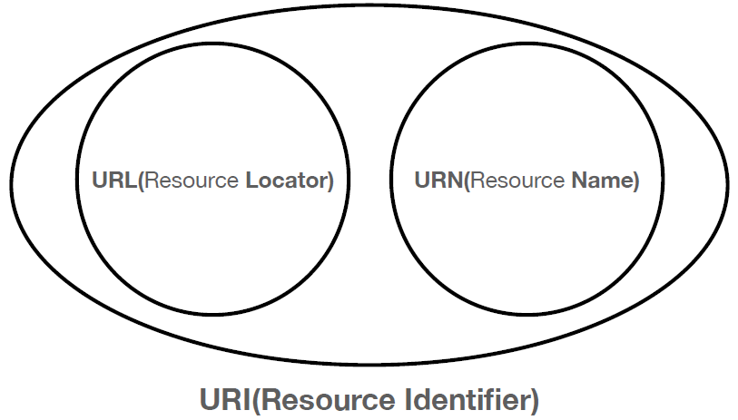
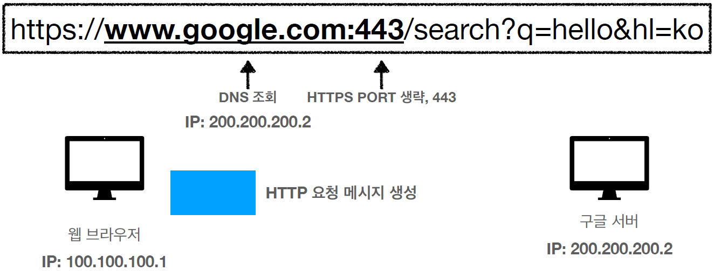
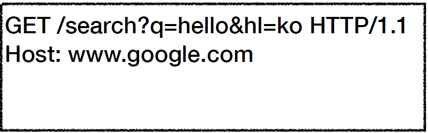
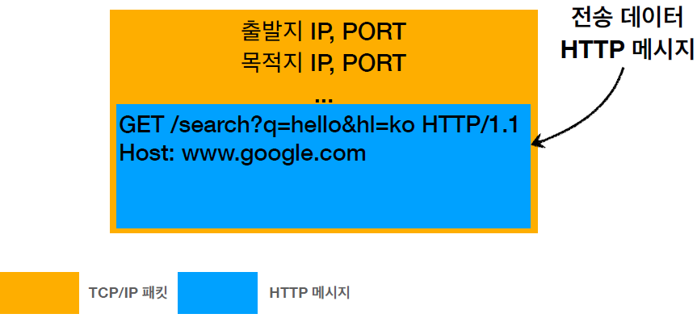
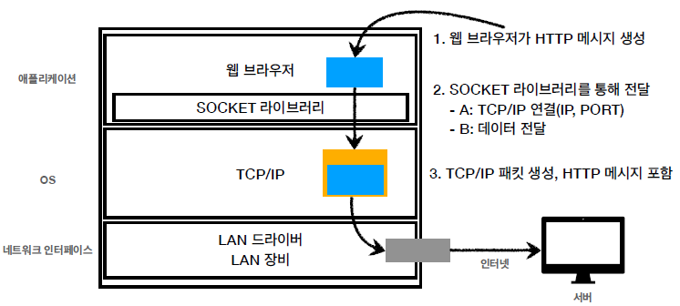
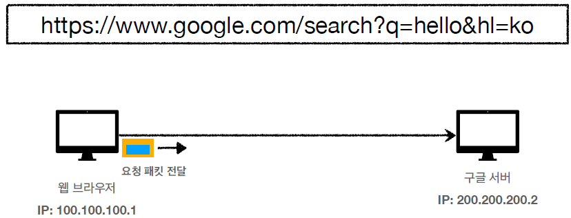
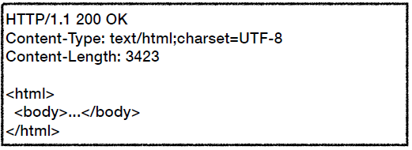
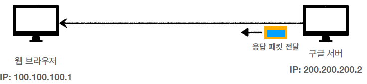
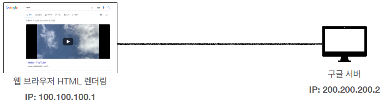

---
title: "[Web] URI와 웹 브라우저 요청 흐름"
excerpt: "URI와 웹 브라우저 요청 흐름에 대해서 알아보자"

categories:
  - Web
tags:
  - [Web]

permalink: /web/uri-and-browser-request-flow/

toc: true
toc_sticky: true

date: 2023-01-05
last_modified_at: 2023-01-05
--- 

## **URI(Uniform Resource Identifier)**

URI는 Locator, Name 또는 둘 다 추가로 분류될 수 있다. 
 

**URI 뜻** 

* Uniform : 리소스를 식별하는 통일된 방식
* Resource : 자원, URI로 식별할 수 있는 모든 것(제한 없음)
* Identifier : 다른 항목과 구분하는데 필요한 정보
  
**URL, URN** 

* URL - Locator : 리소스가 있는 위치를 지정
* URN - Name : 리소스에 이름을 부여
* 위치는 변할 수 있지만, 이름은 변하지 않는다.
* URN 이름만으로 실제 리소스를 찾을 수 있는 방법이 보편화 되지 않았다.

**URL 전체 문법** 

* scheme://[userinfo@]host[:port][/path][?query][#fragment]
* 예시 : https://www.google.com:443/search?q=hello&hl=ko
* 프로토콜 : `https`
* 호스트명 : `www.google.com`, 도메인 또는 IP 주소를 직접 사용 가능
* 포트 번호 : `443`, 접속 포트 번호
* 패스 : `/search`, 리소스 경로
* 쿼리 파라미터 : `q=hello&hl=ko`, key=value 형태

 

## **웹 브라우저 요청 흐름**

**1. DNS 서버에서 IP를 조회하여 IP와 포트 정보 찾기** 

DNS 서버에서 `www.google.com` 이름을 가진 IP를 조회하여 IP와 포트 정보를 찾아낸다. 
 

**2. HTTP 요청 메시지 생성** 
 

**3. 패킷 생성** 
 

**4. HTTP 메시지 전송** 

 
 
생성한 패킷을 인터넷 망으로 던진다. 그러면 수많은 인터넷 노드들을 통해서 `200.200.200.2` IP 주소에 전달 된다. 

**5. HTTP 응답 메시지 생성** 
 
서버에 요청 패킷이 도착하면 TCP/IP 패킷을 까서 버리고 HTTP 메시지를 통해 해석하여 데이터를 찾는다. 그 후에 HTTP 응답 메시지를 만든다. 

**6. 똑같이 패킷을 씌워서 응답 패킷 전송** 
 

**7. 전송 받은 HTTP 메시지의 HTML 데이터를 웹 브라우저가 렌더링** 
 

참고 자료 
<a href="https://www.inflearn.com/course/http-%EC%9B%B9-%EB%84%A4%ED%8A%B8%EC%9B%8C%ED%81%AC/dashboard">https://www.inflearn.com/course/http-%EC%9B%B9-%EB%84%A4%ED%8A%B8%EC%9B%8C%ED%81%AC/dashboard</a> 