---
title: "[Web] HTTP 메서드"
excerpt: "HTTP 메서드에 대해서 알아보자"

categories:
  - Web
tags:
  - [Web, HTTP]

permalink: /web/http-method/

toc: true
toc_sticky: true

date: 2023-01-06
last_modified_at: 2023-01-06
--- 

## **API URI 설계**

회원 정보 관리 API를 만들어보자. 
* 회원 목록 조회 : `/read-member-list`
* 회원 조회 : `/read-member-by-id`
* 회원 등록 : `/create-member`
* 회원 수정 : `/update-member`
* 회원 삭제 : `/delete-member`

**이것은 좋은 URI 설계일까?**  

가장 중요한 것은 **리소스 식별**이다.  

리소스의 의미는 뭘까? 
* 회원을 등록하고 수정하고 조회하는게 리소스가 아니다.
* 예) 회원을 등록 -> 회원이 리소스
* **회원이라는 개념 자체가 리소스다.**

리소스를 어떻게 식별하는게 좋을까?
* 회원을 등록하고 수정하고 조회하는 것을 모두 배제
* **회원이라는 리소스만 식별하면 된다. -> 회원 리소스를 URI에 매핑**
  * 회원 목록 조회 : `/members`
  * 회원 조회 : `/members/{id} -> 어떻게 구분하지?`
  * 회원 등록 : `/members/{id} -> 어떻게 구분하지?`
  * 회원 수정 : `/members/{id} -> 어떻게 구분하지?`
  * 회원 삭제 : `/members/{id} -> 어떻게 구분하지?`

**리소스와 행위를 분리** 
* URI는 리소스만 식별
* **리소스**와 해당 리소스를 대상으로하는 **행위**를 분리 
  * 리소스 : 회원
  * 행위 : 조회, 등록, 삭제, 변경
* 행위는 어떻게 구분할까?

 

## **GET**

* 리소스 조회
* **서버에 전달하고 싶은 데이터는 query(쿼리 파라미터, 쿼리 스트링)를 통해서 전달**
* message body를 사용해서 데이터를 전달할 수 있지만, 지원하지 않는 곳이 많아서 권장하지 않는다.

리소스 조회 1 - 메시지 전달 
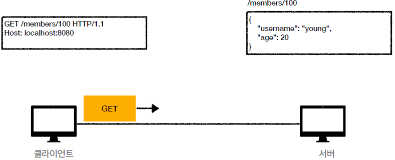 
클라이언트가 `/members/100` id가 100인 회원을 조회하는 요청 메시지를 보낸다.

리소스 조회 2 - 응답 데이터 
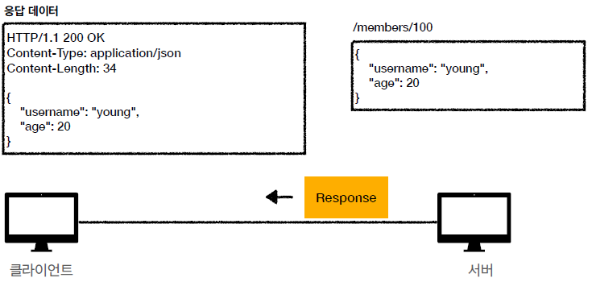 
서버에서 내부의 DB를 조회하여 회원의 정보를 JSON으로 만들고 응답 데이터에 추가하여 클라이언트에게 보낸다.   

## **POST**

* 요청 데이터 처리
* **message body를 통해 서버로 요청 데이터 전달**
* 주로 전달된 데이터로 신규 리소스 등록, 프로세스 처리에 사용한다.

리소스 등록 1 - 메시지 전달 
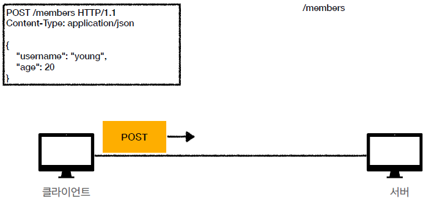 

리소스 등록 2 - 신규 리소스 등록 
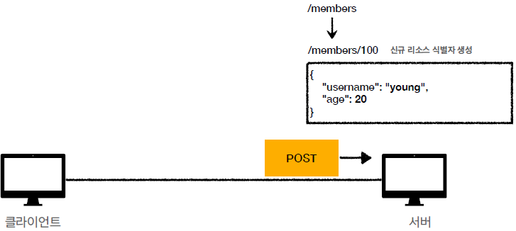 

리소스 등록 3 - 응답 데이터 
 

**POST 용도** 

1. 새 리소스 생성(등록)
   * 서버가 아직 식별하지 않은 새 리소스 생성
2. 요청 데이터 처리
   * 단순히 데이터를 생성하거나, 변경하는 것을 넘어서 프로세스를 처리해야 하는 경우
   * 예) 주문에서 결제완료 -> 배달 시작 -> 배달 완료 처럼 단순히 값 변경을 넘어 프로세스의 상태가 변경되는 경우
   * POST의 결과로 새로운 리소스가 생성되지 않을 수 있다.
   * 예) POST `orders/{orderId}/start-delivery` (컨트롤 URI)
3. 다른 메서드로 처리하기 애매한 경우
   * 예) JSON으로 조회 데이터를 넘겨야 하는데, GET 메서드를 사용하기 어려운 경우

 

## **PUT**

**리소스를 대체**
* 리소스가 있으면 대체
* 리소스가 없으면 생성

**클라이언트가 리소스를 식별**
* 클라이언트가 리소스 위치를 알고 URI 지정 : PUT `/members/100` 

리소스가 있는 경우 
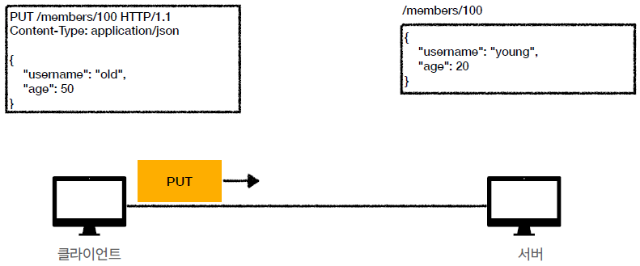 
해당 리소스가 있는 경우 대체 되고, 없는 경우 새로 생성한다. 
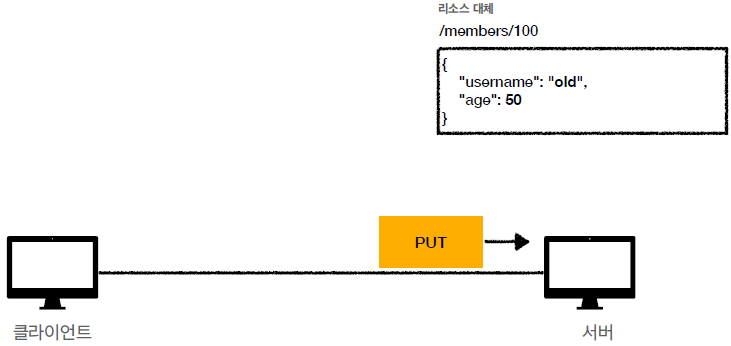 

리소스를 완전히 대체 
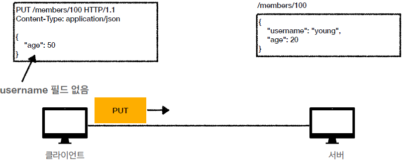 
`/members/100` 리소스에 대해서 `age` 필드만 50으로 업데이트한다.
 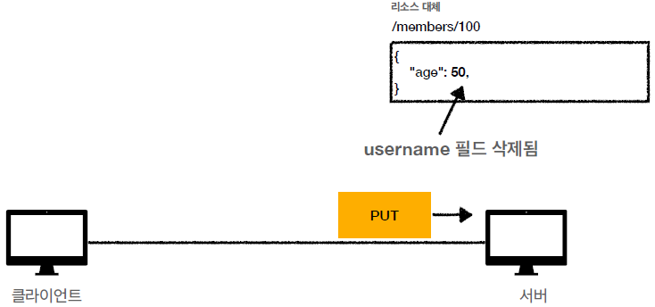 
기존의 있던 리소스를 완전히 대체하게 되어 `username` 필드는 존재하지 않고 `age` 필드만 남는다.
  

## **PATCH**

**리소스 부분 변경**

 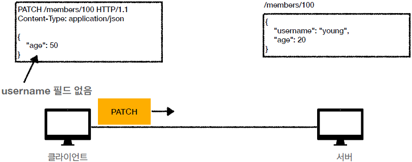 
 `age` 필드의 값을 50으로 수정하려고 한다. 

 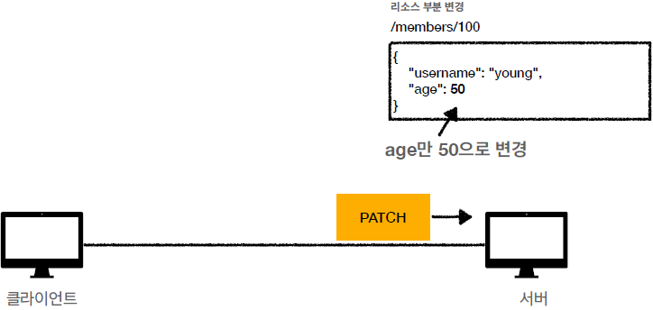 
 `age` 필드의 값만 50으로 수정된다.

  

 ## **DELETE**

**리소스 제거**

 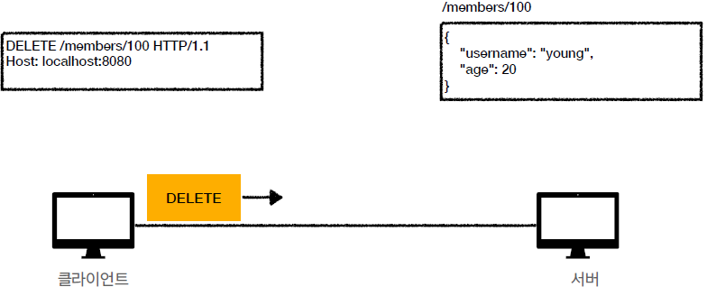 
 `/members/100` 리소스를 삭제 요청 
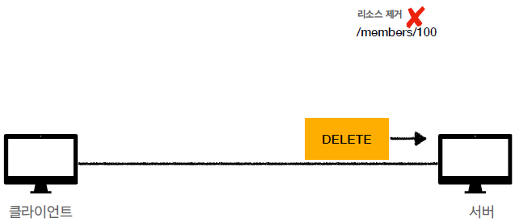 
리소스가 제거 된다.
  

 ## **HTTP 메서드의 속성**

**안전(Safe)** 

호출해도 리소스를 변경하지 않는다. 

Q : 그래도 계속 호출해서, 로그가 쌓여서 장애가 발생하면? 
A : 안전은 해당 리소스만 고려한다. 그런 부분까지 고려하지 않는다.
  
**멱등(Idempotent)** 

한 번 호출하든 100번 호출하든 결과가 똑같다. 

**멱등 메서드**
  * GET : 한 번 조회하든, 두 번 조회하든 같은 결과가 조회된다.
  * PUT : 결과를 대체한다. 따라서 같은 요청을 여러번 해도 최종 결과는 같다.
  * DELETE : 결과를 삭제한다. 같은 요청을 여러번 해도 삭제된 결과는 같다.  
 

Q : 재요청 중간에 다른 곳에서 리소스를 변경해버리면?
  * 사용자 1 : GET -> username : A, age : 20
  * 사용자 2 : PUT -> username : A, age : 30
  * 사용자 1 : GET -> username : A, age : 30 -> 사용자 2의 영향으로 바뀐 데이터 조회
 

A : **멱등은 외부 요인으로 중간에 리소스가 변경되는 것 까지 고려하지 않는다.**

 

**캐시가능(Cacheable)** 

응답 결과 리소스를 캐시해서 사용해도 되는가?

* GET, HEAD, POST, PATCH 캐시 가능
* 실제로는 GET, HEAD 정도만 캐시로 사용한다.
  * POST, PATCH는 본문 내용까지 캐시 키로 고려해야 하는데, 구현이 쉽지 않다.

참고 자료 
<a href="https://www.inflearn.com/course/http-%EC%9B%B9-%EB%84%A4%ED%8A%B8%EC%9B%8C%ED%81%AC/dashboard">https://www.inflearn.com/course/http-%EC%9B%B9-%EB%84%A4%ED%8A%B8%EC%9B%8C%ED%81%AC/dashboard</a>