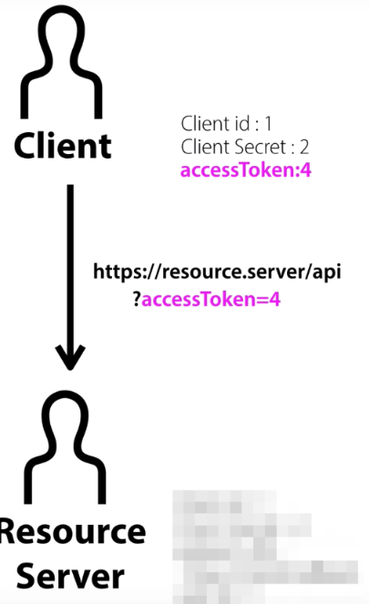

---
title: "[Web] OAuth"
excerpt: "OAuth에 대해서 알아보자"

categories:
  - Web
tags:
  - [Web, OAuth]

permalink: /web/oauth/

toc: true
toc_sticky: true

date: 2023-01-20
last_modified_at: 2023-01-20
--- 

## **OAuth란?**
<hr/>
<br>

웹 서핑을 하다 보면 Google과 Kakao 등의 <span style="color:red">**외부 소셜 계정을 기반으로 간편히 회원가입 및 로그인**</span>할 수 있는 웹 애플리케이션을 찾아볼 수 있다.<br><br>
<span style="color:red">**연동되는 외부 웹 애플리케이션에서**</span> Google 및 Kakao 등이 <span style="color:red">**제공하는 기능을 간편하게 사용**</span>할 수 있다는 장점이 있다.<br><br>
예를 들어, Google로 로그인하면 API를 통해 연동된 계정의 Google Calendar 정보를 가져와 사용자에게 보여줄 수 있다.<br><br>

**OAuth 정의**
<br>
OAuth는 인터넷 사용자들이 비밀번호를 제공하지 않고 다른 웹 사이트 상의 자신들의 정보에 대해 웹 사이트나 애플리케이션의 접근 권한을 부여할 수 있는 공통적인 수단으로서 사용되는, 접근 위임을 위한 개방형 표준 프로토콜.<br><br>

## **OAuth 구성 요소**
<hr/>

<span style="font-size:120%">**Resource Owner**</span><br>

* <span style="color:red">**웹 서비스를 이용하려는 유저, 자원(개인정보)을 소유하는 자, 사용자**</span>
* 'Resource'는 개인정보라고 생각하면 된다.

<span style="font-size:120%">**Client**</span><br>

* 자사 또는 개인이 만든 <span style="color:red">**애플리케이션 서버**</span>
* 클라이언트라는 이름은 Client가 Resource Server에게 필요한 자원을 요청하고 응답하는 관계라서 그렇다.

<span style="font-size:120%">**Authorization Server**</span><br>

* <span style="color:red">**권한을 부여**</span>(인증에 사용할 아이템을 제공해주는)해주는 서버다.
* 사용자는 이 서버로 ID, PW를 넘겨 Authorization Code를 발급 받을 수 있다.
* Client는 이 서버로 Authorization Code를 넘겨 Token을 발급 받을 수 있다.

<span style="font-size:120%">**Resource Server**</span><br>

* 사용자의 개인정보를 가지고 있는 <span style="color:red">**애플리케이션(Google, Kakao 등) 회사 서버**</span>
* Client는 Token을 서버로 넘겨 개인정보를 응답 받을 수 있다.  

<span style="font-size:120%">**Access Token**</span><br>

* 자원에 대한 접근 권한을 Resource Owner가 인가하였음을 나타내는 **자격증명**

<span style="font-size:120%">**Refresh Token**</span><br>

* Client는 Authorization Server로 부터 Access Token과 Refresh Token을 함께 부여 받는다.
* Access Token은 보안상 만료기간이 짧기 때문에 얼마 지나지 않아 만료되면 사용자는 로그인을 다시 시도해야한다.
* Refresh 토큰이 있다면 Access Token이 만료될 때, <span style="color:red">**Refresh Token을 통해 Access Token을 재발급 받아 재 로그인 할 필요없게끔 한다.**</span>
<br>
<hr/>
<br>

직접 사용자가 로그인 하는 것이 아닌, 소셜 로그인을 할 경우, <br>
Client(개인 서비스)는 Resource Owner(사용자)를 대신해 로그인 하는데, 이때 필요한 정보를 Resource Server(google, kakao, naver, ...)에서 얻어 서로 비교해 유효성을 판단한다.<br>

Client가 유저의 정보를 Resource Server에 요청해 로그인 하는 것이다.<br>

이를 위해서 Client는 다음 단계들을 가진다.<br>
1. Resource Owner로 부터 동의(허용)
2. Resource Server로 부터 Client 신원 확인

**Resource Owner(유저) 입장**<br>
자신의 정보를 대신 사용하기 때문에 Client가 어떤 정보를 활용하는지, 어떤 기능을 사용하려는지 모른다. <br>

나쁜 마음을 가지면 개인정보를 마구잡이로 악용할 수 있있기 때문이다.<br>
그러므로 Client는 Resource Owner의 동의를 구해야 한다.<br>

**Resource Server 입장**<br>
Resource Owner의 일을 수행 해주는 Client가 정말 그 Client일까 하는 물음이 있다.<br>

이런 의미에서 Resource Server는 Resource Owner의 브라우저를 통해 <span style="color:red">**Client를 구분하는 값(code)**</span>를 전달한다.
<br><br>

## **Resource owner 승인과정**
<hr/>

**1. 사용자(Resource Owner)는 서비스(Client)를 이용하기 위해 로그인 페이지에 접근한다.**<br>

**2. 그럼 서비스(Client)는 사용자(Resource Owner)에게 로그인 페이지를 제공하게 된다. 로그인 페이지에서 사용자는 "외부 소셜 계정으로 로그인" 버튼을 누른다.**<br>
<br>  

**3. 만일 사용자가 <span style="color:red">Naver 로그인</span> 버튼을 클릭하게 되면, 특정한 URL이 Naver 서버쪽으로 보내지게 된다.**<br>

브라우저 응답(response) 헤더를 확인하면 다음 url내용을 확인할 수 있다.<br>
<br>
``` 
https://resource.server/?client_id=1&scope=B,C&redirect_uri=https://client/callback
```
이는, 사용자가 직접 네이버로 이동해서 로그인을 입력해야 하는데, 저 링크가 대신 로그인으로 이동 하게끔 도와준다.<br>

* `https://resource.server/?` : Resource Server(Naver, Kakao url)
* `client_id=1` : 어떤 Client인지를 id를 통해 Resource Owner에게 알려준다.
* `&scope=B,C` : Resource Owner가 사용하려는 기능, 달리 말해 Client가 서비스에서 사용하려는 Resource Server 기능을 표현한 부분
* `&redirect_uri=https://client/callback` : 개발자 홈페이지에 서비스 개발자가 입력한 응답 콜백

향후 <span style="color:red">**redirect_uri 경로를 통해서 Resource Server는 client에게 임시비밀번호인 Authorization code를 제공**</span>한다.<br><br>

**4. Client로 부터 보낸 서비스 정보와, 리소스 로그인 서버에 등록된 서비스 정보를 비교한다.**<br>
<br><br>

확인이 완료되면, Resource Server로 부터 전용 로그인 페이지로 이동하여 사용자에게 보여준다.

<br><br>

**5. ID/PW를 적어서 로그인을 하게되면, Client가 사용하려는 기능(scope)에 대해 Resource Owner의 동의(승인)을 요청한다.**</span>
   
<br>

Resource Owner가 Allow 버튼을 누르면 Resource Owner가 권한을 위임했다는 승인이 Resource Server 에 전달된다.<br>
<br>
이로써 Resource Server가 갖는 정보는 다음과 같다.<br>

1. Client Id : Resource Owner와 연결된 Client가 누군지
2. Client Secret : Resource Owner와 연결된 Client의 비밀번호
3. Redirect URL : (진짜)Client와 통신홀 통로
4. User Id : Client와 연결된 Resource Owner의 Id
5. Scope : Client가 Resource Owner 대신에 사용할 기능들

<br>

**6. 하지만, 이미 Owner가 Client에게 권한 승인을 했더라도 아직 Server가 허락하지 않았다. 따라서, Resource Server도 Client에게 권한 승인을 하기위해 <span style="color:red">Authorization Code</span>를 Redirect URL을 통해 사용자에게 응답하고**<br>

**7. 다시 사용자는 그대로 Client에게 보낸다.**<br>

<br>

**8. 이제 Client가 Resource Server에게 직접 url(클라이언트 아이디, 비번, 인증코드... 등)을 보낸다.**<br>

<br>

**9. 그럼 Resorce Server는 Client가 전달한 정보들을 비교해서 일치한다면, <span style="color:red">Access Token을 발급</span>한다. 그리고 이제 필요없어진 Authorization Code는 지운다.**<br>

**10. 그렇게 토큰을 받은 Client는 사용자에게 최종적으로 로그인이 완료되었다고 응답한다.**<br>

<br>

**11. 이제 Client는 Resource Server의 API를 요청해 Resource Owner의 Id 혹은 프로필 정보를 사용할 수 있다.**<br>

<br>

**12. Access Token이 기간이 만료되어 401 에러가 발생하면, Refresh Token을 통해 Access Token을 재발급 한다.**<br>

<br>
<hr/>
참고 자료<br>
<a href="https://inpa.tistory.com/entry/WEB-%F0%9F%93%9A-OAuth-20-%EA%B0%9C%EB%85%90-%F0%9F%92%AF-%EC%A0%95%EB%A6%AC">https://inpa.tistory.com/entry/WEB-%F0%9F%93%9A-OAuth-20-%EA%B0%9C%EB%85%90-%F0%9F%92%AF-%EC%A0%95%EB%A6%AC</a>
