---
title: "[Web] CORS의 개념 및 적용 방법"
excerpt: "CORS의 개념 및 적용 방법에 대해서 알아보자"

categories:
  - Web
tags:
  - [Web]

published: true

permalink: /web/cors/

toc: true
toc_sticky: true

date: 2023-03-26
last_modified_at: 2023-03-26

--- 

## **CORS란?**

CORS는 <span style="color:red">**Cross-Origin Resource Sharing**</span>의 약자로 문장을 직역하면 <span style="color:red">**"교차 출처 리소스 공유 정책"**</span>이라고 해석할 수 있는데, 여기서 **교차 출처**라고 하는 것은 **다른 출처**를 의미한다.

<br>

CORS에 대해 자세히 알아보기 전에 출처(Origin)에 대해 알아보자.

<br>

### **출처(Origin)란?**

우리가 어떤 사이트를 접속할 때 URL을 통해 접근하게 된다.<br>

URL은 ` https://domain.com:3000/user?query=name&page=1`과 같이 하나의 문자열 같지만, 다음과 같이 여러개으 구성 요소로 이루어져 있다.<br>

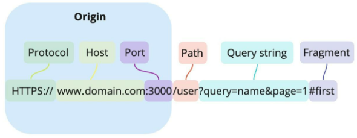<br>

* Protocol : http, https
* Host : 사이트 도메인
* Porg : 포트 번호
* Path : 사이트 내부 경로
* Query string : 요청의 key값과 value값
* Fragment : 리소스 자체의 다른 부분을 가리키는 앵커

출처(Origin) : Protocol + Host + Port<br>

즉, <span style="color:red">**출처(Origin)는 Protocol과 Host 그리고 Port를 합친 URL**</span>을 의미한다.

<br><br>

### **동일 출처 정책(Same-Origin Policy)**

SOP 정책은 단어 그대로 <span style="color:red">**동일한 출처에 대한 정책**</span>을 말한다.<br>
이 정책은 '동일한 출처에서만 리소스를 공유할 수 있다.'라는 정책이다.<br>

동일 출처(Same-Origin) 서버에 있는 리소스는 자유롭게 가져올 수 있지만, 다른 출처(Cross-Origin) 서버에 있는 리소스는 상호작용이 불가능하다.<br>

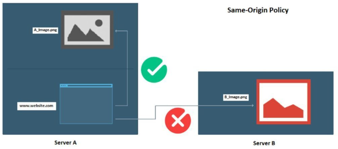

<br>

**동일 출처 정책이 필요한 이유**<br>

만약 동일 출처 정책이 없다면, 해커가 CSRF(Cross-Site Request Forgery)나 XSS(Cross-Site Scripting) 등의 방법을 이용해서 우리가 만든 애플리케이션에서 해커가 심어 놓은 코드가 실행되어 개인 정보를 가로챌 수 있다.

<br><br>

**동일 출처 구분 기준**<br>

출처(Origin)의 동일함은 두 URL의 구성 요소 중 <span style="color:red">**Protocol, Host, Port**</span> 이 3가지만 동일하다면 동일 출처로 판단한다.<br><br>

`https://www.domain.com` 출처에 대한 예제<br>

동일 출처
* https://www.domain.com/api - 프로토콜, 호스트, 포트 동일
* https://www.Domain.com - 프로토콜, 호스트, 포트 동일
  * 호스트(도메인)는 대소문자 구분 X
* https://www.domain.com:443 - 프로토콜, 호스트, 포트 동일
  * https 프로토콜의 포트 번호는 443이다.

<br>

다른 출처

* http://www.domain.com - 프로토콜이 다르다.(http ≠ https)
* https://www.domain.com:443 - 포트 번호가 다르다.
  * http의 포트 번호는 80이다.
* https://www.domain1.com - 호스트가 다르다.

<br>

같은 프로토콜, 호스트, 포트 번호를 사용한다면 그 뒤의 요소들은 다르더라도 같은 출처로 인정된다.

<br><br>

**출처 비교와 차단은 브라우저가 한다.**<br>

출처를 비교하는 로직은 서버에 구현된 스펙이 아닌<span style="color:red">**브라우저에 구현된 스펙**</span>이다.

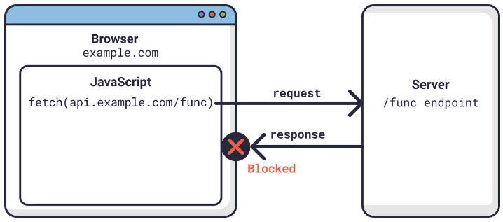

<br>

서버는 리소스 요청에 의한 응답은 정상적으로 해주었지만 <span style="color:red">**브라우저가 이 응답을 분석해서 동일 출처가 아니라면, 에러를 발생**</span>시키는 것이다.<br>

그래서 브라우저에는 에러가 발생하지만, 서버에는 정상적으로 응답을 했다고 하기 때문에 난항을 겪었던 것이다. 즉, 응답 데이터는 정상이지만 브라우저 단에서 응답을 받을수 없도록 차단을 한 것이다.

<br>

웹 페이지에서 다른 출처에 있는 리소스를 가져와 사용하는 일은 매우 흔한 일이기 대문에 몇 가지 예외 조항을 두고 다른 출처의 리소스 요청이라도 이 조항에 해당할 경우에는 허용하기로 했다.<br> 그 중 하나가 바로 <span style="color:red">**CORS 정책을 지킨 리소스 요청**</span>이다.

<br><br>

### **교차 출처 리소스 공유(Cross-Origin Resource Sharing)**

CORS는 단어 그대로 <span style="color:red">**다른 출처의 리소스 공유에 대한 허용/비허용 정책**</span>이다.<br>

브라우저에서 발생하는 CORS 에러는 <span style="color:red">**SOP 정책에 따라 다른 출처의 리소스를 차단하면서 발생된 에러**</span>이며 CORS는 다른 출처의 리소스를 얻기위한 해결 방안이다.<br>

<span style="color:red">**SOP 정책을 위반해도 CORS 정책에 따르면 다른 출처의 리소스라도 허용**</span>한다는 뜻이다.

<br>

#### **브라우저의 CORS 기본 동작**

<br>

**1. 클라이언트에서 HTTP 요청의 헤더에 Origin을 담아 전달**<br>

기본적으로 웹은 HTTP 프로토콜을 이용하여 서버에 요청을 보내게 되는데, 이때 브라우저는 요청 헤더에 Origin이라는 필드에 출처를 함께 담아 보내게 된다.<br>

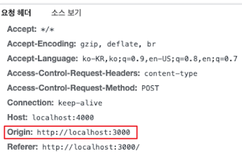

<br>

**2. 서버는 응답 헤더에 Access-Control-Allow-Origin을 담아 클라이언트로 전달한다.**<br>

이후 서버가 요청에 대한 응답을 할 때 응답 헤더에 `Access-Control-Allow-Origin`이라는 필더를 추가하고 값으로 <span style="color:red">**'이 리소스를 접근하는 것이 허용된 출처 URI'**</span>를 보낸다.<br>

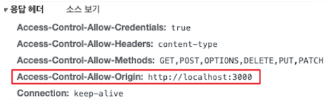

<br>

**3. 클라이언트에서 Origin과 서버가 보내준 Access-Control-Allow-Origin을 비교한다.**

응답을 받은 브라우저는 자신이 보냈던 요청의 Origin과 서버가 보내준 응답의 Access-Control-Allow-Origin을 비교해본 후 차단할지 말지를 결정한다.<br>

만약 유효하지 않다면 그 응답을 사용하지 않고 버린다. (CORS 에러 발생)<br>

<br>

결론은 <span style="color:red">**서버에서 `Access-Control-Allow-Origin` 헤더에 허용할 출처를 기재해서 클라이언트에 응답**</span>하면 되는 것이다.<br>

클리이언트에서 미리 자바스크립트로 Origin 헤더 값을 위조하면 브라우저에서 이를 감지하여 차단한다.

<br><br>

## **CORS 작동 방식 3가지**
<hr />

CORS가 동작하는 방식은 한 가지가 아니라 세 가지의 시나리오에 따라 변경된다.

<br>

### **예비 요청(Preflight Request)**

브라우저는 요청을 보낼때 한번에 바로 보내지않고, 먼저 <span style="color:red">**예비 요청**</span>을 보내 서버와 잘 통신되는지 확인한 후 <span style="color:red">**본 요청**</span>을 보낸다.<br>

즉, 예비 요청의 역할은 본 요청을 보내기 전에 브라우저 스스로 안전한 요청인지 미리 확인한다.<br>

이때 브라우저가 예비 요청을 보내는 것을 <span style="color:red">**Preflight**</span>라고 하며, 이 예비 요청의 HTTP 메서드를 GET이나 POST가 아닌 <span style="color:red">**OPTIONS**</span>라는 요청이 사용된다.<br>

예를 들어 자바스크립트로 다음 API 요청을 보낸다고 가정해보자.<br>

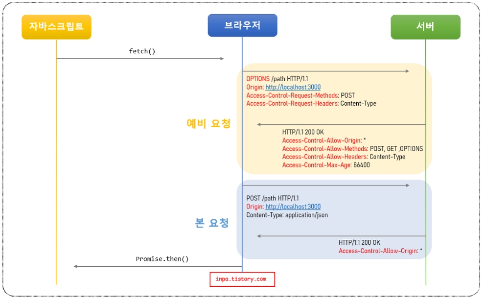

<br>

1. `fetch()` 메서드를 통해 리소스를 받아오려고 한다.
2. 브라우저는 서버로 HTTP OPTIONS 메서드로 예비 요청(Preflight)을 먼저 보낸다.
   1. Origin 헤더에 자신의 출처를 넣는다.
   2. Access-Control-Request-Methods 헤더에 실제 요청에 사용할 메서드를 설정한다.
   3. Access-Control-Request-Headers 헤더에 실제 요청에 사용할 헤더들을 설정한다.
3. 서버는 이 예비 요청에 대한 응답으로 어떤 것을 허용하고 금지하고 있는지에 대한 헤더 정보를 담아서 브라우저로 보내준다.
   1. Access-Control-Allow-Origin 헤더에 허용되는 Origin들의 목록을 설정한다.
   2. Access-Control-Request-Methods 헤더에 허용되는 메서드들의 목록을 설정한다.
   3. Access-Control-Request-Headers 헤더에 허용되는 헤더들의 목록을 설정한다.
   4. Access-Control-Max-Age 헤더에 해당 예비 요청이 브라우저에 캐시 될 수 있는 시간을 초 단위로 설정한다.
4. 이후 브라우저는 보낸 요청과 서버가 응답해준 정책을 비교하여, 해당 요청이 안전한지 확인하고 본 요청을 보내게 된다.  
5. 서버가 본 요청에 대한 응답을 하면 최종적으로 이 응답 데이터를 자바스크립트로 넘겨준다.

<br>

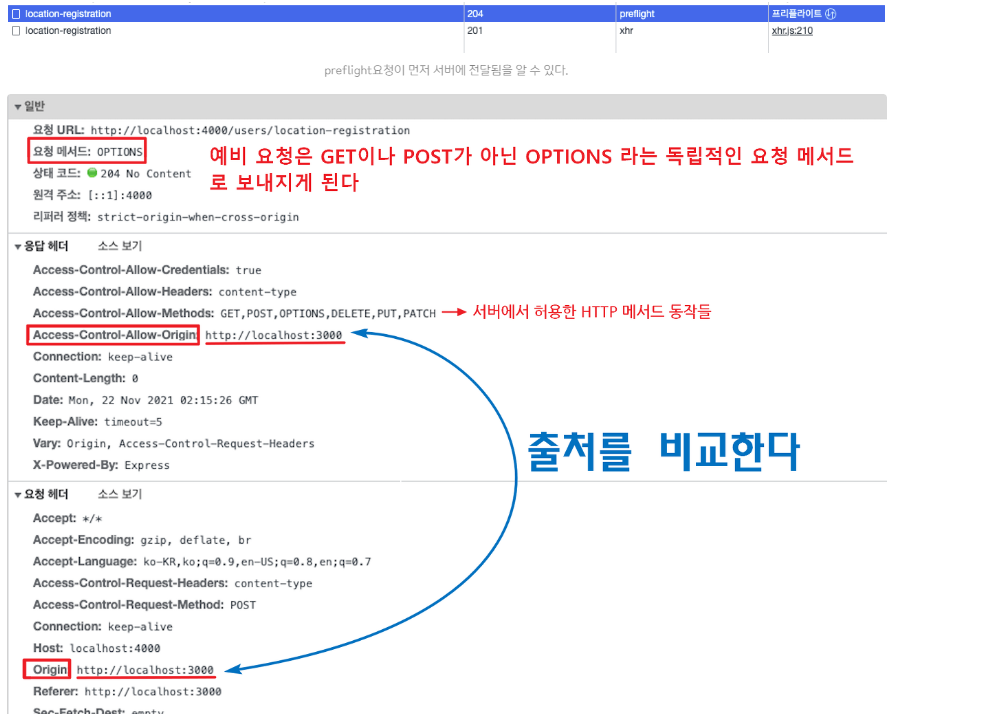

<br>

위의 사진상에는 요청 헤더의 Origin과 응답 헤더의 Access-Cotrol-Allow-Origin의 URL값이 서로 같아 다른 출처라도 다른 출처라도 CORE가 허용되어 정상 응답을 받게 된다.<br>

예비 요청은 보통 <span style="color:red">**PUT, DELETE**</span>같은 요청을 보낼때 이용된다.<br>
PUT이나 DELETE는 서버의 데이터를 변경하는 요청이기 때문에, 요청을 보내기 전에 예비 요청을 보내서 인증 후 본 요청을 받는 원리이다.

<br><br>

#### **예비 요청의 문제점과 캐싱**

요청을 보내기 전에 OPTIONS 메서드로 예비 요청을 보내 보안을 강화하는 취지는 좋지만 실제 요청에 걸리는 시간이 늘어나게 되어 애플리케이션 성능에 영향을 미치는 단점이 있다.<br>

특히 수행하는 API 호출 수가 많으면 많을 수록 예비 요청으로 인해 서버 요청을 배로 보내게 된다. 따라서 <span style="color:red">**브라우저 캐시**</span>를 이용해 `Access-Control-Max-Age` 헤더에 캐시될 시간을 명시해 주면, 이 Preflight 요청을 캐싱 시켜 최적화를 시켜줄 수 있다.<br>

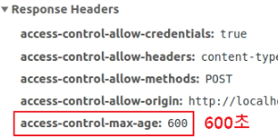

<br>

예비 요청 캐시는 다른 캐싱 매커니즘과 유사하게 동작한다.<br>

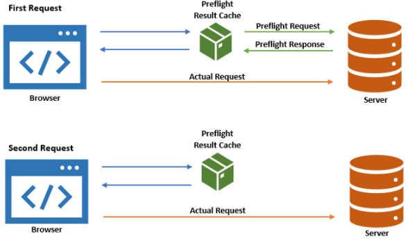

<br>

1. 브라우저는 예비 요청을 할 때마다, 먼저 Preflight 캐시를 확인하여 해당 요청에 대한 응답이 있는지 확인한다.
2. 만일 응답이 캐싱 되어 있지 않다면, 서버에 예비 요청을 보내 인증 절차를 밟는다.
3. 만일 서버로부터 `Access-Control-Max-Age` 응답 헤더를 받는다면 그 기간 동안 브라우저 캐시에 결과를 저장한다.
4. 다시 요청을 보내고 만일 응답이 캐싱 되어 있다면, 예비 요청을 서버로 보내지 않고 대신 캐싱된 응답을 사용한다.

<br><br>

### **단순 요청(Simple Request)**

단순 요청은 <span style="color:red">**예비 요청(Preflight)를 생략하고 바로 서버에 본 요청**</span>을 보낸 후, 서버가 이에 대한 응답의 헤더에 `Access-Control-Allow-Origin` 헤더를 보내주면 브라우저가 CORS 정책 위반 여부를 검사하는 방식이다.<br>

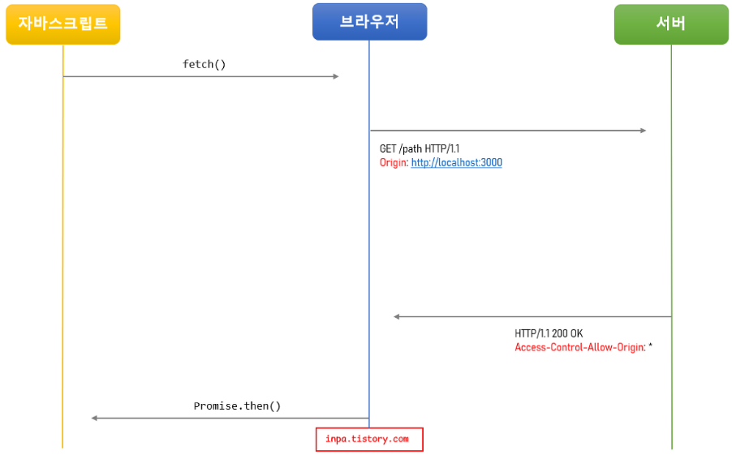

<br>

단순 요청은 3가지 경우를 만족할 때만 가능하다.

1. 요청의 메서드는 <span style="color:red">**GET, HEAD, POST**</span> 중 하나여야 한다.
2. `Accept`, `Accept-Language`, `Content-Language`, `Content-Type`, `DPR`, `Downlink`, `Save-Data`, `Viewport-Width`, `Width` 헤더일 경우에만 적용된다.
3. Content-Type 헤더가 `application/x-www-form-urlencoded`, `multipart/form-data`, `text/plain` 중 하나여야 한다.

<br>

이처럼 까다로운 조건들이 많기 때문에, 위 조건을 모두 만족하여 단순 요청이 일어나는 상황은 드물다.<br>

대부분 HTTP API 요청은 `text/xml`이나 `application/json`으로 통신하기 때문에 Content-Type이 위반되기 때문이다.<br>

<span style="color:red">**따라서 대부분의 API 요청은 예비 요청(Preflight)으로 이루어진다.**</span>

<br><br>

### **인증된 요청(Credentialed Request)**

인증된 요청은 클라이언트가 서버에게 <span style="color:red">**자격 인증 정보(Credential)**</span>를 실어 요청할 때 사용되는 요청이다.<br>

**자격 인증 정보**란 세션 ID가 저장되어있는 <span style="color:red">**쿠키**</span>혹은 <span style="color:red">**Authorization 헤더**</span>에 설정하는 <span style="color:red">**토큰**</span> 값 등을 일컫는다.<br>

클라이언트에서 일반적인 JSON 데이터 외에도 쿠키나 토큰 같은 인증 정보를 포함해서 다른 출처의 서버로 전달할때 CORS의 인증된 요청으로 동작된다.

<br>

**1. 클라이언트에서 인증 정보를 보내도록 설정하기**<br>

기본적으로 브라우저가 제공하는 요청 API들은 별도의 옵션 없이 브라우저의 쿠키 같은 인증과 관련된 데이터를 함부로 요청 데이터에 담지 않도록 되어있다.<br>

이때 요청에 인증과 관련된 정보를 담을 수 있게 해주는 옵션이 `credentials` 옵션이다.<br>
이 옵션에는 세 가지의 옵션 값이 존재한다.<br>

* same-origin(기본값) : 같은 출처 간의 요청에만 인증 정보를 담을 수 있다.
* include : 모든 요청에 인증 정보를 담을 수 있다.
* omit : 모든 요총에 인증 정보를 담지 않는다.

서버에 인증된 요청을 보내는 방법은 axios, jQuery 라이브러리 등 다양하다.<br>
어떤 메서드를 사용하냐에 따라 `credentials` 옵션을 지정하는 문법이 다르지만 프로젝트에서는 axios를 사용하니 axios의 코드만 살펴보자.

``` js
// axios 라이브러리
axios.post('https://example.com:1234/users/login', { 
    profile: { username: username, password: password } 
}, { 
	withCredentials: true // 클라이언트와 서버가 통신할때 쿠키와 같은 인증 정보 값을 공유하겠다는 설정
})
```

<br>

**2. 서버에서 인증된 요청에 대한 헤더 설정하기**<br>

서버도 마찬가지로 이러한 인증된 요청에 대해 일반적인 CORS 요청과는 다르게 대응해줘야 한다.<br>

* 응답 헤더의 `Access-Control-Allow-Credentials` 항목을 true로 설정해야 한다.
* 응답 헤더의 `Access-Control-Allow-Origin`, `Access-Control-Allow-Methods`, `Access-Control-Allow-Headers`들의 값에 와일드카드 문자("*")는 사용할 수 없다.

<br>

즉, 응답의 Access-Control-Allow-Origin 헤더가 와일드카드(*)가 아닌 분명한 Origin으로 설정되어야 하고, Access-Control-Allow-Credentials 헤더는 true로 설정되어야 한다. 그렇지 않으면 브라우저의 CORS 정책에 따라 응답이 거부된다.

<br><br>

## **Spring에서 Access-Control-Allow-Origin 헤더 세팅하기**
<hr />

직접 서버에서 HTTP 헤더 설정을 통해 출처를 허용하게 설정하는 가장 정석적인 해결책이다.<br>

CORS에 연관된 HTTP 헤더 값으로는 다음 종류가 있다.<br>

* `Access-Control-Allow-Origin` : `https://naver.com`
  * 헤더에 작성된 출처만 브라우저가 리소스를 접근할 수 있도록 허용함.
  * 이면 모든 곳에 공개되어 있음을 의미한다. 
* `Access-Control-Request-Methods` : GET, POST, PUT, DELETE
  * 리소스 접근을 허용하는 HTTP 메서드를 지정해 주는 헤더
* `Access-Control-Allow-Headers` : Origin,Accept,X-Requested-With,Content-Type,Access-Control-Request-Method,Access-Control-Request-Headers,Authorization
  * 요청을 허용하는 해더.
* `Access-Control-Max-Age` : 60
  * 클라이언트에서 preflight 의 요청 결과를 저장할 기간을 지정
  * 60초 동안 preflight 요청을 캐시하는 설정으로, 첫 요청 이후 60초 동안은 OPTIONS 메소드를 사용하는 예비 요청을 보내지 않는다.
* `Access-Control-Allow-Credentials` : true
  *  클라이언트 요청이 쿠키를 통해서 자격 증명을 해야 하는 경우에 true. 
  * 자바스크립트 요청에서 credentials가 include일 때 요청에 대한 응답을 할 수 있는지를 나타낸다.
* `Access-Control-Expose-Headers` : Content-Length
  * 기본적으로 브라우저에게 노출이 되지 않지만, 브라우저 측에서 접근할 수 있게 허용해주는 헤더를 지정

<br>

### **Spring 세팅**

``` java
// 스프링 서버 전역적으로 CORS 설정
@Configuration
public class WebConfig implements WebMvcConfigurer {
    @Override
    public void addCorsMappings(CorsRegistry registry) {
        registry.addMapping("/**")
        	.allowedOrigins("http://localhost:8080", "http://localhost:3000") // 허용할 출처
            .allowedMethods("GET", "POST") // 허용할 HTTP method
            .allowCredentials(true) // 쿠키 인증 요청 허용
            .maxAge(3000) // 원하는 시간만큼 pre-flight 리퀘스트를 캐싱
    }
}
```

<br>

또한 프론트에서 React를 사용한다면 서버쪽 코드를 추가하지 않고 해결할 수 있다.

<br>

### **React 세팅**

`package.json`에 <span style="color:red">**Proxy 서버를 설정**</span>하여 해결하는 방법이 있다.
<br>

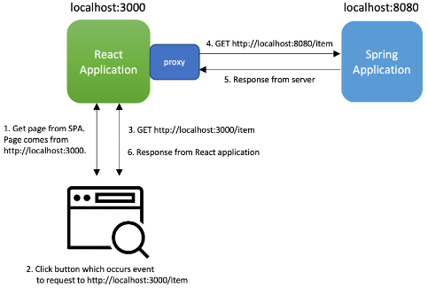

<br>

1. 브라우저에서 React server `http://localhost:3000`로 요청을 보낸다.
2. React 서버가 해당 요청을 API 서버 `http://localhost:8080`에 보낸다.
3. API 서버가 응답을 React 서버에게 전달한다.
4. React 서버는 이 응답을 브라우저로 전달한다.

``` js
{
    //...
    "proxy": "http://localhost:8080"
}
```
<hr />
참고자료<br>
<a href="https://inpa.tistory.com/entry/WEB-%F0%9F%93%9A-CORS-%F0%9F%92%AF-%EC%A0%95%EB%A6%AC-%ED%95%B4%EA%B2%B0-%EB%B0%A9%EB%B2%95-%F0%9F%91%8F#2._xmlhttprequest,_fetch_api_%EC%8A%A4%ED%81%AC%EB%A6%BD%ED%8A%B8">https://inpa.tistory.com/entry</a>