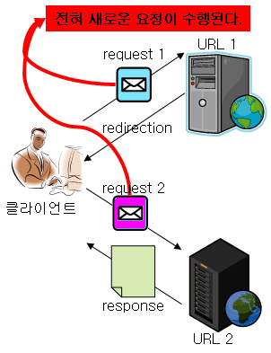
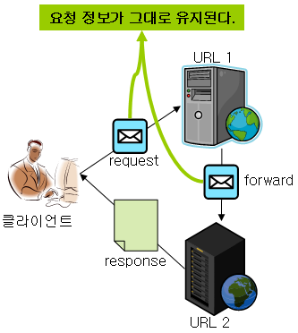

---
title: "[Web] Redirect와 Foward의 차이"
excerpt: "Redirect와 Foward의 차이에 대해서 알아보자"

categories:
  - Web
tags:
  - [Web]

published: true

permalink: /web/redirect-and-foward/

toc: true
toc_sticky: true

date: 2023-03-27
last_modified_at: 2023-03-27

--- 

웹은 현재 작업중인 페이지에서 다른 페이지로 이동하기 위해 2가지 페이지 전환 기능을 제공한다.

<br>

## **Redirect 방식**
<hr />

사례를 통해 알아보자.<br>
여기서 고객은 클라이언트이고, 123번은 URL이며, 상담원은 서버가 된다.
<br>



<br>

1. 고객이 고객센터로 상담원에게 123번으로 전화를 건다
2. 상담원은 고객에게 다음과 같이 이야기한다. "고객님 해당 문의사항은 124번으로 다시 문의 해주시겠어요?"
3. 고객은 다시 124번으로 문의해서 일을 처리한다.

<br>

Redirect는 Web Container로 명령이 들어오면, 웹 브라우저에게 다른 페이지로 이동하라고 명령을 내린다.(고객은 전화를 끊고 124번으로 다시 전화를 건다.)<br>

그러면 웹 브라우저는 <span style="color:red">**URL을 지시된 주소로 바꾸고 해당 주소로 이동**</span>한다. 다른 웹 컨테이너에 있는 주소로 이동하며 <span style="color:red">**새로운 페이지에서는 Request와 Response 객체가 새롭게 생성**</span>된다.(123번에서 고객이 요청했던 문의사항은 사라지고 124번으로 다시 걸어서 요청한 문의사항을 다시 말해야한다.)<br>

Redirect의 경우 <span style="color:red">**최초 요청을 받은 URL1에서 클라이언트에게 redirect할 URL2를 반환하고, 클라이언트에서는 새로운 요청을 생성하여 URL2에 다시 요청을 보낸다.**</span><br>

그러므로 처음 보냈던 <span style="color:red">**최초의 Request와 Response 객체는 유효하지 않고 새롭게 생성**</span>되는 것이다.

<br>

Redirect 예시 코드<br>

``` java
@Controller
public class TestController{
  
  @GetMapping("/test1")
  public String test1(HttpServletRequest request){
    String name = request.getParameter("name") // "홍길동"
    System.out.println(name); // "홍길동"
    return "redirect:/test2";
  }
  
  @GetMapping("/test2")
  public String test2(HttpServletRequest request){
    String name = request.getParameter("name") // null
    System.out.println(name); // null
    return "test2";
  }
}
```

<br><br>

## **Forward 방식**
<hr />



<br>

1. 고객이 고객센터로 상담원에게 123번으로 전화를 건다.
2. 상담원은 해당 문의사항에 대해 잘 알지 못해서 옆의 다른 상담원에게 해당 문의사항에 답을 얻는다.
3. 상담원은 고객에게 문의사항을 처리해준다.

<br>

Forward는 Web Container 차원에서 페이지의 이동만 존재한다. 실제로 웹 브라우저는 다른 페이지로 이동했음을 알 수 없다.(고객은 상담원이 누구한테 물어봤는지 알 수 없다.)<br>

<span style="color:red">**웹 브라우저에는 최초에 호출한 URL이 표시되고, 이동한 페이지의 URL 정보는 확인할 수 없다.**</span>(고객은 123번으로만 전화했기 때문에 알 수 없다.)<br>

또한 <span style="color:red">**현재 실행중인 페이지워 forward에 의해 호출된 페이지는 Request와 Response 객체를 공유**</span>한다.(고객이 요청한 문의사항은 고객이 전화를 끊을 때까지 유효하다.)<br>

위 그림과 같이 Foward는 <span style="color:red">**다음 이동할 URL로 요청정보를 그대로 전달**</span>한다. 그렇기 때문에 사용자가 <span style="color:red">**최초로 요청한 요청정보는 다음 URL에서도 유효**</span>하다.

<br>

Forward 예시 코드<br>

``` java
@Controller
public class TestController{
  
  @GetMapping("/test1")
  public String test1(HttpServletRequest request){
    String name = request.getParameter("name") // "홍길동"
    System.out.println(name); // "홍길동"
    return "forward:/test2";
  }
  
  @GetMapping("/test2")
  public String test2(HttpServletRequest request){
    String name = request.getParameter("name") // "홍길동"
    System.out.println(name); // "홍길동"
    return "test2";
  } 
}
```
<hr />
참고자료<br>
<a href="https://inpa.tistory.com/entry/WEB-%F0%9F%93%9A-CORS-%F0%9F%92%AF-%EC%A0%95%EB%A6%AC-%ED%95%B4%EA%B2%B0-%EB%B0%A9%EB%B2%95-%F0%9F%91%8F#2._xmlhttprequest,_fetch_api_%EC%8A%A4%ED%81%AC%EB%A6%BD%ED%8A%B8">https://inpa.tistory.com/entry</a>