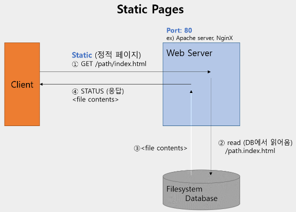
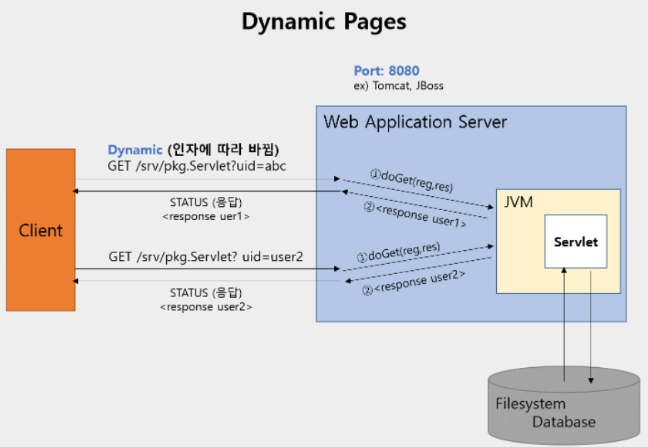
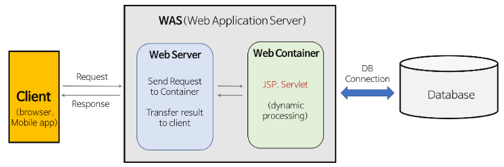

---
title: "[Web] Web Server(WS)와 Web Application Server(WAS)의 차이"
excerpt: "Web Server(WS)와 Web Application Server(WAS)의 차이에 대해서 알아보자"

categories:
  - Web
tags:
  - [Web]

published: true

permalink: /web/ws-and-was/

toc: true
toc_sticky: true

date: 2023-04-02
last_modified_at: 2023-04-02

--- 

웹 서버(Web Server)와 웹 애플리케이션 서버(Web Application Server)를 알아보기 전에 정적 웹 페이지(Static Web Page)와 동적 웹 페이지(Dynamic Web Page)에 대해 알아보자.

  

## **정적 웹 페이지와 동적 웹 페이지**

### **정적 웹 페이지**

 
 

 

* Web Server는 파일 경로 이름을 받아 경로와 일치하는 file contents를 반환한다.
* 이미 완성본으로 저장되어 있는 파일(html)을 전달하는 웹 페이지
* 한 요청에 관하여 모든 사용자가 같은 결과를 받는다.
* 사용자는 서버의 데이터가 변경되지 않는 한 고정된 웹 페이지를 보게 된다.

  

### **동적 웹 페이지**

 
 

 

* 서버에 있는 데이터를 스크립트에 의해 가공처리하여 만들어진 html 문서를 전달하는 웹 페이지
* 요청에 관하여 사용자는 조건에 따라 다른 결과를 받는다.
* 사용자는 상황, 시간, 요청 등에 따라 달라지는 웹 페이지를 보게 된다.

  

## **Web Server와 WAS의 차이**

 

### **Web Server**

Web Server의 개념은 하드웨어와 소프트웨어로 구분된다.
* 하드웨어 - Web Server가 설치되어 있는 컴퓨터
* 소프트웨어 - 웹 브라우저 클라이언트로부터 HTTP 요청을 받아 **정적인 컨텐츠(html, jpg, css 등)**를 제공하는 프로그램
  
 

**Web Server의 기능** 

**HTTP 프로토콜을 기반으로 하여 클라이언트의 요청을 서비스 하는 기능**을 담당한다. 

요청에 따라 두 가지 기능 중 적절하게 선택하여 수행한다.
* 기능 1
  * 정적인 컨텐츠 제공
  * WAS를 거치지 않고 바로 자원을 제공한다.
* 기능 2
  * 동적인 컨텐츠 제공을 위한 요청 전달
  * 클라이언트의 요청(Request)을 WAS에 보내고, WAS가 처리한 결과를 클라이언트에게 전달(Response)한다.

  

### **Web Application Server**

DB 조회나 다양한 로직 처리를 요구하는 **동적인 컨텐츠**를 제공하기 위해 만들어진 Application Server 

**Web Container** 혹은 **Servlet Container**라고도 불린다.
* Container란 JSP, Servlet을 실행시킬 수 있는 소프트웨어를 말한다.
* 즉, WAS는 JSP, Servlet 구동 환경을 제공한다.

 

**WAS의 역할** 

* `WAS = Web Server + Web Container`
* WAS가 가지고 있는 Web Server도 정적인 컨텐츠를 처리하는 데 있어서 성능상 큰 차이가 없다.

 

**WAS의 주요 기능** 

* 프로그램 실행 환경과 DB 접속 기능 제공
* 여러 개의 트랜잭션 관리 가능
* 업무를 처리하는 비즈니스 로직 수행

  

## **Web Server와 WAS를 구분하는 이유**

### **Web Server가 필요한 이유**
* 클라이언트(웹 브라우저)에 이미지 파일(정적 컨텐츠)을 보내는 과정
  * 정적인 파일들은 웹 문서(HTML)가 클라이언트로 보내질 때 함께 가는 것이 아니다.
  * 클라이언트는 HTML 문서를 먼저 받고 그에 맞게 필요한 이미지 파일들을 다시 서버로 요청하면 그때서야 이미지 파일을 받아온다.
  * Web Server를 통해 정적인 파일들을 Application Server까지 가지 않고 앞단에서 빠르게 보내줄 수 있다.
* 따라서 **Web Server에는 정적 컨텐츠만 처리하도록 기능을 분배**하여 서버의 부담을 줄일 수 있다.

 

### **WAS가 필요한 이유**

* 웹 페이지는 정적 컨텐츠와 동적 컨텐츠가 모두 존재한다.
  * 사용자의 요청에 맞게 적잘한 동적 컨텐츠를 만들어서 제공해야 한다.
  * 이떄, Web Server만을 이용한다면 사용자가 원하는 요청에 대한 결과값을 모두 미리 만들어 놓고 서비스 해야 한다. 하지만 이렇게 수행하기에는 자원이 절대적으로 부족하다.
* 따라서 WAS를 통해 요청에 맞는 데이터를 DB에서 가져와서 비즈니스 로직에 맞게 그때 그때 결과를 만들어서 제공함으로써 자원을 효율적으로 사용할 수 있다.

 

**웹 서버가 할 수 있는 일을 WAS로도 모두 가능하다면 웹 서버를 굳이 사용하지 않아도 될까?** 

Web Server와 WAS를 같이 쓰는 이유는 다음과 같다.
1. 기능을 분리하여 서버 부하를 방지한다.
   * WAS는 DB 조회나 다양한 로직을 처리하기 때문에 단순한 정적 컨텐츠는 Web Server에서 빠르게 클라이언트에게 제공하는 것이 좋다.
   * WAS는 기본적으로 동적 컨텐츠를 제공하기 위해 존재하는 서버이다.
   * 만약 정적 컨텐츠 요청까지 WAS에서 처리한다면 정적 데이터 처리로 인해 부하가 커지게 되고, 동적 컨텐츠의 처리가 지연됨에 따라 수행 속도가 느려진다.
2. 물리적으로 분리하여 보안을 강화한다.
3. 여러 웹 애플리케이션 서비스 가능
   * 하나의 서버에서 Java Application과 PHP Application을 함께 사용하는 경우 

 

참고자료 
<a href="https://gmlwjd9405.github.io/2018/10/27/webserver-vs-was.html">https://gmlwjd9405.github.io/2018/10/27/webserver-vs-was.html</a>