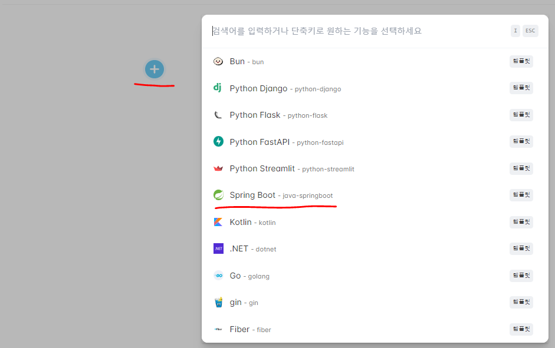
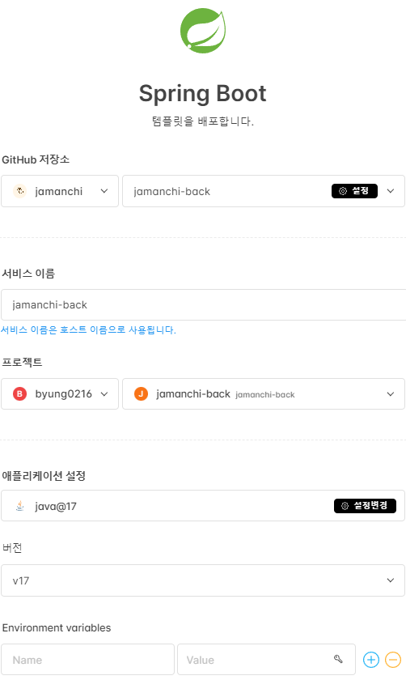
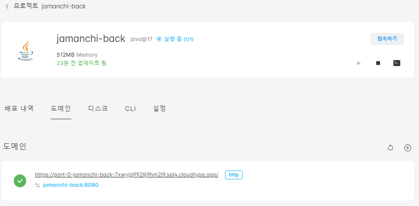

테오의 스프린트 15기에 BE 파트로 참여했을 때 CloudType과 GitHub Actions를 이용하여 배포 및 CI/CD를 구축했다. 

CloudType이라는 새로운 클라우드 서비스를 사용해봐서 CloudType을 사용하여 배포한 이유와 사용법을 기록하려고 한다.

  

## **cloudtype를 사용한 이유**

스프린트 기간은 6일이지만 실제 개발 기간은 2.5일뿐이었다. 배포 및 CI/CD에서 최대한 시간을 줄이기 위해 PaaS를 사용하기로 했다. 

Paas 서비스 중 백엔드, DB를 포함하여 다양한 애플리케이션을 배포할 수 있는 PaaS 서비스는 대표적으로 **Heroku**와 **cloudtype**이 존재한다. 

Heroku는 서버가 해외에 있다보니 국내이용자 서비스를 올리면 속도가 느려지고, 최근에는 무료 플랜을 단계적으로 폐지한다고 한다. 

반면에 cloudtype은 국내 서비스로, 한글 가이드도 지원해주기 때문에 처음 사용하는 개발자도 손쉽게 배포할 수 있고, 아래 사진과 같이 일정 사용량까지 무료로 사용 가능하다. 
 

때문에, cloudtype을 사용하게 되었다.

### **cloudtype의 주요 기능**

* GitHub 기반의 배포 및 배포자동화
* DB 서버 생성
* Dockerfile, 빌드팩 등 다양한 빌드 방식 지원
* 자유로운 성능 조절
  * 필요에 따라 CPU와 메모리, 서버 개수를 자유롭게 변경할 수 있다.
* HTTPS 인증서 자동 발급
* 웹기반 로그뷰어 & 터미널 제공

  

## **배포 방법**

<a href="https://cloudtype.io/">cloudtype</a>으로 이동 후 GitHub 계정으로 로그인한다. 

### **1. 배포할 템플릿 선택**

 

### **2. 템플릿 상세 설정**

프로젝트에 맞게 설정하고 배포한다. 

 

### **3. 배포된 서비스 확인**

 

이때까지 AWS EC2와, Heroku를 사용해서 배포를 해보았는데 cloudtype이 배포에 있어서는 압도적으로 간편했다.  또한, 로그뷰어와 터미널을 제공해주어서 에러에 대해서도 직관적으로 알 수 있었다.