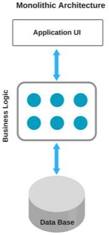
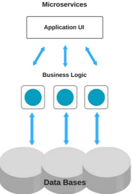

최근에 도커를 공부하기 시작했는데, 모놀리식과 MSA에 대해 무지한 상태였기 때문에 해당 아키텍처들에 대한 개념과 차이점을 먼저 알아보게 되었다. 

모놀리식 애플리케이션은 보통 애플리케이션을 만들 때 선택할 수 있는, 가장 간단한 시작 형태라 할 수 있다. 그렇다면 요즘 마이크로 서비스 아키텍처가 대세가 된 현재에는 모놀리식 아키텍처는 더 이상 사용하지 않아야 할까? MSA로 애플리케이션을 만들면 이점은 무엇일까? 이번 포스팅에서는 모놀리식과 MSA의 장단점과, 비즈니스에 적합한 소프트웨어 아키텍처를 선택하는 방법에 대해 알아보자.

  

## **Monolithic Architecture**

 

모놀리식 아키텍처는 **단일 코드 베이스**의 아키텍처다. 예를 들어 Java로 개발할 때, 전체 애플리케이션은 단일 코드로 작성되어 단일 DB에 연결된다. 이것은 매우 일반적인 접근 방식으로, 현재까지 개발에 참여한 모든 프로젝트 또한 모놀리식으로 개발했다. 단일 코드 베이스이기 때문에 마이크로 서비스 아키텍처보다 구현이 쉽고, 덜 복잡하다는 장점이 있다.

 

### **모놀리식 아키텍처의 장점**

* **단순성** : 모든 코드가 단일 코드 베이스이기 때문에, 변경 사항이 발생할 경우 필요한 모든 코드가 한곳에 존재한다.
* **간편한 배포** : 단일 프로젝트로 배포하면 되기 때문에 간편하다. 새로운 기능이 추가되거나 버그가 수정될 떄마다 단일 애플리케이션을 배포하면 된다.
* **쉬운 디버깅, 테스트** : 모든 코드가 단일 애플리케이션에 있기 때문에 디버깅과 테스트 수행이 쉽다.
* **쉬운 모니터링** : 오류 시 문제가 발생한 위치를 식별하기 쉽다.

 

### **모놀리식 아키텍처의 단점**

* **규모가 커지면 유지 보수가 어려움** : 애플리케이션의 규모가 크고 복잡해지면 관리가 어려울 수 있다.
* **유연하지 않은 확장성** : 모놀리식도 확장할 수 있지만 전체 애플리케이션의 확장만 가능하다. 특정 부분만 확장할 수는 없고, 전체 애플리케이션을 확장해야 한다.
* **대규모 팀 작업이 어려움** : 모든 팀이 동일한 코드, 동일한 프로젝트에서 작업하기 때문에 코드 병합에 대한 충돌 가능성이 높고, 기능 변경 시 다른 팀의 작업에 영향을 줄 수 있다.
* **기술 사용 제한** : 모놀리식 애플리케이션을 다른 기술로 변경하려면 전체를 변경해줘야 하기 때문에 어렵다.

 

### **모놀리식 아키텍처는 언제 사용하면 좋을까?**

* 규모가 작은 애플리케이션인 경우
* 복잡한 시스템 설계 및 관리가 필요하지 않은 경우
* 아직 아이디어를 구상 중인 단계인 경우
* 팀의 규모가 작거나 신생 팀인 경우
* 아직 제품이 MVP 상태라면, 모놀리식은 사용자로부터 피드백을 수집할 수 있는 가장 빠른 방법이다.
* 주된 작업이 CRUD일 경우

  

## **Microservices Architecture**

 

마이크로서비스 아키텍처는 애플리케이션을 작은 서비스로 분할하고, 각 서비스가 서로 독립적이라 기술에 구애받지 않는다. 그래서 각각 고유한 DB를 소유할 수 있다. 그로 인해 많은 이점을 제공하지만, 문제도 많고 복잡성을 함께 수반한다. 때문에 마이크로서비스 아키텍처로 프로젝트를 진행하려면 많은 경험이 필요하다.

 

### **마이크로서비스 아키텍처의 장점**

* **유연한 확장** : 각 마이크로서비스는 다른 서비스와 독립적으로 확장할 수 있다. 예를 들어 애플리케이션의 일부가 요청을 받을 경우, 전체 애플리케이션을 확장하는 대신 특정 마이크로서비스만 확장할 수 있기에 애플리케이션의 고가용성이 필요할 때 매우 유용하다.
* **독립적인 배포** : 마이크로서비스는 느슨하게 결합되어 있으므로 하나의 마이크로서비스만 배포할 수 있다. 이렇게 하면 애플리케이션의 작은 부분만 업데이트되므로 전체 애플리케이션의 동작을 멈출 필요가 없다.
* **전체 서비스 중단 위험 감소** : 특정 마이크로서비스가 중단되더라도 전체 애플리케이션에 영향을 미치지 않고, 해당 마이크로서비스에만 영향을 미친다. 다른 부분은 정상적으로 작동될 수 있다.
* **다른 DB를 소유** : 각 마이크로서비스 별로 DB를 소유할 수 있다. 어떤 마이크로서비스에는 DBMS가 최선일 수 있고, 다른 마이크로서비스에는 NoSQL이 더 적합할 수 있다. 이렇게 각 서비스에 적합한 DB를 사용할 수 있다.
* **다양한 기술 수용 가능** : 각 마이크로서비스는 서로 다른 기술을 가질 수 있다. 하나는 Java, 다른 하나는 Node 등에서 수행될 수 있다.

 

### **마이크로서비스 아키텍처의 단점**
일반적으로 마이크로서비스 아키텍처에서 작업하는 것은 모놀리식 아키텍처에서 작업하는 것보다 훨씬 더 복잡하다.

 

* **개발 생산성 필요** : 여러 개의 마이크로서비스 중 하나의 서비스에 새로운 기능을 구현해야 할 때, 다른 서비스에 접근할 수 있도록 로컬에서 많은 애플리케이션을 실행할 수 있는 환경을 갖춰야 한다.
* **마이크로서비스 간 통신** : 동기/비동기 방식의 통신을 고려해야 하며, 이런 부분이 애플리케이션의 복잡성을 증가시킨다.
* **오류 처리** : 두 개 이상의 마이크로서비스를 사용해 요청을 처리한다면, 첫 번째 마이크로서비스에 대한 요청에서 문제 발생 시 작업을 이전 상태로 되돌릴 수도 있음을 고려해야 한다.
* **오류 식별의 어려움** : 오류를 식별하는 것은 모놀리식보다 훨씬 복잡하고 어렵다. 애플리케이션을 디버깅하고 문제를 찾아야 하는 경우 로컬에서 둘 이상의 마이크로서비스를 실행해야 할 수 있다.

 

### **마이크로서비스 아키텍처는 언제 사용하면 좋을까?**

* 비즈니스가 계속 성장하고 있는 경우
* 복잡한 애플리케이션이 될 것임을 식별할 수 있는 경우
* 가용성 및 유연한 확장이 요규사항인 경우
* 서비스를 만드는 서로 다른 독립적인 팀이 존재하는 경우

  

## **모놀리식과 마이크로서비스 아키텍처의 차이점**

**확장성** 
모놀리식도 확장이 가능하다. 다만 모놀리식 애플리케이션은 여러 복사본을 배포하는 형태로 확장할 수 있는 것에 비해, 마이크로서비스는 더 적은 리소스로도 확장할 수 있어 훨씬 유리하다.

 

**복잡성** 
모놀리식은 복잡성이 낮다. 이에 비해 마이크로서비스는 애플리케이션 복잡성에 따라 소스 코드, 프레임워크 및 기술이 포함되고, 여러 서비스가 API를 통해 서비스 간 통신하는 형태로 구축된다. 그래서 전체 아키텍처에 대한 높은 수준의 관리와 기술에 대한 이해가 필요하다.

 

**지연 시간** 
마이크로서비스는 다른 서비스와 통신할 때, 네트워크를 통해 통신한다. 반면 모놀리식은 모든 서비스가 동일한 워크플로우 내에 있기 때문에 네트워크 대기 시간이 발생하지 않는다. 이런 이유로 마이크로서비스는 모놀리식보다 성능이 느리다.

 

**신뢰성** 
모놀리식은 단 하나의 서버로 구성되기 때문에 장애가 발생하면 전체 애플리케이션이 다운된다. 마이크로서비스는 하나에 문제가 생기면 장애 격리를 통해 애플리케이션을 유지할 수 있다.

  

## **마치며**

아키텍처는 여러 가지 비즈니스 상황을 고려해 선택해야 한다. 최근 마이크로서비스가 대세라지만, 맞지 않는 상황도 존재할 것이다. 

이전까지는 아키텍처 설계에 대해 관심이 없어서 프로젝트를 진행할 때 기본적으로 모놀리식 아키텍처로 개발했다. 도커를 공부하기 시작하면서 마이크로서비스 아키텍처에 대해 알아보았고, 한 번 실습을 통해 더욱 상세하게 학습해 볼 예정이다.

 

참고자료 
<a href="https://yozm.wishket.com/magazine/detail/1813/">https://yozm.wishket.com/magazine/detail/1813/</a> 
<a href="https://hahahoho5915.tistory.com/71">https://hahahoho5915.tistory.com/71</a> 