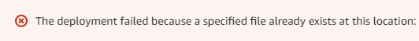
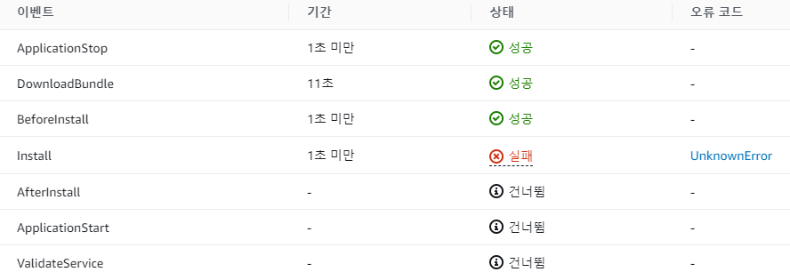

GitHub Actions를 사용한 CI/CD를 프로젝트에 적용할 때 발생한 문제들과 해결 과정에 대해 기록하기 위한 포스트다.

<br><br>

## **CodeDeploy 오류 - 중복 파일**
<hr />

<span style="font-size:130%">**오류 내용**</span>
<br>

<br>



<br>

CodeDeploy의 배포 과정에서 위와 같은 오류로 배포에 실패했는데, 특정 경로에 있는 파일이 이미 존재하고 있는 파일이기 때문에 발생하는 오류이다.<br>

구글링을 해보니 파일들을 OVERWRITE 하는 해결책이 있었다.<br>

**appspec.yml**<br>
``` yml
version: 0.0
os: linux

files:
  - source:  /
    destination: /home/ec2-user/momodo-serv
    overwrite: yes
file_exists_behavior: OVERWRITE

permissions:
  - object: /
    pattern: "**"
    owner: ec2-user
    group: ec2-user
```

`file_exists_behavior: OVERWRITE` 구문을 추가하여 이미 존재하는 파일을 덮어쓰도록 하여 해결했다.

<br><br>

## **submodule을 받아오지 못한 문제**
<hr />

해당 문제는 EC2 서버에서 빌드 파일을 받아 .jar 파일을 실행했을 때 발생했었던 문제이다.<br>

DB, S3, JWT에 사용되는 설정 값을 포함하는 application.yml 파일을 외부에 노출되지 않도록 private repository를 생성하여, 기존 프로젝트에 submodule로 추가하는 방식으로 관리했다.<br>

GitHub Actions를 통해 배포할 때, 이 submodule을 받아오기 위해서는 **checkout**에 설정을 추가해주지 않으면 submodule 내의 application.yml 파일을 못 가져오게 되고, 그대로 빌드 된다.<br>

``` yml
steps:
- name: Checkout
  uses: actions/checkout@v3
  with:
    # private repository에 접근하기 위해서 Git 계정의 token 값이 필요하다.
    token: ${{ secrets.GIT_TOKEN }}
    # submodules: true로 설정해주어야 프로젝트에 포함된 submodule코드까지 받아온다.
    submodules: true
```

submodule을 가져오게 코드를 추가하니 빌드 및 배포가 정상적으로 수행되었다.