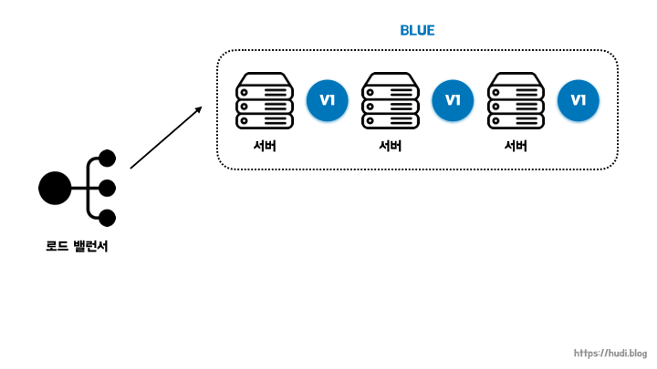
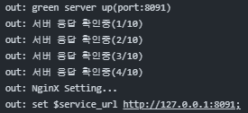

## 배경

---

Github Actions와 Docker를 사용하여 배포 자동화 환경을 구축했지만, 배포를 하는 동안에는 애플리케이션이 종료되는 문제가 존재했습니다. 긴 시간은 아니지만 새로운 배포 버전 서비스가 실행되기 전까지 기존에 배포되어 있는 서비스가 중단됩니다. 때문에 서비스를 중단하지 않고 새로운 버전을 배포할 수 있는 무중단 배포를 구현하게 되었습니다.

<br>

## Nginx를 이용한 Blue/Green 무중단 배포 방법

---

Nginx는 외부의 요청을 받아 서버로 요청을 전달하는 **리버스 프록시** 기능이 존재합니다.
클라이언트의 요청을 Nginx가 받고, Nginx는 WAS에 클라이언트의 요청을 전달하는 **클라이언트 → nginx(웹서버) → WAS** 구조가 됩니다.

### Blue/Green 배포 방식

<br>

트래픽을 한번에 구버전에서 신버전으로 옮기는 방법입니다. Blue/Green 배포 전략에서는 **현재 운영중인 서비스의 환경을 Blue라고 부르고, 새롭게 배포할 환경을 Green**이라고 부릅니다.

Blue 서버가 배포되어 있는 상태에서 Green 버전의 배포가 진행된다면, Green 버전 배포가 성공적으로 완료가 되었을 때, 트래픽을 Green으로 전환시키고, Blue 서버는 중단시킵니다.

저희는 하나의 EC2 프리 티어 서버에서 Port를 2개로 나누어 Blue/Green 배포 방식을 구축했습니다.
새로운 버전 또한 기존 EC2 서버에 그대로 적용하면 되므로 배포를 위해 EC2 서버가 추가로 더 필요하지 않기 때문에 규모가 작은 프로젝트의 비용 측면에서 효율적이라고 생각했습니다. 

구조는 EC2 서버 1대와 Nginx, 배포 파일 Jar 2대를 사용했습니다.

- Nginx에는 8080포트 할당
- 서버 A에는 8090 포트 할당
- 서버 B에는 8091 포트 할당

1. 클라이언트는 Nginx 서비스 주소로 접속(8080 포트)
2. Nginx는 클라이언트 요청을 받아 현재 연결된 서버 A로 요청을 전달합니다.(8090)
    - 연결되지 않은 서버 B는 전달받지 못합니다.
3. 신규 버전의 배포가 진행되면 Nginx와 연결되지 않은 서버 B로 배포됩니다.
    - Nginx는 현재 서버 A와 연결되어 있으므로 배포하는 동안 서비스가 중단되지 않습니다.
4. 배포 이후 서버 B가 정상적으로 구동되는지 확인하고, nginx reload 명령어를 통해 서버 B와 연결되도록 하고, 구버전 서버 A는 중단시킵니다.

이처럼 Nginx는 서버 내부에서 트래픽을 어디로 라우팅할 것인지 정해 요청을 전달하므로 한대의 서버에서 2개의 어플리케이션을 이용하여 무중단 배포를 할 수 있습니다.

<br><br>

## 구축 과정

--- 

### 1. 웹 서버 설정

```bash
# 설정파일 열기
sudo vi /etc/nginx/nginx.conf
```

```bash
# /etc/nginx/nginx.conf
server {
				# 포트 설정.
        listen       8080;
        listen       [::]:8080;
        server_name  _;
        root         /usr/share/nginx/html;

        # Load configuration files for the default server block.
        include /etc/nginx/default.d/*.conf;

        include /etc/nginx/conf.d/service-url.inc;

        location / {
								# 프록시 연결 설정
                proxy_pass $service_url;
                proxy_set_header X-Real-IP $remote_addr;
                proxy_set_header X-Forwarded-For $proxy_add_x_forwarded_for;
                proxy_set_header Host $http_host;
        }
}
```

```bash
# /etc/nginx/conf.d/service-url.inc;
# 배포할 때 마다 포트 변경
# 서버 A -> 8090, 서버 B -> 8091
set $service_url http://127.0.0.1:8090;
```

`listen 8080;` 해당 코드를 통해 8080 포트로 설정하고, 해당 포트에 요청이 들어오면 현재 Nginx와 연결 중인 `proxy_pass $service_url;` 즉, **$service_url**이 가르키고 있는 **http://127.0.0.1:8090** 서버에 요청을 전달합니다.

$service_url의 포트는 배포할 때마다 변경됩니다.

<br>

### 2. blue, green docker-compose 작성

```bash
# docker-compose.blue.yml 
version: '3'
services:
  app:
    build:
      dockerfile: Dockerfile-main
    image: bnfkim/chips
    expose:
      - 8090
    ports:
      - 8090:8080
```

```bash
# docker-compose.green.yml 
version: '3'
services:
  app:
    build:
      dockerfile: Dockerfile-main
    image: bnfkim/chips
    expose:
      - 8091
    ports:
      - 8091:8080
```

두 **docker-compose.yml** 파일은 포트만 다를 뿐 컨테이너 정보는 동일합니다.

<br>

### 3. deploy.sh

```bash
#1
EXIST_BLUE=$(docker-compose -p spring-blue -f docker-compose.blue.yml ps | grep Up)

if [ -z "$EXIST_BLUE" ]; then
    docker-compose -p spring-blue -f docker-compose.blue.yml up -d
    BEFORE_COLOR="green"
    AFTER_COLOR="blue"
    BEFORE_PORT=8091
    AFTER_PORT=8090
else
    docker-compose -p spring-green -f docker-compose.green.yml up -d
    BEFORE_COLOR="blue"
    AFTER_COLOR="green"
    BEFORE_PORT=8090
    AFTER_PORT=8091
fi

echo "${AFTER_COLOR} server up(port:${AFTER_PORT})"

# 2
for cnt in {1..10}
do
    echo "서버 응답 확인중(${cnt}/10)";
    UP=$(curl -s http://localhost:${AFTER_PORT}/api/healthCheck)
    if [ -z "${UP}" ]
        then
            sleep 10
            continue
        else
            break
    fi
done

if [ $cnt -eq 10 ]
then
    echo "서버가 정상적으로 구동되지 않았습니다."
    exit 1
fi

# 3
echo "NginX Setting..."
echo "set \$service_url http://127.0.0.1:$AFTER_PORT;" |sudo tee /etc/nginx/conf.d/service-url.inc
sudo service nginx reload

echo "Deploy Completed!!"

# 4
echo "$BEFORE_COLOR server down(port:${BEFORE_PORT})"
docker-compose -p spring-${BEFORE_COLOR} -f docker-compose.${BEFORE_COLOR}.yml down
```

#### 1. 새로운 버전을 배포할 포트 결정

1. 컨테이너 상태 확인 및 변수 설정
    - **`docker-compose.blue.yml`** 파일을 사용하는 Docker Compose 프로젝트인 **`spring-blue`**에서 실행 중인 컨테이너 중 "Up" 상태인 컨테이너를 찾아서, 그 결과를 **`EXIST_BLUE`** 라는 환경 변수에 저장합니다.
2. 조건에 따른 서비스 시작
    - 변수 **`EXIST_BLUE`** 를 확인하여 **`spring-blue`** 프로젝트에서 "Up" 상태가 아니라면 해당 프로젝트를 시작하고, "Up" 상태라면 **`spring-green`** 프로젝트를 시작하고 포트를 결정합니다.

#### 2. HealthCheck

1. 반복문을 통한 서버 응답 확인
    - 주어진 횟수 동안 서버 응답을 확인하는 작업을 수행하고, 만약 서버가 정상적으로 구동되지 않으면 해당 정보를 출력하고 스크립트를 종료합니다.
2. 루프 종료 후의 처리
    - 루프가 10회 돌았는지 확인합니다. 만약 10회 모두 돌았으면(서버가 10번 확인 동안 응답이 없었다면) 아래의 메시지를 출력하고 스크립트를 종료합니다.

#### 3. **Nginx 설정 업데이트**

1. Nginx 설정 업데이트
    - `/etc/nginx/conf.d/service-url.inc` 파일의 **service_url** 변수를 **AFTER_PORT** 변수를 사용하여 변경 → Nginx에서 사용할 서비스 URL이 설정됩니다.
2. Nginx 재시작
    - Nginx에게 설정을 다시 읽도록 하여 새로운 설정이 적용되게 합니다.

#### 4. 이전 버전의 서버 중단

1. Docker Compose를 사용하여 이전 버전의 서비스를 중단
    - **BEFORE_COLOR** 변수를 사용하여 이전 버전을 중단합니다.

<br>

<br>

배포하면 현재 8090 포트가 실행중이기 때문에 8091 포트로 새로운 버전을 실행하는 모습을 볼 수 있습니다.

<br><br>

## 정리

---

CI/CD를 구축하고 나니까 자연스럽게 무중단 배포까지 관심을 가지게 되었습니다. 또한 이번 무중단 배포를 구축하면서 Nginx에 대해서도 학습하게 되어 매우 뜻깊은 시간이었습니다. 다음에는 Nginx에 대해 자세히 공부한 후에 Nginx를 사용한 로드 밸런싱을 구현해 보도록 하겠습니다.

<br><br>

<hr />
참고자료<br>
<a href="https://hudi.blog/zero-downtime-deployment/">https://hudi.blog/zero-downtime-deployment/</a><br>
<a href="https://cookiee.tistory.com/690">https://cookiee.tistory.com/690</a><br>
<a href="https://mr-popo.tistory.com/230">https://mr-popo.tistory.com/230</a><br>
<a href="https://soobysu.tistory.com/123?category=1035458">https://soobysu.tistory.com/123?category=1035458</a><br>