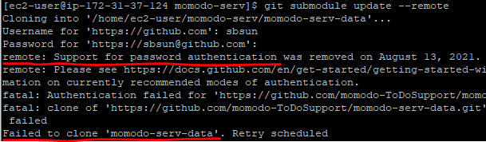

프로젝트를 진행할 때 DB, AWS S3 등의 정보들을 application.yml에 작성한다. 해당 프로젝트가 GitHub에 public으로 설정되어 있다면, yml에 작성한 프로젝트의 중요 정보들이 그대로 노출되는 문제가 발생한다.<br>

기존에는 *.yml을 gitignore 설정하는 방법을 사용했지만 이번에는 git submodule을 사용하여 특정 폴더만 private로 설정해서 노출을 막는 방법으로 구현해 보겠다.

<br><br>

## **git submodule을 사용하여 민감한 정보(yml) 숨기기**
<hr />

### **1. 민감한 정보를 저장할 private repo 생성**

<br>
위와 같이 **src/main/resource** 경로에 **application.yml** 파일이 존재한다.<br>
최종 목적은 application.yml 파일을 public repo에서 노출되지 않지만 프로젝트는 정상적으로 수행되게 만드는 것이다.

<br>

<br>
public repo의 application.yml 파일을 삭제하고 gitignore에 *.yml*을 추가한다.

<br>

<br>
private repo를 생성하고 복사한 application.yml 파일을 추가한다.

<br>

### **2. public repository에 submodule 등록**

```
$ git submodule add ${repo 주소}
```
<br>
생성한 private repository를 submodule로 등록한다.

<br>

<br>
그러면 프로젝트의 최상위 경로에 submodule의 repository name을 가진 폴더가 생성된다.

<br>

### **3. submodule의 파일을 수정했을 경우**

git submodule 방식은 branch의 hash를 작성하는 방식이기 때문에 submodule 내의 application.yml 파일이 수정되었다면 **git submodule update --remote** 명령어를 실행하여 submodule를 update한다.

<br>

### **4. gradle를 이용해 빌드 시 submodule의 application.yml 파일을 local로 가져오기**

``` gradle
task copyPrivate(type: Copy){
	copy{
		from './momodo-serv-data'
		include "*.yml"
		into 'src/main/resources'
	}
}
```

빌드 시 submodule의 yml 파일들을 'src/main/resources' 경로에 가져온다.

<br>

### **5. EC2 등 CLI 환경에서 submodule을 가져오기 위한 권한 부여받기**

EC2에서 프로젝트를 빌드하기 위해 submodule 최신화 명령어를 실행했는데,
<br>
<br>
password를 이용한 인증은 안된다고 한다.<br>

찾아보니까 GitHub에서 personal access token을 발급받아 password 대신 입력해주어야 했다.

<hr />
참고자료<br>
<a href="https://dkswnkk.tistory.com/578">https://dkswnkk.tistory.com/578</a><br>
<a href="https://my-codinglog.tistory.com/30">https://my-codinglog.tistory.com/30</a><br>
