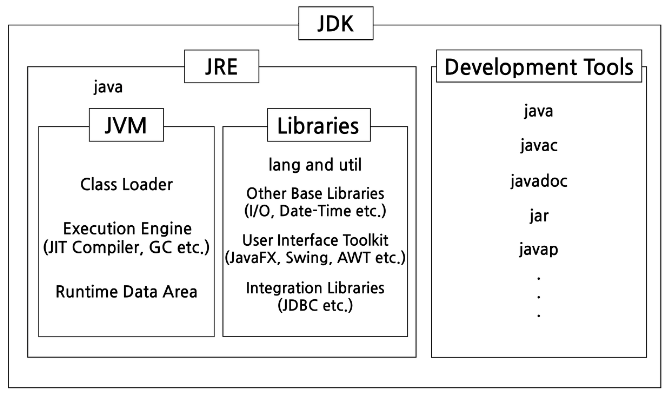
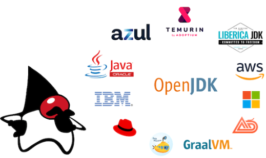
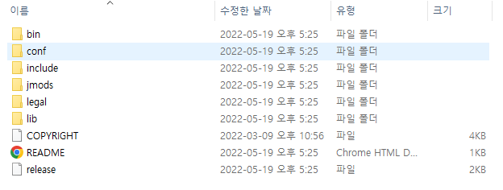
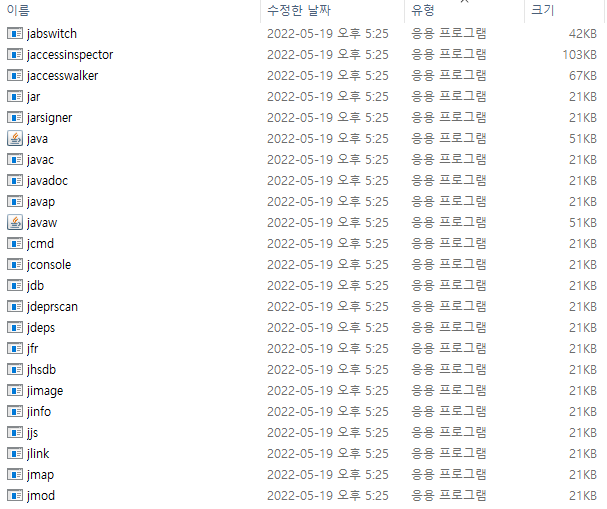
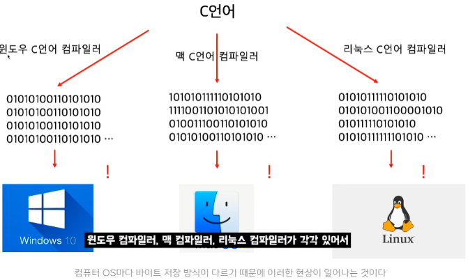
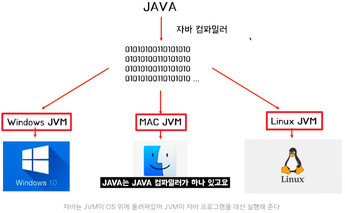

## **JDK**

JDK는 자바 개발 키트(Java Development Kit)의 약자로 **개발자들이 Java 기반 애플리케이션을 개발**하기 위해 필요한 기능을 갖춘 Java용 SDK 키트이다. 

그래서 JDK 내에는 자바를 개발 시 필요한 라이브러리들과 javac, javadoc 등의 개발 도구들이 포함되어 있고, 개발을 하려면 **자바 프로그램을 실행**시켜줘야 하기 때문에 JRE도 함께 포함되어 있다. 

**SDK란?** 
Software Development Kit(소프트웨어 개발 키트)로, 하드웨어 플랫폼, 운영체제 또는 프로그래밍 언어 제작사가 제공하는 툴이다. 키트의 요소는 제작사마다 다르다. 
SDK의 대표적인 예시로, 안드로이드 스튜디오, IOS 등이 있다. 이 SDK를 활용하여 애플리케이션을 개발할 수 있다. 

JDK는 JRE, JVM를 모두 포함하고, 이외에 자바를 개발 하는데 필요한 development tools도 포함하고 있다. 

  

 **JDK 버전 표기**  

**Java SE(Java Standard Edition)** 

* 가장 기본이 되는 표준 에디션의 자바 플랫폼으로 자바 언어의 핵심 기능을 제공 
* 흔히 자바 언어라고하는 대부분의 패키지가 포함된 에디션
  * `java.lang.*`, `java.util.*`, `java.awt.*` 등

**Java EE(Java Enterprise Edition)** 

* Java SE 플랫폼 위에 구축된다.
* 대규모, 다계층, 확장 가능하고 안정적이며 안전한 네트워크 애플리케이션을 개발하고 실행하기 위한 API 및 런타임 환경 제공
* WEB 개발에 필요한 기능을 다수 포함

**Java ME(Java Micro Edition)** 

* 피쳐폰, PDA폰, 셉톱박스, 프린터와 같은 작은 임베디드 기기들 같은 작은 기기를 다루는데 이용하는 에디션
* 각각의 OS(ex. Android OS, IOS, Black Berry 등)를 가지고 있는 스마트 폰이 대중화된 지금은 잘 쓰이지 않는다

   

 **JDK 종류** 

자바는 JDK도 여러가지 종류로 나뉜다. (리눅스처럼 Ubuntu, CentOS, RedHat 계열이 있는 것과 같다.) 

이처럼 여러가지 JDK가 있는 큰 이유는 라이센스 때문이다. 

Java 소스코드 자체는 오픈소스이다. 

그래서 오픈소스인 Java 소스코드를 빌드하여 사용하는 것에는 거의 제약이 없지만 Oracle에서 제공하는 설치버전의 JDK에는 NFTC 라이센스가 적용되어 회사에서는 사용할 수 없게 된다.(따로 돈내고 사용해야 된다.) 

그래서 무료 라이센스를 제공하는 또다른 JDK 버전을 여러 회사에서 출시했다. 

 

**Oracle JDK** : Oracle에서 제공하는 JDK. 구독을 통해 유료 라이센스를 구매할 수 있다. 
**Open JDK** : 유명한 무료 JDK. 하지만 OpenJDK를 직접 사용하는것 보다는, OpenJDK 기반으로 빌드된 JDK 사용을 추천한다. 
**Azul Zulu** : 인지도가 높은 JDK 중 하나이며, Mac 등에서 사용할 수 있는 바이너리를 제공하는 것이 특징이다. 
**Amazon Corretto** : AWS에서 제공하는 JDK. AWS에서 쉽게 사용 가능하며, AWS 환경이 아니더라도 사용할 수 있다. 
**Temurin** : Eclipse에서 제공하는 JDK. Eclipse를 사용한다면 Temurin 설치를 추천한다.  

 **JDK 디렉토리 구성요소**  

 

**bin** : 자바 개발, 실행에 필요한 도구와 유틸리티 명령 
**include** : 네이티브 코드 프로그래밍에 필요한 C언어 헤더 파일 
**lib** : 런타임에 필요한 라이브러리 클래스들  

**bin 디렉토리에 들어 있는 개발 프로그램****Java로 프로그램을 직접 개발하려면 JDK**가 필요하고, **컴파일 된 Java 프로그램을 실행시키려면 JRE**가 필요하다.  

## **JVM**

JVM은 자바 가상머신(Java Virtual Machine)의 약자로서, 직역하면 '자바를 실행하기 위한 가상 기계'라고 할 수 있다. 

**자바로 작성된 모든 프로그램은 JVM에서만 실행될 수 있으므로, 자바 프로그램을 실행하기 위해서는 JVM이 설치되어 있어야 한다.** 

Java와 C언어를 비교해보자.  

 **C언어의 실행(WOCA)**  

C언어 코드를 작성한 뒤 저장하고 실행하면 exe 파일이 생성되어, 그 exe 파일을 실행하면 C언어 코드가 실행된다. 

개발자가 소스 코드를 작성하면, 기계에 맞춰진 컴파일러가 각 기계가 이해하는 기계어로 변환해주어 실행 프로그램(exe)를 만들어 주는 것이다. 

이렇게 컴파일된 코드를 **Binary Code(기계어가 읽을 수 있는 이진 코드, 기계어)**라고 부른다. 

이를 **WOCA**의 특성이라 부르며, `Write Once, Compile Anywhere` '한번만 작성하고 컴파일하면 어디서든 사용 가능하다'를 의미한다. 

그런데 이 기계어는 **특정 OS나 CPU 구조에 맞춰진 컴파일러에 의해 다르게 컴파일** 된다는 특징이 있다. 

이 말은 다양한 환경의 기기(다른 OS, CPU 구조)를 사용하는 환경에서는 이 기계어를 이해할 수 없다는 말이다. 
컴파일러는 같은 형식의 기계어를 만들어내지만, 각 OS 환경에 맞춰진 독자적인 컴파일러이기 때문에 다른 환경에서는 이해하지 못하기 때문이다. 

 

보통 C언어를 OS에 종속된 언어라고 표현하는데, 윈도우 OS 환경에서 컴파일된 코드가 리눅스 OS 환경에서는 읽어질 수 없기에, 개발자는 윈도우용 C 프로그램, 리눅스용 C 프로그램을 또 만들어야 되서 OS 환경에 종속 되었다고 말한다.  

 **Java의 실행(WORA)**  

Java 언어로 작성한 소스파일은 직접 운영체제로 가서 실행하는 것이 아닌, **JVM을 거쳐서 운영체제 상호작용**을 하게 된다. 

JVM으로 인해 운영체제 종류에 상관없이 **운영체제로부터 독립적으로 프로그램을 제약 없이 실행**할 수 있다. 

이것이 가능한 이유는 컴파일된 코드와 하드웨어/OS 사이 중간에서, 해당 하드웨어/OS 환경에 알맞게 JVM이 Byte Code로 변환해주기 때문이다. 

 

C언어에서의 컴파일 과정은 소스 코드를 **Binary Code**로 바로 변환하여 하드웨어에 의해 읽어지고, 그렇기 때문에 OS 환경에 따라 코드가 달라져야했던 것과 달리, Java는 아래의 과정을 거치는 것을 통해 코드의 수정이 불필요하게 된다. 

1. Java Compiler가 Java로 작성된 소스 코드 .java 파일을 .class 파일인 **Byte Code**로 컴파일한다. (단, 해당 코드는 직접 CPU에서 동작할 수 있는 코드가 아니다. 정확히 말하면 가상머신 JVM이 이해할 수 있는 코드이다.)
2. 이제 **Byte Code**를 기계어로 변환시키기 위해 가상 CPU가 필요한데, 이것이 JVM의 역할이다.
3. JVM이 **Byte Code**를 **Binary Code**로 변환한다.
4. JVM에 의해 컴파일된 기계어는 바로 CPU에서 실행되어 사용자에게 서비스를 제공해준다.

 

이처럼 Java는 **WORA**의 특성이라고 불리우며, `Write Once, Read Anywhere` 이라는 재컴파일할 필요가 없고 바로 기계가 읽고 실행할 수 있게 한다는 의미로 쓰여진다. 

즉, 윈도우에서 컴파일한 Byte Code를 맥, 리눅스 환경에서도 제약없이 동작한다는 것은, JVM이 자바 파일을 한번 더 기계어로 변환해주기 때문에 가능한 것이다. 

이러한 장점 때문에 자가바 아닌 다른 언어도 클래스 파일만 있다면 JVM을 사용할 수 있게 개발되고 있다. 
실제로 Java외 다른 언어(클로저, 그루비, 코틀린 등)에서도 이 JVM을 사용하고 있다. 

자바 프로그램은 일반 프로그램보다 JVM이라는 한 단계를 더 거쳐야 하므로, 결국은 상대적으로 실행 속도가 느리다는 단점이 있다. 

즉, Java는 C언어와 달리 **두 번의 컴파일**로 인한 속도의 문제가 발생하는데, 이를 보완하기 위해 **JIT 컴파일러**라는 내부 프로그램을 사용해서 필요한 부분만을 기계어로 바꾸어 줌으로서 성능 향상이 되었지만 그럼에도 C언어의 실행 속도를 따라잡지는 못했다. (게임이나 임베디드에서 C계열 언어를 사용하는 이유가 바로 이 때문이기도 하다.) 

참고자료 
<a href="https://inpa.tistory.com/entry/JAVA-%E2%98%95-JDK-JRE-JVM-%EA%B0%9C%EB%85%90-%EA%B5%AC%EC%84%B1-%EC%9B%90%EB%A6%AC-%F0%9F%92%AF-%EC%99%84%EB%B2%BD-%EC%B4%9D%EC%A0%95%EB%A6%AC">https://inpa.tistory.com/entry/JAVA-%E2%98%95-JDK-JRE-JVM-%EA%B0%9C%EB%85%90-%EA%B5%AC%EC%84%B1-%EC%9B%90%EB%A6%AC-%F0%9F%92%AF-%EC%99%84%EB%B2%BD-%EC%B4%9D%EC%A0%95%EB%A6%AC</a> 
