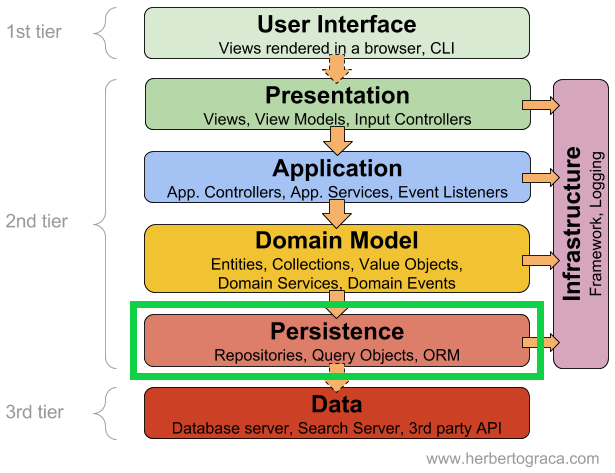
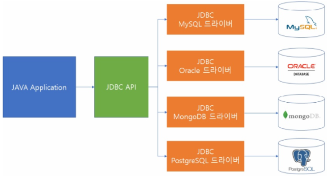
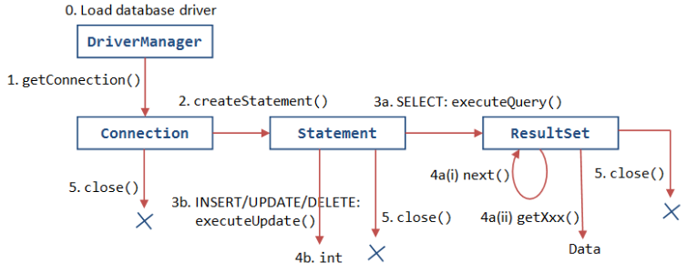
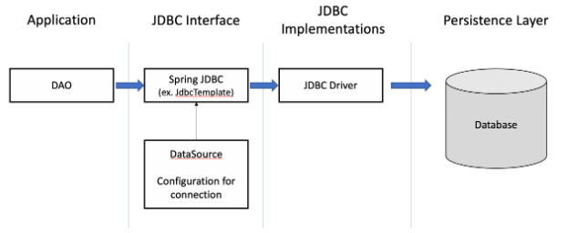

---
title: "[Java] JDBC, SQL Mapper, ORM의 개념과 비교"
excerpt: "JDBC, SQL Mapper, ORM에 대해서 알아보자."

categories:
  - Java
tags:
  - [Java, DB]

permalink: /java/jdbc-sql-mapper-orm/

toc: true
toc_sticky: true

date: 2023-02-10
last_modified_at: 2023-02-10

--- 

## **Persistence(영속성) 이란?**

**Persistence**는 데이터를 생성한 프로그램이 종료되더라도 사라지지 않는 데이터의 특성이다. 

객체지향 프로그램에서 객체의 상태는 단지 메모리에만 존재하고 프로그램이 종료되면 휘발하는 형태이다. 따라서, 객체의 상태를 DB에 저장하면서 객체에게 영속성을 부여해야 한다.  

**persistence layer** 
* 데이터에 영속성을 부여해주는 계층(보통 DB에 접근하는 역할)
* JDBC로 직접 구현할 수 있지만, 보통 persistence framework를 사용하여 개발한다.

**Persistence Framework**  
데이터베이스와 연동되는 시스템을 빠르게 개발하고 안정적인 구동을 보장해주는 프레임워크 

JDBC 프로그래밍의 복잡함이나 번거로움 없이 간단한 작업만으로 데이터베이스와 연동되는 시스템을 빠르게 개발할 수 있도록 해준다. 

종류로는 **SQL Mapper**와 **ORM**이 있다.  

## **JDBC**

**JDBC**는 Java DataBase Connectivity의 약자로 **자바에서 데이터베이스에 접속할 수 있도록 하는 자바 API**이다. 

 

위 그림과 같이 자바 애플리케이션에서 DBMS의 종류에 상관 없이, 하나의 JDBC API를 이용해 DB 작업을 처리한다. 

각각의 DBMS는 JDBC 인터페이스를 구현한 드라이버를 제공하여 드라이버만 교체한다면 해당 DB에 접근할 수 있게 해준다. 

따라서 JDBC API를 사용할 경우 하나의 자바 응용프로그램에서 JDBC 드라이버를 제공하는 DBMS들을 자유롭게 접근할 수 있다.  

### **JDBC의 동작 흐름**

 

1. JDBC Driver 로드
2. DB와 연결하는 통로 역할을 할 Connection 객체 생성
3. Statement 객체를 생성하고, 이를 통해 쿼리문을 생성 및 실행
4. SQL문에 결과물이 있다면 ResultSet 객체를 생성하여 필요한 객체를 얻는다.
5. DB 연결을 종료한다.

 

### **JDBC의 단점**

* 간단한 SQL을 실행하는 데도 중복된 코드를 반복적으로 사용한다.
* Connection과 같은 공유 자원을 제대로 릴리즈(반환) 해주지 않으면 시스템의 자원이 바닥나는 버그가 발생한다.
* JDBC가 사용하는 SQL은 단순 문자열이므로 컴파일 체크가 불가능하여 문법 오류와 오타 발생 확률이 높다.

 

## **SQL Mapper**

**SQL Mapper**는 Java Persistence Framework 중 하나로 객체의 필드와 SQL문을 매핑하여 데이터를 객체화 하는 것이다. 

주의해야 할 점은 객체를 관계와 매핑하는 것이 아니라 직접 작성한 SQL문의 질의 결과와 객체의 필드를 매핑하여 데이터를 객체화 하는 것이다. 

종류로는 Spring JDBC과 Mybatis가 있다.  

### **Spring JDBC**

 

**JDBC API를 이용**하려면 DB 연동에 필요한 **Connection 객체**와 쿼리 실행을 위한 **PreparedStatement 객체**를 생성해야한다. 그리고 쿼리 실행 후에는 finally 블록에서 **ResultSet, PrepardStatement, Connection 객체들을 close() 메서드로 닫아주어야 한다.** 

Spring JDBC에서 제공하는 **JDBC Templete**은 개발자가 DataSource만 제공해주면 위의 JDBC 코드들을 자동으로 처리해준다. 또한, 쿼리 수행 결과와 객체의 필드를 맵핑하여 반환 받을 수 있고, RowMapper를 재활용할 수 있다. 

하지만 기존 JDBC의 문제점인 반복적인 **데이터 바인딩**, **자바 코드와 쿼리문 분리**는 아직 해결되지 못한 것 같다.  

### **Mybatis**

**Mybatis**는 반복적인 JDBC 프로그래밍을 단순화하고, SQL 쿼리들을 XML 파일에 작성하여 자바 코드와 SQL을 분리하여 관리한다. 

순수 JDBC만 사용하면 결과를 가져와서 객체의 인스턴스에 매핑하기 위한 많은 코드가 길어지는데, Mybatis는 그 코드들을 작성하지 않아도 되게 해준다. 

정리하자면 반복적인 JDBC 프로그래밍을 단순화하면서 동시에, 복잡하거나 동적인 쿼리를 작성할 수 있고, DAO로부터 SQL라는 관심사를 분리함으로써 코드 간결성 및 유지 보수성을 높여준다.  

### **SQL을 직접 다룸으로 생기는 문제점**

JDBC와 SQL Mapper는 SQL을 개발자가 직접 작성함으로써 생기는 문제점을 피할 수 없다. 

**1. 특정 DB에 종속적으로 사용하기 쉽다.** 
DB에 종속적이지 않은 것이 JDBC의 장점이였으나 사용하는 쿼리 문법이나 데이터 타입은 DB마다 조금씩 다르기 때문에, 쿼리 문을 직접 작성할 경우 결국 특정 DB에 종속적으로 사용하게 된다. 

만약 테이블 필드가 변경될 시 관련된 모든 DAO의 SQL문, 객체의 필드 등을 수정해야 한다.  

**2. 관계형 DB와 객체간의 패러다임 불일치** 

관계형 데이터베이스는 객체 구조와는 다른 데이터 중심의 구조를 가지고 있어서 추상화, 상속, 다형성 같은 개념을 가진 객체를 데이터베이스에 직접 저장하거나 조회하기에는 어려움이 있다. 

객체의 구조를 테이블 구조에 저장하는 데는 한계가 있다. 객체지향적인 설계일수록 패러다임 불일치는 심화될 수밖에 없다.  

## **ORM**

**ORM은** Object Relational Mapping의 약자로 객체와 관계형 DB의 데이터를 자동으로 매핑해주는 것을 말한다. 

객체 지향 프로그래밍은 **클래스**를 사용하고, 관계형 DB는 **테이블**을 사용하기 때문에, 객체 모델과 관계형 모델 간에 불일치가 존재한다. 

이 문제를 **ORM**을 통해 객체 간의 관계를 바탕으로 SQL을 자동으로 생성하여 불일치를 해결한다.  

### **ORM의 장단점**

**장점** 
* **객체 지향적인 코드로 인해 더 직관적이고 비즈니스 로직에 더 집중할 수 있게 도와준다.**
  * 선언문, 할당, 종료 같은 부수적인 코드가 없거나 급격히 줄어든다.
  * 각종 객체에 대한 코드를 별도로 작성하기 때문에 코드의 가독성을 올려준다.
* **생산성**
  * 반복적인 CRUD 용 SQL을 개발자가 작성하지 않아도 된다.
* **DBMS에 대한 종속성이 줄어든다.**
  * DB 벤더마다 미묘하게 다른 데이터 타입, SQL 문법을 손쉽게 해결해준다.
* **유지보수**
  * 필드 추가, 삭제 시 관련된 CRUD 쿼리를 직접 수정하지 않고, Entity를 수정하면 된다.

 

**단점** 
* **완벽한 ORM 으로만 서비스를 구현하기가 어렵다.**
  * 사용하기는 편하지만 설계는 매우 신중하게 해야한다.
  * 프로젝트의 복잡성이 커질경우 난이도 또한 올라갈 수 있다.
  * 잘못 구현된 경우에 속도 저하 및 심각할 경우 일관성이 무너지는 문제점이 생길 수 있다.

참고자료 
<a href="https://www.youtube.com/watch?v=VTqqZSuSdOk&t=678s">https://www.youtube.com/watch?v=VTqqZSuSdOk&t=678s</a> 