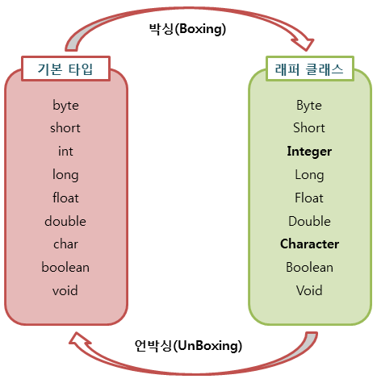

---
title: "[Java] Wrapper Class"
excerpt: "자바의 Wrapper Class에 대해서 알아보자. "

categories:
  - Java
tags:
  - [Java]

published: true

permalink: /java/wrapper-class/

toc: true
toc_sticky: true

date: 2023-02-16
last_modified_at: 2023-02-16

--- 

## **래퍼 클래스(Wrapper class)란?**
<hr />

래퍼 클래스란 8개의 <span style="color:red">**기본 타입에 해당하는 데이터를 객체로 표현**</span>하기 위해 포장해주는 클래스이다.<br>

예를 들어, 메서드의 인수로 객체 타입만이 요구되면, 기본 타입의 데이터를 그대로 사용할 수 없다.<br>
이때에는 기본 타입의 데이터를 먼저 객체로 변환한 후 작업을 수행해야 한다.<br>

래퍼 클래스는 각각의 타입에 해당하는 데이터를 인수로 받아, 해당 값을 가지는 객체로 만들어준다.<br>
이러한 래퍼 클래스는 모두 `java.lang` 패키지에 포함되어 제공된다.<br>

자바의 기본 타입에 대응하여 제공하고 있는 래퍼 클래스는 다음과 같다.<br>

| <span style="font-size:120%">기본 타입</span> | <span style="font-size:120%">래퍼 클래스</span> |
|:---:|:---:|
| <span style="font-size:120%">byte</span> | <span style="font-size:120%">Byte</span> |
| <span style="font-size:120%">short</span> | <span style="font-size:120%">Short</span> |
| <span style="font-size:120%">int</span> | <span style="font-size:120%">Integer</span> |
| <span style="font-size:120%">long</span> | <span style="font-size:120%">Long</span> |
| <span style="font-size:120%">float</span> | <span style="font-size:120%">Float</span> |
| <span style="font-size:120%">double</span> | <span style="font-size:120%">Double</span> |
| <span style="font-size:120%">char</span> | <span style="font-size:120%">Character</span> |
| <span style="font-size:120%">boolean</span> | <span style="font-size:120%">Boolean</span> |

<br>

## **박싱(Boxing)과 언박싱(UnBoxing)**
<hr />

래퍼 클래스는 산술 연산을 위해 정의된 클래스가 아니므로, <span style="color:red">**인스턴스에 저장된 값을 변경할 수 없다.**</span><br>
값을 참조하기 위해 새로운 인스턴스를 생성하고, 생성된 인스턴스의 값만을 참조할 수 있다.<br>

<br>

위의 그림과 같이 기본 타입의 데이터를 래퍼 클래스의 인스턴스로 변환하는 과정을 **박싱**이라고 한다.<br>
반면 래퍼 클래스의 인스턴스에 저장된 값을 다시 기본 타입의 데이터로 꺼내는 과정을 **언박싱**이라고 한다.
<br><br>

## **오토 박싱(AutoBoxing)과 오토 언박싱(AutoUnBoxing)**
<hr />  

JDK 1.5부터는 박싱과 언박싱이 필요한 상황에서 자바 컴파일러가 이를 자동으로 처리해 준다.<br>
이렇게 자동화된 박싱과 언박싱을 **오토 박싱**과 **오토 언박싱**이라고 부른다.<br>

다음 코드는 박싱과 언박싱, 오토 박싱과 오토 언박싱의 차이를 보여주는 코드이다.<br>

``` java
Integer i1 = new Integer(10); // 박싱
int i2 = num.intValue();        // 언박싱

Integer i1 = 10; // 오토 박싱
int i2 = i1;     // 오토 언박싱
```
<br>

## **래퍼 클래스 객체 생성 방법**
<hr />

래퍼 클래스의 객체 생성 방법은 Java 9 이후로는 생성자를 통한 객체 생성 방법이 deprecated 되어 있고, 대신 `valueOf()`를 사용하도록 권장하고 있다. 또는 오토 박싱으로 인하여 기본형 데이터 값을 직접 대입하여 생성할 수 있다.<br>

``` java
Integer i1 = new Integer(10);       // deprecated since version 9 대신 valueOf() 권장
Integer i2 = Integer.valueOf(10);   // 매개변수의 값(정수)을 Integer 객체로 반환
Integer i3 = Integer.valueOf("10"); // 매개변수의 값(문자열로 표시된 정수)을 Integer 객체로 반환
Integer i4 = 10;                    // 오토 박싱으로 직접 기본 데이터형 대입
```

<hr />
참고자료<br>
<a href="http://www.tcpschool.com/java/java_api_wrapper">http://www.tcpschool.com/java/java_api_wrapper</a><br>