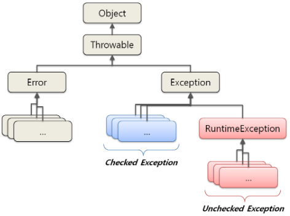

---
title: "[Java] Check Exception과 Uncheck Exception"
excerpt: "Check Exception과 Uncheck Exception에 대해서 알아보자"

categories:
  - Java
tags:
  - [Java]

published: true

permalink: /java/checkexception-and-uncheckexception/

toc: true
toc_sticky: true

date: 2023-03-24
last_modified_at: 2023-03-24

--- 

## **예외(Exception)의 종류**
<hr />

<br>

<br>

* 에러(Error)
* 예외(Exception)
  * 체크 예외(Check Exception)
  * 언체크 예외(Uncheck Exception)

<br>

**에러(Error)**
<br>

java.lang.Error 클래스의 하위 클래스다. Error는 프로그램 실행 중 오작동을 일으키거나 비정상적인 종료가 일어나게 하는 원인을 프로그램 에러 또는 오류라고 한다.<br>

주로 JVM에서 발생시키기 때문에 <span stlye="color:red">**애플리케이션 코드에서 잡아서는 안되며, 잡아서 대응할 수 있는 방법도 없다.**</span> 따라서 시스템 레벨에서 특별한 작업을 하는게 아니라면 에러 처리는 하지 않아도 된다.

<br><br>

**예외(Exception)**
<br>

java.lang.Exception 클래스와 하위 클래스들은 Error와 달리 애플리케이션 코드에서 에외가 발생했을 경우에 사용된다.

<br><br>

**체크 예외(Check Exception)**
<br>

체크 예외는 RuntimeException 클래스를 상속받지 않은 예외 클래스들이다.<br>

체크 예외는 <span stlye="color:red">**복구 가능성이 있는 예외**</span>이므로 반드시 <span stlye="color:red">**예외를 처리하는 코드를 함께 작성**</span>해야 한다.<br>
대표적으로 IOException, SQLException 등이 있으며, 예외를 처리하기 위해서는 **catch** 문으로 잡거나 **throws**를 통해 메서드 밖으로 던질 수 있다. 만약 <span stlye="color:red">**에러를 처리하지 않으면 컴파일 에러가 발생**</span>한다.
<br>

체크 예외는 개발자가 실수로 예외 처리를 누락하지 않도록 컴파일러가 도와준다. 하지만 개발자가 모든 체크 예외를 처리해주어야 하므로 번거로우며, 신경쓰지 않고 싶은 예외까지 처리해야 한다는 단점이 있다.<br>

또한 실제로 애플리케이션 개발에서 발생하는 예외들은 복구 불가능한 경우가 많기 때문에 실제 개발에서는 대부분 언체크 예외를 사용한다.

<br><br>

**언체크 예외(Uncheck Exception)**
<br>

RuntimeException 클래스를 상속받는 예외 클래스들은 <span stlye="color:red">**복구 가능성이 없는 예외들**</span>이므로 컴파일러가 <span stlye="color:red">**예외 처리를 강제하지 않는다.**</span><br>

언체크 예외는 Error와 마찬가지로 에러를 처리하지 않아도 컴파일 에러가 발생하지 않는다. 즉, 런타임 예외는 예상치 못했던 상황에서 발생하는 것이 아니므로 <span stlye="color:red">**굳이 예외 처리를 강제하지 않는다.**</span> 런타임 예외에는 대표적으로 NullPointerException이나 IllegalArgumentException 등이 있다.<br>

스프링에서 제공하는 <span stlye="color:red">**선언적 트랜잭션(@Transactional)안에서 에러 발생 시 체크 예외는 롤백이 되지 않고, 언체크 예외는 롤백 된다.**</span>

<br><br>

## **예외 처리 방법**
<hr />

* 예외 복구
* 예외 처리 회피
* 예외 전환

<br>

### **예외 복구**

예외 복구의 핵심은 <span stlye="color:red">**예외가 발생해도 애플리케이션은 정상적으로 동작**</span>한다는 것이다.<br>

<span stlye="color:red">**예외 발생 시 이를 예측**</span>하여 <span stlye="color:red">**다른 비즈니스 로직 흐름으로 유도**</span> 시키거나, <span stlye="color:red">**예외가 발생하지 않는 상황으로 복구를 시도하는 로직을 추가**</span>하는 방식이다.
<br>

대표적으로 API 호출에 실패했을 경우 설정한 횟수만큼 retry 하여 복구되도록 하는 것들이 있다.<br>

``` java
private void mayThrowExceptionLogic() {
    int maxTry = 20;
    while(maxTry --> 0) {
    	try {
    		// ???Exception 이 Throw 될 수 가능성이 있는 로직
        
        	// 성공 시 return, 해당 메소드 종료
        	return ;
    	} catch(???Exception e) {
    		// Error 로그 출력
                // 실패 로직 존재 시 원상 복구
        	// 일정 시간 동안 대기
    	} finally {
    		// 작업에 사용한 Resource 반환 및 정리
    	}
    }
    // 최대 횟수 실패시 예외 Throw
    throw new MaxTryFailedException();
}
```

<br><br>

### **예외 처리 회피**

<span stlye="color:red">**예외 발생 시 예외 처리를 직접 처리하지 않고, `throws`를 통해 호출 된 부분으로 해당 예외를 던져**</span>버리고, 예외 처리를 회피하는 방식이다.<br>

``` java
private void mayThrowExceptionLogic() throws ???Exception {
	// 비즈니스 로직
}
```

무작정 예외를 넘겨주는 것은 무책임한 회피가 될 수 있으므로 상황에 따라 적절하게 사용해야 한다.

<br><br>

### **예외 전환**

예외 전환은 예외 회피와 마찬가지로 예외를 복구할 수 없는 상황에 사용되며, 예외 회피와 다르게 <span stlye="color:red">**적절한 예외로 변환하여 던진다**</span>는 특징이 있다.<br>

예외 전환은 크게 2가지 목적으로 사용된다.<br>

* 의미 있고 추상화된 예외로 바꾸는 경우
* 런타임 예외로 포장하여 불필요한 처리를 줄여주는 경우

예를 들어 새로운 사용자를 등록하고자 할 때 동일한 아이디가 존재하면 **SQLException**이 발생하게 된다. 하지만 이 에러를 그대로 던지면 서비스 계층에서는 왜 예외가 발생한건지 파악이 힘들다. 
<br>
그래서 **DuplicatedUserIdException**과 같은 예외로 바꿔서 던지면 보다 확실히 의미를 전달할 수 있다.<br>

``` java
// 조금 더 명확한 예외로 던진다.
public void add(User user) throws DuplicateUserIdException, SQLException {
    try {
        // ...
    } catch(SQLException e) { // SQLException 예외가 발생하면
        if(e.getErrorCode() == MysqlErrorNumbers.ER_DUP_ENTRY) { // 그리고 정확히 어떠한 에러인걸 알았다면
            throw DuplicateUserIdException(); // 상위 클래스가 아닌 정확한 예외클래스를 던진다
        }
        else {
        	throw e;
        }
    }
}
```
<hr />
참고자료<br>
<a href="https://mangkyu.tistory.com/152">https://mangkyu.tistory.com/152</a><br>
<a href="https://inpa.tistory.com/entry/JAVA-%E2%98%95-Exception-Handling-%EC%98%88%EC%99%B8%EB%A5%BC-%EC%B2%98%EB%A6%AC%ED%95%98%EB%8A%94-3%EA%B0%80%EC%A7%80-%EA%B8%B0%EB%B2%95">https://inpa.tistory.com</a><br>