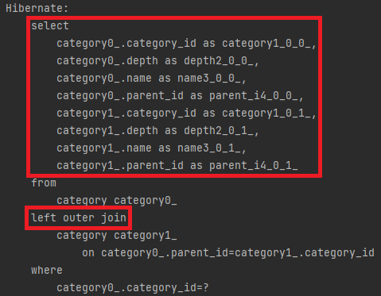
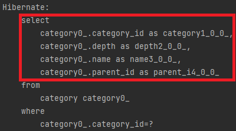

---
title: "[JPA] 즉시 로딩과 지연 로딩(FetchType.EAGER, LAZY)"
excerpt: "JPA의 즉시 로딩과 지연 로딩에 대해 알아보자."

categories:
  - JPA
tags:
  - [JPA]

permalink: /jpa/fetchtype/

toc: true
toc_sticky: true

date: 2023-02-05
last_modified_at: 2023-02-05

--- 

JPA에서 연관관계를 조회할 때 참조하는 객체들의 조회 시점을 선택할 수 있도록 두 가지 방법을 제공하는데 바로 <span style="color:red">**즉시 로딩(EAGER Loading)**</span>과 <span style="color:red">**지연 로딩(LAZY Loading)**</span>이다.<br>

예제를 통해 알아보자.<br><br>

## **Category Entity Class**
<hr />

``` java
@Getter
@Builder
@NoArgsConstructor
@AllArgsConstructor
@Entity
public class Category {
    @Id
    @GeneratedValue(strategy = GenerationType.IDENTITY)
    @Column(name = "category_id")
    private Long id;

    @Column(name = "name")
    private String name;

    @ManyToOne // 기본 값(EAGER)
    @JoinColumn(name = "parent_id")
    private Category parent;

    @Column(name = "depth")
    private Long depth;

    @OneToMany(mappedBy = "parent")
    private List<Category> children = new ArrayList<>();
}
```

Category Entity에서 parent(상위 카테고리)와 children(하위 카테고리들)은 `@OneToMany(1:N)`의 관계를 맺고 있다.<br>

즉, **하나의 카테고리(1)는 여러 카테고리들(N)을 하위로 둘 수 있다는 것**이다.<br>

따라서 상위 카테고리 기준으로 봤을 때, 하위 카테고리와의 관계는 **1:N**이 된다.<br>

만약 Category Entity를 조회한다면 해당 카테고리의 상위 카테고리도 함께 조회가 될 것이다.<br><br>

## **TEST**
<hr />

``` java
@Test
void 카테고리_반환_테스트(){
    // given
    String name = "돼지고기";

    // when
    CategoryResponseDTO categoryResponseDTO = categoryService.getCategoryByName(name);

    // then
    System.out.println(categoryResponseDTO);
    assertThat(categoryResponseDTO.getName()).isEqualTo(name);
}
```

### **즉시 로딩(EAGER Loading)**

<br>

실행된 SQL 쿼리문을 보면 검색한 카테고리와 해당 카테고리의 상위 카테고리 테이블도 함께 조회하며, OUTER JOIN으로 처리되는 것을 볼 수 있다.<br>

즉시 로딩은 항상 외부 조인(OUTER JOIN)을 사용한다.<br>

위 결과와 같이 <span style="color:red">**특정 Entity를 조회할 때 연관된 모든 Entity를 같이 로딩**</span>하는 것을 즉시 로딩이라고 한다.<br>

즉시 로딩은 연관된 Entity를 모두 가져온다는 장점이 있지만, Entity 간의 관계가 복잡해질수록 조인으로 인한 성능 저하를 피할 수 없고 <span style="color:red">**N+1**</span> 문제를 일으킨다.<br><br>

### **즉시 로딩(EAGER Loading)**

``` java
public class Category {
    @Id
    @GeneratedValue(strategy = GenerationType.IDENTITY)
    @Column(name = "category_id")
    private Long id;

    @Column(name = "name")
    private String name;

    @ManyToOne(fetch = FetchType.LAZY) // 지연 로딩
    @JoinColumn(name = "parent_id")
    private Category parent;

    @Column(name = "depth")
    private Long depth;

    @OneToMany(mappedBy = "parent")
    private List<Category> children = new ArrayList<>();
}
```

<br>

지연 로딩을 적용하면 이전과는 다르게 검색한 카테고리 테이블만 조회된다.<br>

즉시 로딩을 사용할 이유가 없다면 기본적으로 지연 로딩을 사용하자!

<hr/>
참고자료<br>
<a href="https://dev-coco.tistory.com/139">https://dev-coco.tistory.com/139</a><br>
