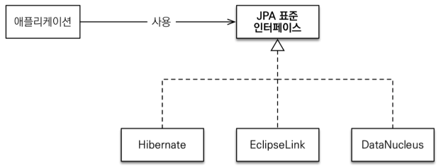
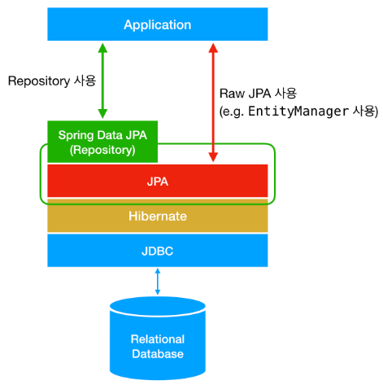

---
title: "[JPA] JPA, Hibernate, Spring Data JPA"
excerpt: "JPA, Hibernate, Spring Data JPA에 대해서 알아보자."

categories:
  - JPA
tags:
  - [JPA]

permalink: /jpa/jpa-hibernate-spring-data-jpa/

toc: true
toc_sticky: true

date: 2023-02-06
last_modified_at: 2023-02-06

--- 

## **JPA란?**
<hr />

JPA란 Java Persistent API의 약자로 <span style="color:red">**자바 ORM 기술에 대한 API 표준 명세**</span>를 의미한다.<br>
* JPA는 특정 기능을 하는 라이브러리가 아니고, <span style="color:red">**ORM을 사용하기 위한 인터페이스를 모아둔 것**</span>이다.
* JPA는 자바 애플리케이션에서 관계형 데이터베이스를 어떻게 사용해야 하는지를 정의하는 방법중 하나이다.
* JPA는 단순히 명세이기 때문에 구현체가 없다.

JPA를 정의한 `javax.persistence` 패키지의 대부분은 interface, enum, Exception, Annotation 들로 이루어져 있다.<br>

JPA의 핵심이 되는 EntityManager는 아래와 같이 javax.persistence 패키지 안에 interface로 정의되어 있다.<br>

``` java
package javax.persistence;
 
import ...
 
public interface EntityManager {
 
    public void persist(Object entity);
 
    public <T> T merge(T entity);
 
    public void remove(Object entity);
 
    public <T> T find(Class<T> entityClass, Object primaryKey);
 
    // More interface methods...
}
```

JPA를 사용하기 위해서는 <span style="color:red">**JPA의 구현체인 Hibernate, EclipseLink, DataNucleus 같은 ORM 프레임워크를 사용**</span>해야 한다.<br>
Hibernate를 많이 사용하는 이유는 가장 범용적으로 다양한 기능을 제공하기 때문이다.<br>

<br><br>

## **Hibernate란?**
<hr />

<span style="color:red">**Hibernate**</span>는 JPA의 구현체이다.<br>

즉, 위에서 언급한 `javax.persistence.EntityManager`와 같은 인터페이스를 직접 구현한 라이브러리이다.<br>

**JPA와 Hibernate는 마치 자바의 interface와 해당 interface를 구현한 class와 같은 관계이다.**

그리고 Hibernate는 SQL을 직접 사용하지 않고 직관적인 코드(메서드)를 사용해 데이터를 조작할 수 있다.<br>
Hibernate가 지원하는 메서드 내부에는 JDBC API를 사용한다.<br>

<br>

위 사진은 JPA와 Hibernate의 상속 및 구현 관계를 나타낸 것이다.<br>

JPA의 핵심인 <span style="color:red">**EntityManagerFactory, EntityManager, EntityTransaction**</span>을<br>
Hibernate에서는 각각 <span style="color:blue">**SessionFactory, Session, Transaction**</span>으로 상속받고 각각 **Impl**로 구현하고 있음을 확인할 수 있다.<br><br>

### **Hibernate의 장점**
**생산성**<br>
Hibernate는 SQL을 직접 사용하지 않고, 메서드 호출만으로 쿼리가 수행된다.<br>
즉, SQL 반복 작업을 하지 않으므로 생산성이 매우 높아진다.<br>

현재 진행하고 있는 프로젝트에서 `findById()`, `save()` 등의 메서드를 통해 해당 테이블의 데이터를 조회하거나 새로운 데이터를 저장할 수 있다.<br>

쿼리를 따로 작성하지 않아도 되지만 Hibernate가 수행한 쿼리를 보면서 의도한 대로 쿼리가 짜여졌는지, 성능은 어떠한지에 대한 모니터링이 필요하기 때문에 SQL 역시 잘 알아야 한다.<br><br>

**유지보수**<br>
Hibernate 사용의 또 다른 장점은 테이블 컬럼이 하나 변경되었을 경우 들어난다.<br>

Mybatis의 경우에는 이 테이블과 관련된 DAO의 파라미터, 결과, SQL 등을 모두 확인하여 수정해야 한다. 하지만 JPA를 사용하면 JPA가 이런 일들을 대신해주기 때문에 유지보수 측면에서 좋다.<br><br>

**특정 벤더에 종속적이지 않다.**<br>
여러 DB 벤더(MySQL, ORACLE 등)마다 쿼리 사용이 조금씩 다르기 때문에 애플리케이션 개발 시 처음 선택한 DB를 나중에 바꾸는 것은 매우 어렵다. 그런데 JPA는 추상화된 데이터 접근 계층을 제공하기 때문에 특정 벤더에 종속적이지 않다.<br>

즉, 설정 파일에서 JPA에게 어떤 DB를 사용하고 있는지 알려주기만 하면 얼마든지 DB를 바꿀 수 있다.<br><br>

### **Hibernate의 단점**
**성능**<br>
SQL를 직접 작성하는 것보다 메서드 호출만으로 쿼리를 수행한다는 것은 성능이 떨어질 수 있다.<br> 실제로 초기의 ORM은 쿼리가 제대로 수행되지 않았고, 성능도 좋지 못했다고 한다.<br><br>

**세밀함**<br>
메서드 호출로 DB 데이터를 조작 하기 때문에 세밀함이 떨어진다. <br>
복잡한 쿼리를 메서드만으로 해결하는 것은 힘든 일이다. 이것을 보완하기 위해 SQL과 유사한 기술인 JPQL을 지원한다. 물론 SQL 자체 쿼리도 작성할 수 있도록 지원한다.<br><br>

## **Spring Data JPA란?**
<hr />

**Spring Data JPA는 Spring에서 제공하는 모듈 중 하나로 JPA를 쉽고 편하게 사용할 수 있도록 도와준다.**<br>

기존에 JPA를 사용하려면 <span style="color:red">`Entity Manager`</span>를 주입받아 사용해야 하지만,<br>

**Spring Data JPA는 JPA를 한 단계 더 추상화 시킨 <span style="color:red">`Repository`</span> 인터페이스를 제공한다.**<br>

사용자가 <span style="color:red">`Repository`</span> 인터페이스에 **정해진 규칙대로 메서드를 입력하면, Spring이 알아서 해당 메서드 이름에 적합한 쿼리를 날리는 구현체를 만들어서 Bean으로 등록**해준다.<br>

Spring Data JPA가 JPA를 추상화 했다는 말은, **Spring Data JPA의 <span style="color:red">`Repository`</span>의 구현에서 JPA를 사용하고 있다**는 것이다.<br>

<span style="color:red">`Repository`</span> 인터페이스의 기본 구현체인 <span style="color:red">`SimpleJpaRepository`</span> 클래스의 코드를 보면 내부적으로 <span style="color:red">`EntityManager`</span>를 사용하고 있는 것을 볼 수 있다.<br>

``` java
package org.springframework.data.jpa.repository.support;

import ...

public class SimpleJpaRepository<T, ID> implements JpaRepositoryImplementation<T, ID> {

    private final EntityManager em;

    public Optional<T> findById(ID id) {

        Assert.notNull(id, ID_MUST_NOT_BE_NULL);

        Class<T> domainType = getDomainClass();

        if (metadata == null) {
            return Optional.ofNullable(em.find(domainType, id));
        }

        LockModeType type = metadata.getLockModeType();

        Map<String, Object> hints = getQueryHints().withFetchGraphs(em).asMap();

        return Optional.ofNullable(type == null ? em.find(domainType, id, hints) : em.find(domainType, id, type, hints));
    }

    // Other methods...
}
```
<br>

## **JPA, Hibernate, Spring Data JPA의 관계**
<hr />

<br>

위의 사진은 JPA, Hibernate, Spring Data JPA의 전반적인 관계를 그림으로 표현한 것이다.<br>

**Hibernate는 JPA의 구현체**이고, **Spring Data JPA는 JPA에 대한 데이터 접근의 추상화**라고 말할 수 있다.<br>

여기서 반드시 기억해야할 점은 **Spring Data JPA는 항상 Hibernate와 같은 JPA 구현체가 필요**하다.
<hr />
<a href="https://suhwan.dev/2019/02/24/jpa-vs-hibernate-vs-spring-data-jpa/">https://suhwan.dev/2019/02/24/jpa-vs-hibernate-vs-spring-data-jpa/</a><br>
<a href="https://m.blog.naver.com/swoh1227/221479428906">https://m.blog.naver.com/swoh1227/221479428906</a><br>
