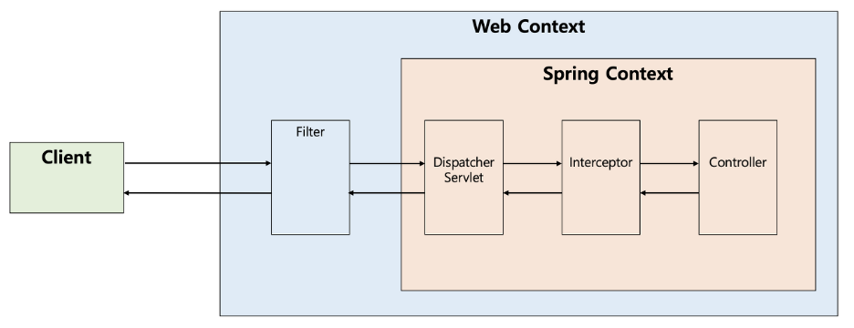

## Dispatcher Servlet의 개념

**Dispatcher Servlet 이란?** 
Dispatcher Servlet은 HTTP 프로토콜로 들어오는 모든 요청을 가장 먼저 받아 적합한 Controller에 위임해주는 Front Controller라고 정의할 수 있다.  
Client로부터 어떠한 요청이 오면 Tomcat과 같은 서블릿 컨테이너가 요청을 받게 된다. 그리고 이 모든 요청을 디스패처 서블릿이 가장 먼저 받게 된다. 그러면 디스패처 서블릿은 공통적인 작업을 먼저 처리한 후에 해당 요청을 처리해야 하는 컨트롤러를 찾아서 작업을 위임한다.  

**Dispatcher Servlet의 장점** 
Spring MVC는 Dispatcher Servlet이 등장함에 따라 web.xml의 역할을 상당히 축소시켜주었다. Dispatcher Servlet이 해당 애플리케이션으로 들어오는 모든 요청을 핸들링해 주고 공통 작업을 처리하면서 우리는 컨트롤러를 구현해두기만 하면 디스패처 서블릿이 알아서 적합한 컨트롤러로 위임을 해주는 구조가 되었다. 

 **정적 자원(Static Resources)의 처리** 
Dispatcher Servlet이 요청을 Controller로 넘겨주는 방식은 효율적으로 보인다. 하지만 Dispatcher Servlet이 모든 요청을 처리하다보니 이미지나 HTML/CSS/JavaScript 등과 같은 정적 파일에 대한 요청마저 모두 가로채는 까닭에 정적자원(Static Resources)을 불러오지 못하는 상황도 발생하곤 했습니다. 이러한 문제를 해결하기 위해 개발자들은 2가지 방법을 고안했다.  **1. 정적 자원에 대한 요청과 애플리케이션에 대한 요청을 분리** 
첫 번째는 클라이언트의 요청을 2가지로 분리하여 구분하는 것이다. 

* /apps의 URL로 접근하면 Dispatcher Servlet이 담당한다.
* /resources의 URL로 접근하면 Dispatcher Servlet이 컨트롤할 수 없으므로 담당하지 않는다. 

 **2. 애플리케이션에 대한 요청을 탐색하고 없으면 정적 자원에 대한 요청으로 처리**
 두번째 방법은 Dispatcher Servlet이 요청을 처리할 컨트롤러를 먼저 찾고, 요청에 대한 컨트롤러를 찾을 수 없는 경우에, 2차적으로 설정된 자원(Resource) 경로를 탐색하여 자원을 탐색하는 것이다. 이렇게 영역을 분리하면 효율적인 리소스 관리를 지원할 뿐 아니라 추후에 확장을 용이하게 해준다는 장점이 있다.  

## Dispatcher Servlet의 동작 과정

**Dispatcher Servlet의 동작 방식** 
앞서 설명한대로 디스패처 서블릿은 적합한 컨트롤러와 메서드를 찾아 요청을 위임해야 한다.

 **1. 클라이언트의 요청을 디스패치 서블릿이 받는다.** 
서블릿 컨텍스트(웹 컨텍스트)에서 필터들을 지나 스프링 컨텍스트에서 디스패처 서블릿이 가장 먼저 요청을 받게 된다. 실제로는 Interceptor가 Controller로 요청을 위임하지는 않으므로 아래의 그림은 처리 순서를 도식화한 것으로만 이해하면 된다.

 **2. 요청 정보를 통해 요청을 위임할 컨트롤러를 찾는다.** 
디스패처 서블릿은 요청을 처리할 컨트롤러를 찾고 해당 메서드를 호출해야 한다. HandlerMapping의 구현체 중 하나인 RequestMappingHandlerMapping은 @Controller로 작성된 모든 컨트롤러 빈을 파싱하여 HashMap으로 요청 정보, 처리할 대상을 관리한다. 엄밀히는 컨트롤러가 아닌, 요청에 매핑되는 컨트롤러와 해당 메소드 등을 갖는 HandlerMethod 객체를 찾는다.  그래서 HadlerMapping은 요청이 오면 Http Method, URI 등을 사용해 Key 객체인 요청 정보를 만들고, Value인 요청을 처리할 HandlerMethod를 찾아 HandlerMethodExecutionChain으로 감싸서 반환한다. HandlerMethodExecutionChain으로 감싸는 이유는 컨트롤러로 요청을 넘겨주기 전에 처리해야 하는 인터셉터 등을 포함하기 위해서이다.

 **3. 요청을 Controller로 위임할 Handler Adapter를 찾아서 전달한다.** 
디스패처 서블릿은 컨트롤러로 요청을 직접 위임하는 것이 아니라 HandlerAdapter를 통해 컨트롤러로 요청을 위임한다. 이때 어댑터 인터페이스를 통해 컨트롤러를 호출하는 이유는 컨트롤러의 구현 방식이 다양하기 때문이다. 최근에는 @Controller에  @RequestMapping 관련 어노테이션을 사용해 컨트롤러 클래스를 주로 작성하지만, Controller 인터페이스를 구현하여 컨트롤러 클래스를 작성할 수도 있다. 스프링은 HandlerAdapter라는 어댑터 인터페이스를 통해 어댑터 패턴을 적용함으로써 컨트롤러의 구현 방식에 상관없이 요청을 위임할 수 있는 것이다

 **4. Handler Adapter가 Controller로 요청을 위임한다.** 
핸들러 어댑터가 컨트롤러로 요청을 넘기기 전에 공통적인 전/후처리 과정이 필요하다. 대표적으로 인터셉터들을 포함해 요청 시에 @RequestParam, @RequestBody 등을 처리하기 위한 ArgumentResolver들과 응답 시에 ResponseEntity의 Body를 Json으로 직렬화하는 등의 처리를 하는 ReturnValueHandler 등이 어댑터에서 컨트롤러로 전달되기 전에 처리된다. 그리고 컨트롤러의 메소드를 호출하도록 요청을 위임한다. 실제로 요청이 위임되는 과정에서는 리플렉션이 사용된다. 요청을 처리할 대상 정보인 HandlerMethod 객체에는 컨트롤러 정보와 메소드 객체가 있으므로 리플렉션의 메소드 객체를 invoke한다.

 **5. 비지니스 로직을 처리한다.** 
이후에 컨트롤러는 서비스를 호출하고 우리가 작성한 비지니스 로직들이 진행된다.

 **6. 컨트롤러가 반환값을 반환한다.** 
비지니스 로직이 처리된 후에는 컨트롤러가 반환값을 반환한다. 요즘 프론트엔드와 백엔드를 분리하고, MSA로 가고 있는 시대에서는 주로 ResponseEntity를 반환합니다. 물론 컨트롤러에서 View 이름을 반환할 수도 있다.

 **7. HandlerAdapter가 반환값을 처리한다.** 
HandlerAdapter는 컨트롤러로부터 받은 응답을 응답 처리기인 ReturnValueHandler가 후처리한 후에 디스패처 서블릿으로 돌려준다. 만약 컨트롤러가 ResponseEntity를 반환하면 HttpEntityMethodProcessor가 MessageConverter를 사용해 응답 객체를 직렬화하고 응답 상태(HttpStatus)를 설정한다. 만약 컨트롤러가 View 이름을 반환하면 ViewResolver를 통해 View를 반환한다.

 **8. 서버의 응답을 클라이언트로 반환한다.** 
디스패처 서블릿을 통해 반환되는 응답은 다시 필터들을 거쳐 클라이언트에게 반환된다.

 

참고 자료
 <a href="https://mangkyu.tistory.com/18?category=761302" target="_blank">https://mangkyu.tistory.com/18?category=761302</a>