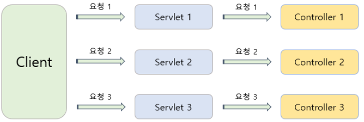
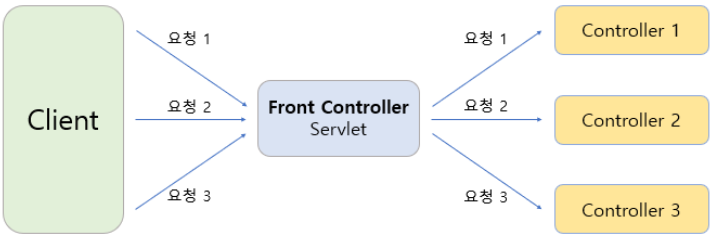
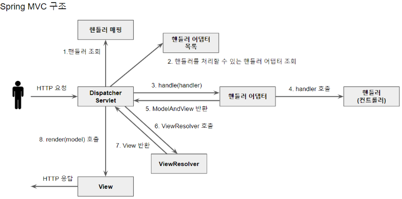

## Front Controller 패턴이란?

Front Controller는 주로 서블릿 컨테이너의 제일 앞에서 서버로 들어오는 클라이언트의 모든 요청을 받아서 처리해주는 컨트롤러이며, MVC 구조에서 함께 사용되는 패턴이다.  

Client의 요청을 Servlet에게 전달하기 위해 web.xml에 Servlet을 등록하고 Mapping하는 과정이 필요하다. 
하지만 수 많은 요청이 필요한 경우 계속해서 이 작업을 필요로 하기 때문에 이 점을 해소하고자 Front Controller 패턴이 생겨났다.  

**기존의 Servlet**

기존의 방식은 요청 URL당 Servlet을 생성하고 해당 Controller에게 요청을 보내는 코드를 따로 작성해야 했다.
  
**Front Controller 패턴 적용**

위 구조와 같이 Front Controller 패턴을 적용하면 한 곳에서 모든 Client의 요청을 컨트롤할 수 있기 때문에 기본적으로 Client의 모든 요청에 대해 인코딩 처리, 에러페이지 처리, 공지 등에 대한 처리를 한 곳에서 처리할 수 있다.
  

## Handler란?

**Handler** 
웹 요청을 처리(Handle)한다고 해서 Handler라고 부른다. 그런데 사실 Spring MVC에서 Controller가 웹 요청을 처리한다고 알고 있었다. DispatcherServlet은 @Controller 어노테이션 이외에도 여러 종류의 객체로 웹 요청을 처리할 수 있다. 웹 요청을 처리하는 객체를 큰 범위에서 우리는 Handler라고 부르는 것이다. 따라서 Controller도 일종의 Handler인 셈이다.
 

**Handler Method** 
Handler Method는 Controller 클래스 안에 구현된 요청을 처리해주는 메서드를 말한다.
 

**Handler Mapping** 

Handler Mapping은 HTTP 요청정보를 이용하여 이를 처리할 핸들러 오브젝트를 찾아주는 기능을 가진 DispatcherServlet의 전략이다. 
Spring은 기본적으로 다섯 가지 핸들러 매핑을 제공한다.

* **BeanNameUrlHandlerMapping** : HTTP 요청 URL과 빈의 이름을 비교하여 일치하는 빈을 찾는다.  
* **ControllerBeanNameHandlerMapping** : BeanNameUrlHandlerMapping과 유사하지만 위처럼 빈 이름을 URL 형태로 짓지 않아도 된다는 차이가 있다.
* **ControllerClassNameHandlerMapping** : 빈의 클래스 이름을 URL에 매핑해주는 매핑 클래스이다.
* **SimpleUrlHandlerMapping** : URL과 컨트롤러 매핑정보를 한곳에 모아놓을 수 있는 전략이다.
* **RequestMappingHandlerMapping** : @RequestMapping을 이용해 매핑하는 전략이다.

DispatcherServlet은 init되는 순간 HandlerMapping 전략들을 등록한다. 스프링 부트의 경우 RequestMappingHandlerMapping 전략이 가장 높은 우선 순위를 가진다.
  
DispatcherServlet은 getHandler 함수를 호출하여 등록된 HandlerMapping전략들의 우선순위 순으로 핸들러를 찾는다.
  
 

**Handler Adaptor** 
Handler Adapter는 핸들러 매핑을 통해 검색된 핸들러 객체를 가지고 이에 맞는 어댑터를 찾는 과정이다. 여기서 어댑터란, 2개 이상의 인터페이스에 스펙이 맞지 않을 때, 중간에 이 스펙이 맞도록 변환해주는 역할을 하는 객체이다.
 

참고 자료 
<a href="https://devmoony.tistory.com/102">https://devmoony.tistory.com/102</a> 
<a href="http://www.incodom.kr/spring/handler#h_446a441602e8011fad26fa433420e9c3">http://www.incodom.kr/spring/handler#h_446a441602e8011fad26fa433420e9c3</a> 
<a href="https://liamkim-daeyong.github.io/posts/spring-16/">https://liamkim-daeyong.github.io/posts/spring-16/</a>