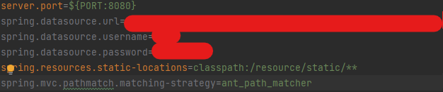
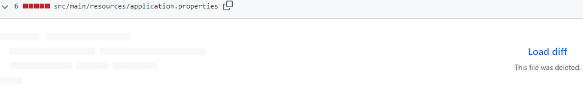

---
title: "[Spring Boot] application.properties 파일 .gitignore 적용"
excerpt: "application.properties 파일을 .gitignore 적용 이유와 방법을 알아보자"

categories:
  - Spring
tags:
  - [Spring Boot, Git]

permalink: /spring/springboot-application-properties-gitignore/

toc: true
toc_sticky: true

date: 2022-12-21
last_modified_at: 2022-12-21
--- 
## **application.properties 파일 .gitignore 적용 이유**
Spring Boot 프로젝트에서 `application.properties` 파일을 .gitignore 적용하지 않고 Github에 그대로 푸쉬할 경우 프로젝트의 중요 정보가 노출 된다. 
 
이번에 RDS에 DB를 배포하고 `application.properties`에 설정된 RDS Endpoint와 username, password가 그대로 Github에 노출되는 것을 보고 `.gitignore`에 추가로 설정해야 한다고 생각했다.  

## **.gitignore 적용**
기존 `.gitignore`에서 변경 관리를 추적하지 않기로 설정한 후, 새롭게 `.gitignore`에 목록을 추가하게 될 경우 이미 변경 관리에 의해 관리되고 있는 파일은 `.gitignore`에 등록하더라도, 계속해서 Tracking된다.  
이를 위해선 Tracking 하고 있는 캐시를 삭제한 후, 새로 커밋 해주면 `.gitignore`를 재적용 할 수 있다.  

`git rm -r --cached` 
`git rm filename` 명령어는 원격 저장소와 로컬 저장소의 `staging area`에서 파일을 삭제한다. 
`--cached` 옵션은 원격 저장소에 잘못된 파일을 올렸을 때 주로 사용하는 옵션으로 원격 저장소의 파일을 삭제하고 로컬 저장소의 파일은 삭제하지 않는다.  

먼저 `application.properties`의 기존 내용을 복사한 뒤, 아래 명령어를 사용하여 `application.properties`만 원격 저장소에서 삭제한다.  
`git rm -r --cached application.properties 경로`
 
원격 저장소에서 `application.properties` 파일이 삭제된 것을 볼 수 있다.  
이제 로컬 저장소에서 `application.properties` 파일을 수정해도 Tracking 되지 않는다!

 

참고 자료 
<a href="https://velog.io/@gillog/Git-.gitignore-%EC%9E%AC%EC%A0%81%EC%9A%A9">https://velog.io/@gillog/Git-.gitignore-%EC%9E%AC%EC%A0%81%EC%9A%A9</a> 