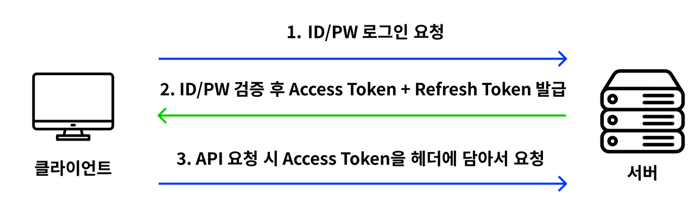
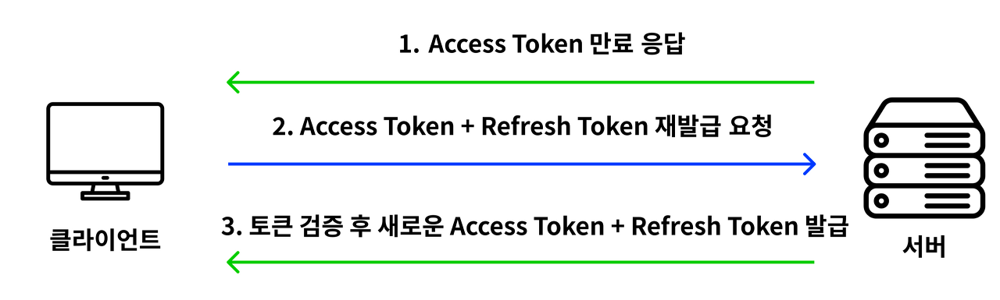
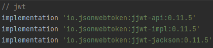
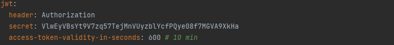
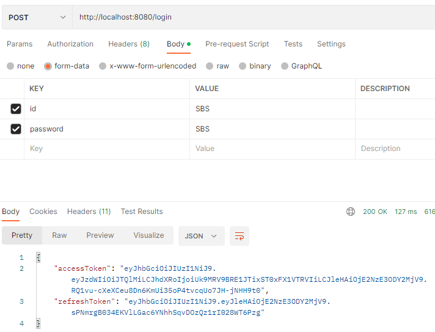
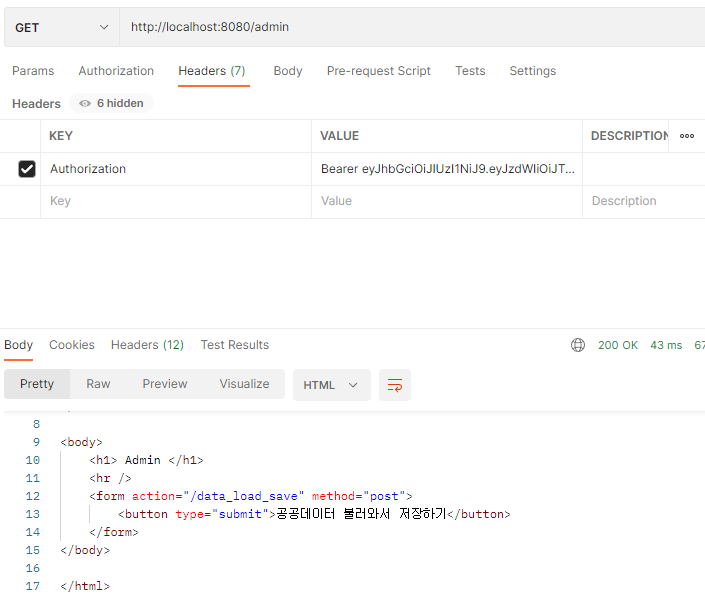

---
title: "[Spring Boot] Spring Security + JWT 토큰을 통한 로그인"
excerpt: "기존에 구현한 Security 로그인 기능에서 JWT 토큰 기능을 추가해보자"

categories:
  - Spring
tags:
  - [Spring Boot, Spring Security, JWT]

permalink: /spring/springboot-security-jwt-login/

toc: true
toc_sticky: true

date: 2022-12-23
last_modified_at: 2022-12-23
--- 

JWT에 대해서는 해당 포스팅을 참고하자!<br>
<a href="https://sbsun.github.io/web/jwt/">https://sbsun.github.io/web/jwt/</a><br><br>
 <hr/>
 
## **Spring Security + JWT의 동작 과정**
<p align="center"></p>

<br>1. 클라이언트에서 ID/PW를 통해 로그인 요청
<br>2. 서버에서 DB에 해당 ID/PW를 가진 User가 있다면, **Access Token**과 **Refresh Token**을 발급 
<br>3. 클라이언트는 발급 받은 **Access Token**을 헤더에 담아서 서버가 허용한 API를 사용할 수 있게 된다.<br><br>
여기서 **Refresh Token**은 새로운 Access Token을 발급하기 위한 토큰이다.<br>
기본적으로 Access Token은 외부 유출 문제로 인해 유효기간을 짧게 설정하는데, 정상적인 클라이언트는 유효기간이 끝난 Access Token에 대해 Refresh Token을 사용하여 새로운 Access Token을 발급받을 수 있다. 따라서 Refresh Token의 유효기간은 Access Token의 유효기간보다 길게 설정해야 한다고 생각할 수 있다.<br><br>
그런데, 만약 Refresh Token이 유출되어서 다른 사용자가 이를 통해 새로운 Access Token을 발급받았다면 Access Token의 충돌이 발생하기 때문에, 서버측에서는 두 토큰 모두 폐기시켜야 한다. 국제 인터넷 표준화 기구(IETF)에서는 이를 방지하기 위해 Refresh Token도 Access Token과 같은 유효 기간을 가지도록 하여, 사용자가 한 번 Refresh Token으로 Access Token을 발급 받았으면, Refresh Token도 다시 발급 받도록 하는 것을 권장하고 있다.<br>

**새로운 Access Token + Refresh Token에 대한 재발급 원리**
<p align="center"></p><br>

<hr/>

## **구현**
<br>

<span style="font-size:130%">**dependency 추가**</span><br>

JWT를 사용하기 위해 JWT 관련 dependency를 추가한다.
<br>
<br><br>
<span style="font-size:130%">**application.yml 설정**</span><br>

header, secret, token-validity-in-seconds를 설정한다.<br>

`jwt.secret`은 사용할 알고리즘에 따라 길이를 맞추어 base64로 인코딩 된 임의 값을 설정한다.<br>
`access-token-validity-in-seconds`은 발급할 Access Token의 유효기간을 설정한다.<br>
<br><br>
<span style="font-size:130%">**TokenDto**</span><br>

클라이언트에게 토큰을 보내기 위한 DTO를 생성한다.
``` java
@Builder
@Getter
@AllArgsConstructor
public static class TokenInfo {
    private String grantType;
    private String accessToken;
    private String refreshToken;
    private Long refreshTokenExpirationTime;
}
```
<br>

<span style="font-size:130%">**JwtTokenProvider**</span><br>

JWT 토큰 생성, 토큰 복호화 및 정보 추출, 토큰 유효셩 검증의 기능이 구현된 클래스이다.
``` java
@Component
public class JwtTokenProvider {
    private final Logger LOGGER = LoggerFactory.getLogger(JwtTokenProvider.class);

    private static final String AUTHORITIES_KEY = "NeighborAPI";

    private final String secret;                     // 사용할 알고리즘에 따라 길이를 맞추어 base64로 인코딩 된 임의 값
    private final long accessTokenValidityInSeconds; // Access Token의 유효기간
    private Key key;

    public JwtTokenProvider(@Value("${jwt.secret}") String secret,
                         @Value("${jwt.access-token-validity-in-seconds}") long accessTokenValidityInSeconds){
        this.secret = secret;
        this.accessTokenValidityInSeconds = accessTokenValidityInSeconds * 1000l;

        // secret 값을 Base64 Decode해서 key 변수에 할당
        byte[] keyBytes = Decoders.BASE64.decode(secret);
        this.key = Keys.hmacShaKeyFor(keyBytes);
    }

    // 유저 정보를 가지고 AccessToken, RefreshToken 을 생성하는 메서드
    public UserDto.TokenInfo createToken(Authentication authentication){
        // 권한 가져오기
        String authorities = authentication.getAuthorities().stream()
                .map(GrantedAuthority::getAuthority)
                .collect(Collectors.joining(","));

        long now = (new Date()).getTime();
        // Access Token 생성
        Date accessTokenExpiresIn = new Date(now + accessTokenValidityInSeconds);

        String accessToken = Jwts.builder()
                .setSubject(authentication.getName())     // 토큰 제목
                .claim("auth", authorities)         // 비공개 클레임
                .setExpiration(accessTokenExpiresIn)      // 토큰 만료 시간
                .signWith(key, SignatureAlgorithm.HS256)  // 서명
                .compact();

        // Refresh Token 생성
        String refreshToken = Jwts.builder()
                .setExpiration(new Date(now + accessTokenValidityInSeconds))
                .signWith(key, SignatureAlgorithm.HS256)
                .compact();

        return UserDto.TokenInfo.builder()
                .accessToken(accessToken)
                .refreshToken(refreshToken)
                .build();
    }

    // JWT 토큰을 복호화하여 토큰에 들어있는 정보를 꺼내는 메서드
    public Authentication getAuthentication(String accessToken) {
        // 토큰 복호화
        Claims claims = parseClaims(accessToken);

        if (claims.get("auth") == null) {
            throw new RuntimeException("권한 정보가 없는 토큰입니다.");
        }

        // 클레임에서 권한 정보 가져오기
        Collection<? extends GrantedAuthority> authorities =
                Arrays.stream(claims.get("auth").toString().split(","))
                        .map(SimpleGrantedAuthority::new)
                        .collect(Collectors.toList());

        // UserDetails 객체를 만들어서 Authentication 리턴
        UserDetails principal = new User(claims.getSubject(), "", authorities);
        return new UsernamePasswordAuthenticationToken(principal, "", authorities);
    }

    // 토큰 정보 검사
    public boolean validateToken(String token){
        try{
            Jwts.parserBuilder().setSigningKey(key).build().parseClaimsJws(token);
            return true;
        }catch(io.jsonwebtoken.security.SecurityException | MalformedJwtException e){
            LOGGER.info("잘못된 JWT 서명입니다.");
        }catch(ExpiredJwtException e){
            LOGGER.info("만료된 JWT 토큰입니다.");
        }catch(UnsupportedJwtException e){
            LOGGER.info("지원하지 않는 JWT 토큰입니다.");
        }catch(IllegalArgumentException e){
            LOGGER.info("JWT 토큰이 잘못되었습니다.");
        }
        return false;
    }

    private Claims parseClaims(String accessToken) {
        try {
            return Jwts.parserBuilder().setSigningKey(key).build().parseClaimsJws(accessToken).getBody();
        } catch (ExpiredJwtException e) {
            return e.getClaims();
        }
    }
}
```
<br>

<span style="font-size:130%">**JwtAuthenticationFilter**</span><br>

Jwt의 인증정보를 SecurityContext에 저장하는 역할을 한다.<br>

클라이언트 요청 시 JWT 인증을 하기 위해 설치하는 커스텀 필터로 `UsernamePasswordAuthenticationFilter` 이전에 실행된다.<br>

이전에 실행된다는 뜻은 `JwtAuthenticationFilter`를 통과하면 `UsernamePasswordAuthenticationFilter` 이후의 필터는 통과한 것으로 본다는 뜻이다.

doFilter 메서드에서 Reqeust가 들어올 때 SecurityContext에 Authentication 객체를 저장해 사용하게 된다.
``` java
@RequiredArgsConstructor
public class JwtAuthenticationFilter extends GenericFilterBean {
    private static final Logger LOGGER = LoggerFactory.getLogger(JwtAuthenticationFilter.class);

    private final JwtTokenProvider jwtTokenProvider;

    @Override
    public void doFilter(ServletRequest request, ServletResponse response, FilterChain chain) throws IOException, ServletException {
        // 1. Request Header 에서 JWT 토큰 추출
        HttpServletRequest httpServletRequest = (HttpServletRequest) request;
        String token = resolveToken(httpServletRequest);
        String requestURI = httpServletRequest.getRequestURI();

        // 2. validateToken 으로 토큰 유효성 검사
        if(StringUtils.hasText(token) && jwtTokenProvider.validateToken(token)){
            // 토큰이 유효할 경우 토큰에서 Authentication 객체를 가지고 와서 SecurityContext 에 저장
            Authentication authentication = jwtTokenProvider.getAuthentication(token);
            SecurityContextHolder.getContext().setAuthentication(authentication);
            LOGGER.info("Security Context에 '{}' 인증 정보를 저장했습니다, uri: {}", authentication.getName(), requestURI);
        }else{
            LOGGER.info("유효한 JWT 토큰이 없습니다., uri: {}", requestURI);
        }
        chain.doFilter(httpServletRequest, response);
    }

    // Request Header 에서 토큰 정보 추출
    private String resolveToken(HttpServletRequest request) {
        String bearerToken = request.getHeader("Authorization");
        if (StringUtils.hasText(bearerToken) && bearerToken.startsWith("Bearer ")) {
            return bearerToken.substring(7); // "Bearer " 이후의 ACCESS_TOKEN 문자열 반환
        }
        return null;
    }
}
```
<br>

<span style="font-size:130%">**SecurityConfig 설정**</span><br>

Spring Security 설정을 위한 클래스이다.
``` java
@EnableWebSecurity
@Configuration
@AllArgsConstructor
public class SecurityConfiguration {
    private final JwtTokenProvider jwtTokenProvider;

    @Bean
    public SecurityFilterChain filterChain(HttpSecurity http) throws Exception {
        http
                .httpBasic().disable()
                .csrf().disable()
                .sessionManagement().sessionCreationPolicy(SessionCreationPolicy.STATELESS)
                .and()
                .authorizeRequests()
                .antMatchers("/", "/signUp").permitAll() 없이 허용
                .antMatchers("/admin", "/signUpAdmin", "/data_load_save").hasRole("ADMIN")
                .antMatchers("/signUpAdmin").hasRole("USER")
                .and()
                .addFilterBefore(new JwtAuthenticationFilter(jwtTokenProvider), UsernamePasswordAuthenticationFilter.class)
        return http.build();
    }
}
```

<br>**`httpBasic().disable().csrf().disable()`**<br>
rest api이므로 basic auth 및 csrf 보안을 사용하지 않는다는 설정이다.<br>

**`sessionManagement().sessionCreationPolicy(SessionCreationPolicy.STATELESS)`**<br>
JWT를 사용하기 때문에 세션을 사용하지 않는다는 설정이다.<br>

**`addFilterBefore(new JwtAUthenticationFilter(jwtTokenProvider), UsernamePasswordAuthenticationFilter.class)`**
<br>JWT 인증을 위하여 직접 구현한 필터를 UsernamePasswordAuthenticationFilter 전에 실행하겠다는 설정이다.
<br><br>

<span style="font-size:130%">**UserService**</span><br>

``` java
@Service
@RequiredArgsConstructor
public class UserService implements UserDetailsService {
    private final AuthenticationManagerBuilder authenticationManagerBuilder;
    private final JwtTokenProvider jwtTokenProvider;

    public UserDto.TokenInfo login(UserDto.LoginRequest loginInfo){
        // 1. Login ID/PW 를 기반으로 Authentication 객체 생성
        // 이때 authentication 는 인증 여부를 확인하는 authenticated 값이 false
        UsernamePasswordAuthenticationToken authenticationToken = new UsernamePasswordAuthenticationToken(loginInfo.getId(), loginInfo.getPassword());

        // 2. 실제 검증 (사용자 비밀번호 체크)이 이루어지는 부분
        // authenticate 매서드가 실행될 때 CustomUserDetailsService 에서 만든 loadUserByUsername 메서드가 실행
        Authentication authentication = authenticationManagerBuilder.getObject().authenticate(authenticationToken);

        // 3. 인증 정보를 기반으로 JWT 토큰 생성
        UserDto.TokenInfo tokenInfo = jwtTokenProvider.createToken(authentication);

        return tokenInfo;
    }
}
```

<br><span style="font-size:130%">**UserController**</span><br>

``` java
@RestController
public class UserController {
    @Autowired
    private UserService userService;

    @PostMapping("/login")
    public UserDto.TokenInfo login(UserDto.LoginRequest loginInfo) {
        UserDto.TokenInfo tokenInfo = userService.login(loginInfo);

        return UserDto.TokenInfo;
    }
```
<br>

<span style="font-size:130%">**Postman Test**</span><br>

Access Token과 RefreshToken이 잘 생성된 것을 볼 수 있다.<br>
<br><br>

Access Token을 이용하여 `ROLE_ADMIN` 권한이 필요한 API를 호출해보자.<br>

Access Token을 Authorization 헤더에 "Bearer [Access Token]" 형태로 추가한다.<br>
<br><br>

정상적으로 API가 호출된다!<br>

아직 코드를 전부 완벽하게 이해한 것은 아니지만, 프로젝트에 적용해야 하기 위해 더욱 공부해야겠다.
<hr/>
참고 자료<br>
<a href="https://gksdudrb922.tistory.com/217">https://gksdudrb922.tistory.com/217</a><br>
<a href="https://aljjabaegi.tistory.com/659">https://aljjabaegi.tistory.com/659</a><br>