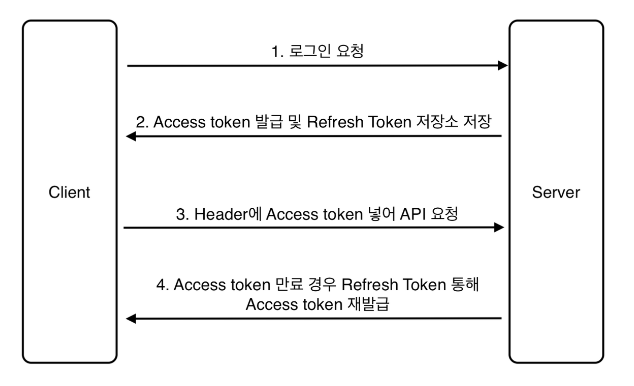
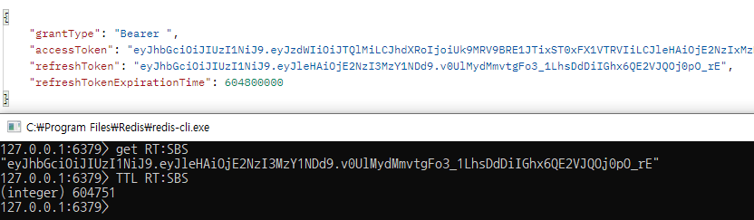

---
title: "[Spring Boot] Spring Security + JWT + Redis 로그인"
excerpt: "기존에 구현한 Spring Security + JWT 로그인 기능에서 Redis를 사용해보자"

categories:
  - Spring
tags:
  - [Spring Boot, Spring Security, JWT, Redis]

permalink: /spring/springboot-security-jwt-redis-login/

toc: true
toc_sticky: true

date: 2022-12-27
last_modified_at: 2022-12-27

--- 

전에 구현한 Spring Security + JWT 로그인 기능은 Header에 Access Token을 넣어 API를 요청하는 단계까지 구현했었다. <br>
<a href="https://sbsun.github.io/spring/springboot-security-jwt-login/">https://sbsun.github.io/spring/springboot-security-jwt-login/</a><br><br>

이번에는 Access Token이 만료되었을 경우 Refresh Token을 통해 Access Token을 재발급하는 기능을 구현해보자.
<br><br>

## JWT 로직
<hr/>


1. 클라이언트에서 로그인을 요청한다.

2. 로그인 성공 시 Access Token과 Refresh Token을 생성한다. <br>
   Access Token은 만료시간을 30분, Refresh Token은 만료시간을 2주로 설정한다.

3. Refresh Token은 Redis에 저장을 하고 클라이언트에게는 Access Token을 보내준다.

4. 로그인한 유저는 헤더에 Access Token을 가지고 다니며, API 통신을 할 때 서버에서 만료된 토큰인지 체크한다.

5. 만료된 토큰일 경우 Access Token이 만료되었음을 알려주고 클라이언트는 재발급 API를 요청한다.

6. 저장소에 저장된 Refresh Token이 만료가 되지 않았으면 Access Token을 재발급하여 클라이언트에게 보내준다.
<br><br><br>

## Refresh Token과 Redis를 사용하는 이유
<hr/>

<span style="font-size:130%">**Refresh Token 사용 이유**</span><br>

유저의 Access Token을 누군가가 탈취했을 때 악의적인 사용을 막기 위해 Access Token의 만료 시간을 짧게 설정한다. 30분으로 설정하게 되면 정작 토큰의 주인 유저가 사용을 할 때 30분마다 로그인을 해주어야 한다는 번거로운 점이 생기게 된다. 이를 위해 만료시간이 보다 긴 Refresh Token을 생성하고 저장소에 보관함으로써 Access Token이 만료되면 재발급을 하는 구조로 사용자의 번거로움을 없애준다.<br><br>

<span style="font-size:130%">**Redis 사용 이유**</span><br>

레디스는 key-value 구조로 데이터를 관리할 수 있는 비관계형 데이터베이스이다. 기본적으로 레디스는 in-memory로 데이터를 관리하므로, 저장된 데이터가 영속적이지 않다.<br>

데이터가 HDD나 SDD가 아니라 RAM에 저장하므로 데이터를 영구적으로 저장할 수 없는 대신, 굉장히 빠른 엑세스 속도를 보장받을 수 있다. 빠른 엑세스 속도와 휘발성이라는 특징으로 보통 캐시의 용도로 레디스를 사용한다.<br>

Refresh Token은 발급된 후 일정 시간 이후 만료되어야 한다. Refresh Token을 RDB 등에 저장하면, 스케줄러 등을 사용하여 주기적으로 만료된 토큰을 만료 처리하거나 제거해야한다. 하지만, 레디스는 기본적으로 데이터의 유효기간을 지정할 수 있다. 이런 특징들은 Refresh Token을 저장하기 적합하다.<br><br><br>

## Refresh Token 구현
<hr/>

<span style="font-size:130%">**Gradle 의존성 추가**</span><br>

``` java
implementation 'org.springframework.boot:spring-boot-starter-data-redis'
```

Spring Boot에서는 Spring Data Redis를 통해 Lettuce, Jedis라는 두 가지 오픈소스 라이브러리를 사용할 수 있다. 의존성을 추가할 때 별도의 설정을 하지 않으면 Lettuce가 기본적으로 적용된다.<br><br>
<span style="font-size:130%">**RedisRepositoryConfig**</span><br>

Redis 사용법은 `RedisTemplate`과 `ReidsRepository`가 있고, 해당 코드에서는 `RedisTemplate`을 사용한다.

``` java
@RequiredArgsConstructor
@Configuration
@EnableRedisRepositories
public class RedisRepositoryConfig {

    private final RedisProperties redisProperties;

    // lettuce
    @Bean
    public RedisConnectionFactory redisConnectionFactory() {
        return new LettuceConnectionFactory(redisProperties.getHost(), redisProperties.getPort());
    }

    @Bean
    public RedisTemplate<String, Object> redisTemplate() {
        RedisTemplate<String, Object> redisTemplate = new RedisTemplate<>();
        redisTemplate.setConnectionFactory(redisConnectionFactory());
        redisTemplate.setKeySerializer(new StringRedisSerializer());
        redisTemplate.setValueSerializer(new StringRedisSerializer());
        return redisTemplate;
    }
}
```

`RedisConnctionFactory` 인터페이스를 통해 `LettuceConnectionFactory`를 생성하여 반환한다.<br>
`setKeySerializer`, `setValueSerializer` 설정을 함으로써 redis-cli을 통해 직접 데이터를 볼 수 있다.

``` java
spring:
  redis:
      host: localhost
      port: 6379
```
RedisProperties를 통해서 yml에 저장한 host, port를 가지고 와서 연결한다.
<br><br>
<span style="font-size:130%">**Login**</span><br>

``` java
public UserDto.TokenInfo login(UserDto.LoginRequest loginInfo){
    // 1. Login ID/PW 를 기반으로 Authentication 객체 생성
    // 이때 authentication 는 인증 여부를 확인하는 authenticated 값이 false
    UsernamePasswordAuthenticationToken authenticationToken = new UsernamePasswordAuthenticationToken(loginInfo.getId(), loginInfo.getPassword());

    // 2. 실제 검증 (사용자 비밀번호 체크)이 이루어지는 부분
    // authenticate 매서드가 실행될 때 CustomUserDetailsService 에서 만든 loadUserByUsername 메서드가 실행
    Authentication authentication = authenticationManagerBuilder.getObject().authenticate(authenticationToken);

    // 3. 인증 정보를 기반으로 JWT 토큰 생성
    UserDto.TokenInfo tokenInfo = jwtTokenProvider.createToken(authentication);

    // 4. RefreshToken Redis 저장 (expirationTime 설정을 통해 자동 삭제 처리)
    redisTemplate.opsForValue()
            .set("refreshToken:" + authentication.getName(), tokenInfo.getRefreshToken(), tokenInfo.getRefreshTokenExpirationTime(), TimeUnit.MILLISECONDS);

    return tokenInfo;
}
```

나머지는 기존에 구현한 코드이고 **4. RefreshToken Redis 저장** 부분이 추가되었다.<br>

RefreshToken 저장을 위해 사용한 set 메서드는 key, value 값 외에 long type의 timeout, TimeUnit type의 unit을 인자로 받는다. 해당 메서드의 용도는 Refresh Token의 유효기간 정보를 함께 저장해서 토큰이 만료되었을 때, value 값을 자동으로 삭제하는 기능을 위해 사용한다.<br>


<br>
이렇게 로그인이 성공했을 때, Redis에 Refresh Token이 정상적으로 저장되는 것을 볼 수 있다. 또한 TTL(key) 명령어를 통해 key 값의 유효시간도 정상적으로 저장되었다. 

<br>

<span style="font-size:130%">**Reissue(재발급)**</span><br>

``` java
public UserResponseDto.TokenInfo reissue(UserRequestDto.Reissue reissue) {
    // 1. Refresh Token 검증
    if (!jwtTokenProvider.validateToken(reissue.getRefreshToken())) {
        BasicResponse basicResponse = new BasicResponse(HttpStatus.BAD_REQUEST.value(), "Refresh Token 정보가 유효하지 않습니다.");
        return new UserResponseDto.TokenInfo(basicResponse);
    }

    // 2. Access Token 에서 User email 를 가져옵니다.
    Authentication authentication = jwtTokenProvider.getAuthentication(reissue.getAccessToken());

    // 3. Redis 에서 User email 을 기반으로 저장된 Refresh Token 값을 가져옵니다.
    String refreshToken = (String)redisTemplate.opsForValue().get("refreshToken:" + authentication.getName());
    if(!refreshToken.equals(reissue.getRefreshToken())) {
        BasicResponse basicResponse = new BasicResponse(HttpStatus.BAD_REQUEST.value(), "Refresh Token 정보가 일치하지 않습니다.");
        return new UserResponseDto.TokenInfo(basicResponse);
    }

    // 4. 새로운 토큰 생성
    UserResponseDto.TokenInfo tokenInfo = jwtTokenProvider.createToken(authentication);

    // 5. RefreshToken Redis 업데이트
    redisTemplate.opsForValue()
            .set("refreshToken:" + authentication.getName(), tokenInfo.getRefreshToken(), tokenInfo.getRefreshTokenExpirationTime(), TimeUnit.MILLISECONDS);

    return tokenInfo;
}
```

토큰을 재발급하는 메서드이다.

``` java
@Getter
@Setter
public static class Reissue {
    private String accessToken;
    private String refreshToken;
}
```

토큰 갱신을 위해서는 Access Token과 Refresh Token 값이 필요하다.<br><br>
**갱신 과정**<br>

1. Refresh Token이 유효한지 검증한다.
2. Access Token에서 Authentication 객체를 가지고 와서 저장된 name(email)을 가지고 온다.
3. email로 Redis에 저장된 Refresh Token을 가지고 와서 입력받은 Refresh Token 값과 비교한다.  
4. Authentication 객체를 가지고 새로운 토큰을 생성한다.
5. Redis에 새로 생성된 Refresh Token을 저장한다.
6. 클라이언트에게 새로 발급된 토큰 정보를 전달한다.

<br>
  다음엔 로그아웃 기능을 구현해 봐야겠다.
<hr/>
참고 자료<br>
<a href="https://wildeveloperetrain.tistory.com/59">https://wildeveloperetrain.tistory.com/59</a><br>


