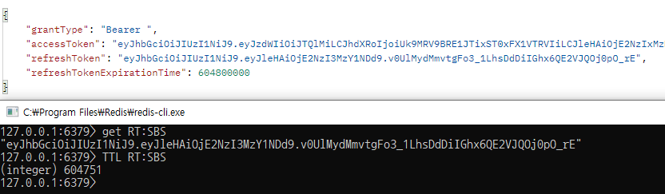

---
title: "[Spring Boot] Spring Security + JWT + Redis 로그아웃"
excerpt: "Spring Security + JWT + Redis들을 활용하여 로그아웃 기능을 구현해보자"

categories:
  - Spring
tags:
  - [Spring Boot, Spring Security, JWT, Redis]

permalink: /spring/springboot-security-jwt-redis-logout/

toc: true
toc_sticky: true

date: 2022-12-28
last_modified_at: 2022-12-28

--- 

로그인과 Refresh Token 재발급 기능을 구현했으니 마지막으로 로그아웃 기능을 구현해 보겠습니다.

<br>

## JWT + Redis 로그아웃 로직
<hr/>

로그아웃 요청을 한다는 것은 로그인 된 상태라는 것을 의미한다. 그렇기 때문에 클라이언트로부터 Access Token과 Refresh Token을 받는다.<br>

현재까지는 Redis를 Refresh Token을 저장하는 용도로만 사용했지만 로그아웃 과정에서는 추가로 로그아웃 요청된 Access Token을 BlackList로 저장하는 기능이 추가된다.<br>

Access Token을 Redis에 BlackList로 등록할 때 필요한 부분은 요청 들어온 Access Token의 남은 유효시간이다.<br>

**로그아웃 과정**
1. 로그아웃 성공된 회원의 Access Token을 BlackList로 Redis에 저장
2. 토큰 값 자체를 key로 두고, value로 "logout" 문자열을 넣어준다.
3. 블랙리스트로 등록하는 Access Token의 유효시간을 요청시 받은 Access Token의 남은 유효시간으로 설정한다.

로그아웃된 Access Token으로 요청이 들어왔을 때, 해당 토큰의 유효성이 남아있는 동안은 Redis에 해당 토큰 값이 Key로 블랙리스트에 등록되어 있을 것이기 때문에 로그인을 할 수 없다.<br>

요청하는 Access Token의 유효시간이 만료되었을 때는 당연히 요청할 수 없고, 블랙리스트에 등록된 해당 Token 값도 자동으로 제거된다.

<br><br>
## Logout 구현
<hr/>

<span style="font-size:130%">**Logout**</span><br>

``` java
public BasicResponse logout(UserRequestDto.Logout logout) {
    // 1. Access Token 검증
    if (!jwtTokenProvider.validateToken(logout.getAccessToken())) {
        return new BasicResponse(HttpStatus.BAD_REQUEST.value(), "잘못된 요청입니다.");
    }

    // 2. Access Token 에서 User id를 가져옵니다.
    Authentication authentication = jwtTokenProvider.getAuthentication(logout.getAccessToken());

    // 3. Redis 에서 해당 User email 로 저장된 Refresh Token 이 있는지 여부를 확인 후 있을 경우 삭제합니다.
    if (redisTemplate.opsForValue().get("RT:" + authentication.getName()) != null) {
        // Refresh Token 삭제
        redisTemplate.delete("RT:" + authentication.getName());
    }

    // 4. 해당 Access Token 유효시간 가지고 와서 BlackList 로 저장하기
    Long expiration = jwtTokenProvider.getExpiration(logout.getAccessToken());
    redisTemplate.opsForValue()
            .set(logout.getAccessToken(), "logout", expiration, TimeUnit.MILLISECONDS);

    return new BasicResponse(HttpStatus.OK.value(), "로그아웃 되었습니다.");
}
```
1. 먼저 요청받은 Access Token 유효성을 검증한다.  
2. 유효성 검증이 끝나고 Access Token을 통해 Authentication 객체를 그리고 저장된 User의 id를 가져온다.
3. user id(Redis key 값)을 통해 저장된 Refresh Token이 있다면 삭제한다.
4. 요청으로 들어온 Access Token의 유효시간을 해당 Access Token을 키 값으로 하고, 유효시간을 적용시켜 Redis에 블랙리스트로 등록한다.
   
<br>

<span style="font-size:130%">**Logout된 Access Token인지 체크**</span><br>

``` java
@Override
public void doFilter(ServletRequest request, ServletResponse response, FilterChain chain) throws IOException, ServletException {
    // 1. Request Header 에서 JWT 토큰 추출
    HttpServletRequest httpServletRequest = (HttpServletRequest) request;
    String token = resolveToken(httpServletRequest);
    String requestURI = httpServletRequest.getRequestURI();

    System.out.println(token + ", " + jwtTokenProvider.validateToken(token));
    // 2. validateToken 으로 토큰 유효성 검사
    if(StringUtils.hasText(token) && jwtTokenProvider.validateToken(token)){
        // Redis에 해당 accessToken logout 여부 확인
        String isLogout = (String)redisTemplate.opsForValue().get(token);
        if (ObjectUtils.isEmpty(isLogout)) {
            // 토큰이 유효할 경우 토큰에서 Authentication 객체를 가지고 와서 SecurityContext 에 저장
            Authentication authentication = jwtTokenProvider.getAuthentication(token);
            SecurityContextHolder.getContext().setAuthentication(authentication);
            LOGGER.info("Security Context에 '{}' 인증 정보를 저장했습니다, uri: {}", authentication.getName(), requestURI);
        }else{
            LOGGER.info("Logout된 Access Token입니다., uri: {}", requestURI);
        }
    }else{
        LOGGER.info("유효한 JWT 토큰이 없습니다., uri: {}", requestURI);
    }
    chain.doFilter(httpServletRequest, response);
}
```
기존 인증 과정에서 redisTemplat으로 요청된 AccessToken이 블랙리스트에 등록되었는지 확인하는 로직만 추가되었다.<br>

블랙리스트(로그아웃된 Access Token)로 등록되지 않았다면 Authentication 객체를 가져와서 SecurityContext에 저장하는 기존 인증 로직을 수행한다.

``` java 
public UserResponseDto.TokenInfo reissue(UserRequestDto.Reissue reissue) {
    .
    .

    // 3. Redis 에서 User email 을 기반으로 저장된 Refresh Token 값을 가져옵니다.
    String refreshToken = (String)redisTemplate.opsForValue().get("RT:" + authentication.getName());
    // 로그아웃되어 Redis에 Refresh Token이 존재하지 않는 경우
    if(ObjectUtils.isEmpty(refreshToken)){
        BasicResponse basicResponse = new BasicResponse(HttpStatus.BAD_REQUEST.value(), "잘못된 요청입니다.");
        return new UserResponseDto.TokenInfo(basicResponse);
    }
    if(!refreshToken.equals(reissue.getRefreshToken())) {
        BasicResponse basicResponse = new BasicResponse(HttpStatus.BAD_REQUEST.value(), "Refresh Token 정보가 일치하지 않습니다.");
        return new UserResponseDto.TokenInfo(basicResponse);
    }

    .
    .
}
```
토큰을 재발급 받는 기능에서는 Redis에서 기존에 저장된 Refresh Token 정보를 가져올 때, 로그아웃된 유저라면 Refresh Token이 삭제되어 Redis에 없을 것이다. 따라서 토큰이 존재하지 않을 수 있다는 조건 처리를 추가하였다.<br><br>



<br>
코드 작성 후 Postman을 통해 로그아웃 및 로그아웃 된 토큰으로 요청하여 정상 작동 여부를 확인하였다!

<br>
다음엔 Redis에 대해서 더 알아봐야겠다.
<hr/>
참고 자료<br>
<a href="https://wildeveloperetrain.tistory.com/61">https://wildeveloperetrain.tistory.com/61</a><br>


