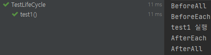

---
title: "[Spring Boot] 테스트 코드 적용하기(TDD, JUnit)"
excerpt: "TDD와 JUnit에 대해서 알아보자"

categories:
  - Spring
tags:
  - [Spring Boot, TDD, JUnit]

permalink: /spring/springboot-tdd-junit/

toc: true
toc_sticky: true

date: 2023-01-28
last_modified_at: 2023-01-28

--- 

현재까지 테스트 코드의 장점과 구현 방식에 대해 자세히 공부하지 않은 채 개발을 진행하고 있었다.<br>

이번 기회에 TDD 개발 방식과 JUnit에 대해 학습하여 앞으로 기능을 개발할 때마다 체계적으로 테스트 코드를 작성해 보려고 한다.<br><br>

## **TDD란?**
<hr/>

`TDD`란 `Test Driven Development`의 약자로 <span style="color:red">**테스트 주도 개발**</span>이라고 한다.<br>

반복 테스트를 이용한 소프트웨어 방법론으로 작은 단위의 테스트 케이스를 작성하고 이를 통과하는 코드를 추가하는 단계를 반복하여 구현한다.<br>

<span style="font-size:120%">**TDD 개발주기**</span>

<br>

1. 항상 실패하는 테스트를 먼저 작성한다.(Red)
2. 테스트를 통과하기 위해 코드를 수정한다.(Green)
3. 중복 코드를 제거하는 등의 리팩토링을 수행한다.(Blue)

<br>

## **단위 테스트와 통합 테스트**
<hr/>

<span style="font-size:120%">**단위 테스트(Unit Test)**</span><br>

단위 테스트는 <span style="color:red">**하나의 모듈을 기준으로 독립적으로 진행되는 가장 작은 단위의 테스트**</span>이다. 여기서 모듈은 애플리케이션에서 작동하는 <span style="color:red">**하나의 기능 또는 메서드**</span>로 이해할 수 있다.<br>

즉, 단위 테스트는 애플리케이션을 구성하는 하나의 기능이 올바르게 동작하는지를 독립적으로 테스트 하는 것이다.<br>

프로그래밍 언어마다 단위 테스트에서 사용하는 프레임워크가 다르다. Java는 주로 `JUnit`을 사용한다.<br><br>

<span style="font-size:120%">**통합 테스트(Integration Test)**</span><br>

통합 테스트는 <span style="color:red">**모듈을 통합하는 과정에서 모듈 간의 호환성을 확인하기 위해 수행되는 테스트**</span>이다.<br>

일반적으로 애플리케이션은 여러 개의 모듈들로 구성이 되고, 모듈끼리 메세지를 주고 받으면서(함수 호출) 기능을 수행한다. 그렇기에 통합 테스트는 독립적인 기능에 대한 테스트가 아니라 웹 페이지로부터 API를 호출하여 올바르게 동작하는 지를 확인하는 것이다.<br>

Spring Boot에서는 클래스 상단에 `@SpringBootTest` 어노테이션을 추가해 통합 테스트를 수행할 수 있다.<br><br>

## **JUnit이란?**
<hr/>

* Java의 단위테스트를 수행해주는 대표적인 <span style="color:red">**Test Framework**</span>로써 JUnit4와 그 다음 버전인 JUnit5를 대게 사용한다. 
* <span style="color:red">**어노테이션(Annotation)**</span>을 기반으로 테스트를 지원(JUnit4 부터)
* <span style="color:red">**단정문(Assert)**</span>으로 테스트 케이스의 기대값에 대해 수행 결과를 확인할 수 있다.
* JUint5는 크게 `Jupiter`, `Platform`, `Vintage` 모듈로 구성

JUnit5는 다음과 같은 구조를 가지고 있다.<br>
<br>

<span style="font-size:120%">**JUnit Platform**</span>

* JUnit으로 작성한 테스트 코드를 실행해 주는 런처를 제공한다.
* 또한, 플랫폼에서 실행되는 테스트 프레임워크 개발을 위한 TestEngine API를 정의한다.
* IDE(Intellij, Eclipse, VS Code), 빌드 도구(Gradle, Maven, Ant)에서도 JUnit Platform을 지원한다.

<span style="font-size:120%">**JUnit Jupiter**</span>

* TestEngine API 구현체로 JUnit5을 지원한다.
* Jupiter API를 사용하여 테스트를 발견하고 실행하는 역할을 한다. 

<span style="font-size:120%">**JUnit Vintage**</span>

* TestEngine API 구현체로 JUnit3과 4를 지원한다.
* 기존 JUnit3, 4 버전으로 작성된 테스트 코드를 실행할 때 Vintage-Engine 모듈을 사용한다.

<br>

## **JUnit Annotation 및 실습**
<hr/>

<span style="font-size:120%">**dependencies 추가**</span><br>

```
testImplementation ('org.springframework.boot:spring-boot-starter-test'){
  exclude group: 'org.junit.vintage', module: 'junit-vintage-engine' //JUnit4제외
}
```

JUnit5는 Spring Boot 2.2버전 이상부터 기본 제공된다.<br>
JUnit4도 포함되어 있기 때문에 제거하고 싶다면 exclude 해주면 된다.<br><br>

<span style="font-size:120%">**JUnit Annotation**</span>

<span style="font-size:120%">**`@Test`**</span><br>
테스트용 메서드를 표현<br>

<span style="font-size:120%">**`@BeforEach`**</span><br> 
각 테스트 메서드가 시작되기 전에 실행되어야 하는 메서드를 표현<br>

<span style="font-size:120%">**`@AfterEach`**</span><br>
각 테스트 메서드가 시작된 후 실행되어야 하는 메서드를 표현<br>

<span style="font-size:120%">**`@BeforeAll`**</span><br>
테스트 시작 전에 실행되어야 하는 메서드를 표현(static 처리 필요)<br>

<span style="font-size:120%">**`@AfterAll`**</span><br>
테스트 종료 후에 실행되어야 하는 메서드를 표현(static 처리 필요)<br>

``` java
@BeforeAll
static void beforeAll(){
    System.out.println("BeforeAll");
}

@AfterAll
static void afterAll(){
    System.out.println("AfterAll");
}

@BeforeEach
void beforeEach(){
    System.out.println("BeforeEach");
}

@AfterEach
void afterEach(){
    System.out.println("AfterEach");
}

@Test
void test1(){
    System.out.println("test1 실행");
}
```
<br>

<span style="font-size:120%">**`@Disabled`**</span><br>
테스트를 하고 싶지 않는 클래스나 메서드에 붙이는 어노테이션<br>

``` java
@Test
@Disabled("문제가 해결될 때까지 테스트 중단")
void test1(){
    System.out.println("test1 실행");
}
```
<br>

<span style="font-size:120%">**`@DisplayName`**</span><br>
* 어떤 테스트인지 쉽게 표현할 수 있도록 해주는 어노테이션<br>
* **공백, Emoji, 특수문자** 등을 모두 지원
  
``` java
@DisplayName("DisplayName Test")
public class JUnitTest {
    @Test
    @DisplayName("ㅎㅎ 재밌네요")
    void test1(){
    }
}
```
<br>

<span style="font-size:120%">**`@RepeatedTest`**</span><br>
* 특정 **테스트를 반복**시키고 싶을 때 사용하는 어노테이션<br>
* 반복 횟수와 반복 테스트 이름을 설정 가능

``` java
@RepeatedTest(value = 3, name = "{displayName} 중 {currentRepetition} of {totalRepetitions}")
@DisplayName("반복 테스트")
void repeatedTest(){
}
```
<br>

<span style="font-size:120%">**`@ParameterizedTest`**</span><br>
테스트에 여러 다른 **매개변수를 대입해가며 반복 실행**할 때 사용하는 어노테이션<br>

``` java
@ParameterizedTest
@CsvSource(value = {"Test 1", "Test 2", "Test 3"})
@DisplayName("파라미터 테스트")
void parameterizedTest(final String input){
    final String[] inputs = input.split(",");
    for(final String text : inputs){
        System.out.println(text);
    }
}
```
<br>

<span style="font-size:120%">**`@Nested`**</span><br>
* 테스트 클래스 안에서 내부 클래스를 정의해 테스트를 계층화 할 때 사용
* 내부 클래스는 부모 클래스의 멤버 필드에 접근 가능
* Before/After와 같은 테스트 생명주기에 관련된 메서드들도 계층에 맞춰 동작한다.

``` java
@Nested
class nestedTest{
    @Nested
    class test1{
        @Test
        void success(){}

        @Test
        void fail(){}
    }

    @Nested
    class test2{
        @Test
        void success(){}

        @Test
        void fail(){}
    }
}
```
<br>

<span style="font-size:120%">**`@ExtendWith`**</span><br>
* 단위 테스트에 공통적으로 사용할 확장 기능을 선언해주는 역할을 한다.
* 인자로 `SpringExtension.class` 또는 `MockitoExtension.class`를 많이 사용한다.
* `@SpringBootTest`에는 기본적으로 `@ExtendWith`가 추가되어 있다.

<hr/>
참고자료<br>
<a href="https://www.youtube.com/watch?v=EwI3E9Natcw">https://www.youtube.com/watch?v=EwI3E9Natcw</a><br>

