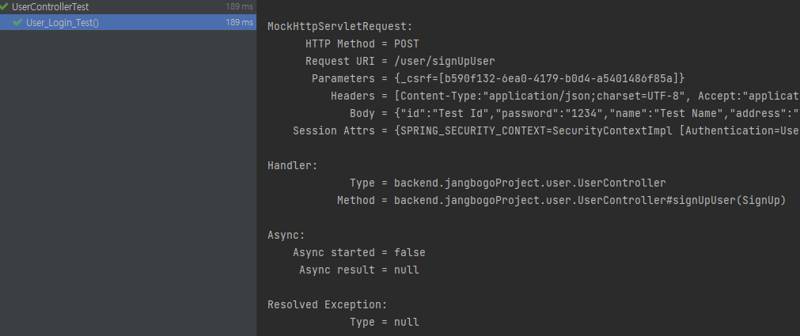

---
title: "[Spring Boot] @SpringBootTest, @WebMvcTest"
excerpt: "Spring Boot에서 제공하는 @SpringBootTest와 @WebMvcTest에 대해서 알아보자"

categories:
  - Spring
tags:
  - [Spring Boot, Test]

permalink: /spring/springboot-springboottest-webmvctest/

toc: true
toc_sticky: true

date: 2023-01-29
last_modified_at: 2023-01-29

--- 
## **Spring Boot Test**
<hr/>
Spring Boot는 기본적인 Test Stater를 제공한다. 스타터에 웬만한 테스트 라이브러리들을 한데 뭉쳐놓았기 때문에 편리하게 사용할 수 있다. 스타터는 크게 두 가지 모듈로 구성된다.<br>

* spring-boot-test
* spring-boot-test-autoconfigure

`spring-boot-test-autoconfigure`는 테스트 관련 자동 설정 기능을 제공한다.<br>

보통은 `spring-boot-starter-test`로 위 두 모듈을 함께 사용한다.<br>

Spring Boot 1.4 버전부터는 각종 테스트를 위한 어노테이션 기반 기능을 제공하여 특정 주제에 맞게 테스트를 구현할 수 있다.<br><Br>

## **`@SpringBootTest`**
<hr/>

**통합 테스트를 제공**하는 기본적인 스프링 부트 테스트 어노테이션이다.<br>

애플리케이션이 실행될 때의 설정을 임의로 바꾸어 테스트를 진행할 수 있으며 여러 단위 테스트를 하나의 통합된 테스트로 수행할 때 적합하다.<br>

`@SpringBootTest`는 `@SpringBootApplication`을 찾아가 하위의 모든 Bean을 스캔하여 로드하기 때문에 하고 싶은 테스트를 모두 수행할 수 있다.<br>

단, 애플리케이션에 설정된 Bean을 모두 로드하기 때문에 규모가 클수록 테스트 속도가 느려진다.

`@ExtendWith(SpringExtension.class)`와 같이 정의하여야 동작하지만 JUnit5에서는 기본적으로 `@SpringBootTest`에 추가되어 있다.<br><br>

``` java
@SpringBootTest
public class ApplicationTests {
    @Test
    public void contextLoads() {
    }
}
```

이 클래스를 실행하면 Application Context를 로드하여 SpringBootTest를 진행한다.<br><br>

## **`@WebMvcTest`**
<hr/>

MVC를 위한 테스트이다. 웹에서 테스트하기 힘든 컨트롤러를 테스트하는 데 적합하다. 웹 상에서 요청과 응답에 대해 테스트할 수 있다.<br>

`@WebMvcTest` 어노테이션을 사용하면 컨트롤러와 관련된 Bean만 로드되기 때문에 `@SpringBootTest` 어노테이션보다 가볍게 테스트할 수 있다.

``` java
@WebMvcTest(UserController.class)
public class UserControllerTest {
    @Autowired
    private MockMvc mvc;

    @MockBean
    private UserService userService;
    @MockBean
    private CommodityService commodityService;

    @Autowired
    private ObjectMapper objectMapper;

    @Test
    @WithMockUser(roles = "USER")
    void User_SignUp_Test() throws Exception{

        UserRequestDto.SignUp signUp = UserRequestDto.SignUp.builder()
                .id("Test Id")
                .password("1234")
                .address("Test Address")
                .name("Test Name")
                .build();

        String content = objectMapper.writeValueAsString(signUp);

        mvc.perform(
                MockMvcRequestBuilders.post("/user/signUpUser")
                        .content(content)
                        .contentType(MediaType.APPLICATION_JSON)
                        .accept(MediaType.APPLICATION_JSON)
                        .with(SecurityMockMvcRequestPostProcessors.csrf()))
                .andDo(MockMvcResultHandlers.print());
    }
}
```
<br>

`@WebMvcTest`를 사용하기 위해 테스트할 특정 컨트롤러를 명시해주어야 한다. 주입된 `MockMvc`는 컨트롤러 테스트 시 모든 의존성을 로드하는 것이 아닌 해당 컨트롤러 관련 빈만 로드하여 가벼운 MVC 테스트를 수행한다.<br>

위 예제는 `MockMvc`를 주입시켰기 때문에 전체 HTTP 서버를 실행하지 않고 테스트할 수 있다.<br>

`@Service` 어노테이션은 `@WebMvcTest`의 적용 대상이 아니다. `@MockBean`을 적극적으로 활용하여 컨트롤러 내부의 의존성 요소인 `UserService`를 가짜 객체로 대체하였다. 이를 흔히 Mock 객체라고 한다. Mock 객체는 실제 객체는 아니지만 특정 행위를 지정하여 실제 객체처럼 동작하게 만들 수 있다.<br>


<hr/>

참고자료<br>
<a href="https://velog.io/@songs4805/Spring-Boot%EC%97%90%EC%84%9C%EC%9D%98-Test-%EC%96%B4%EB%85%B8%ED%85%8C%EC%9D%B4%EC%85%98">https://velog.io/@songs4805/Spring-Boot%EC%97%90%EC%84%9C%EC%9D%98-Test-%EC%96%B4%EB%85%B8%ED%85%8C%EC%9D%B4%EC%85%98</a><br>

