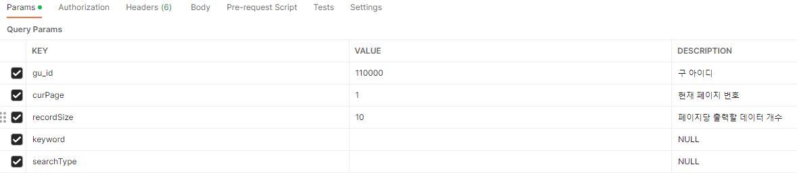

---
title: "[Spring Boot] 페이징(Paging) 기능 구현"
excerpt: "페이징 기능을 구현해보자."

categories:
  - Spring
tags:
  - [Spring Boot]

permalink: /spring/springboot-paging/

toc: true
toc_sticky: true

date: 2023-02-13
last_modified_at: 2023-02-13

--- 

현재 진행하고 있는 프로젝트에 페이징 시스템이 필요하여 구현하게 되었다.<br><br>

## **페이징(Paging)이란?**
<hr />

페이징은 데이터를 반환할 때, **전체 데이터 중의 일부를 반환**하는 방식이다.<br>

예를 들어, 쇼핑몰 사이트에 등록된 상품이 100,000개라고 가정하고 하나의 페이지에 100,000개의 데이터들을 전부 출력한다면 어떻게 될까?<br>

페이지의 로딩 속도가 느려질뿐더러, 사용자가 필요하는 데이터가 50,000번째 데이터라면, 스크롤을 계속 내리면서 한참을 찾아야 하는 불편함을 겪게 될 것이다.<br>

이러한 문제점을 페이징 기능과 검색 기능을 구현하여 아래 사진처럼 **페이지 번호로 나누어 데이터를 제공**함으로써 해결할 수 있다.<br>

<br><br>

## **구현**
<hr />

### **SearchRequestDTO Class**

``` java
@Getter
@A
public class SearchRequestDTO {
    private int page;           // 현재 페이지 번호
    private int recordSize;     // 페이지당 출력할 데이터 개수
    private String keyword;     // 검색 키워드
    private String searchType;  // 검색 유형

    public int getOffset() {    // MySQL에서 LIMIT 구문의 시작 부분에 사용되는 메서드
        return (page - 1) * recordSize;
    }
}
```

상품, 매장, 리뷰 등과 같은 데이터들을 요청할 때 필요한 정보들을 가진 **RequestDTO Class**<br>

페이징과 검색은 다음 파라미터들을 필요로 한다.<br>

**page** : 현재 페이지 번호<br>

**recordSize** : 페이지당 출력할 데이터 개수<br>

**pageSize** : 화면 하단에 출력할 페이지의 개수
* ex) 1~5, 1~10 등

**keyword** : 검색 키워드<br>

**searchType** : 검색 유형
* ex) 전체, 제목, 작성자 등

<br>

### **Page Class**

``` java
@Getter
@Setter
public class Page {
    private int totalDataCnt;   // 전체 데이터 개수
    private int pageSize;       // 화면 하단에 출력할 페이지 사이즈

    private int curPage;
    private int startPage;      // 화면의 시작 번호
    private int endPage;        // 화면의 끝 번호
    private boolean canPrev;    // 페이징 이전 버튼 활성화 여부
    private boolean canNext;    // 페이징 다음 버튼 활성화 여부

    private SearchRequestDTO searchRequestDTO;

    public Page(SearchRequestDTO searchRequestDTO, int totalDataCnt){
        pageSize = 10;

        this.searchRequestDTO = searchRequestDTO;

        this.curPage = searchRequestDTO.getCurPage();
        this.totalDataCnt = totalDataCnt;

        SetPageData();
    }

    private void SetPageData(){
        endPage = (int)(Math.ceil(curPage / (double)pageSize) * pageSize);
        // (현재 페이지 번호 / 화면에 보여질 페이지 번호의 개수) * 화면에 보여질 페이지 번호의 개수
        startPage = (endPage - pageSize) + 1;
        // (마지막 페이지 - 화면에 보여질 페이지 번호의 개수) + 1

        int tempEndPage = (int)(Math.ceil(totalDataCnt / (double)searchRequestDTO.getRecordSize()));
        // (전체 데이터 개수 / 한 페이지당 보여줄 데이터의 개수) -> 마지막 페이지 번호를 알 수 있다.

        if(endPage > tempEndPage){
            // 마지막 페이지 번호 = 총 데이터 수 / 한 페이지당 보여줄 데이터의 개수
            endPage = tempEndPage;
        }

        canPrev = startPage == 1 ? false : true;

        canNext = endPage * searchRequestDTO.getRecordSize() >= tempEndPage ? false : true;
    }

    public PageResponseDTO toResponse(){
        return PageResponseDTO.builder()
                .startPage(startPage)
                .endPage(endPage)
                .canPrev(canPrev)
                .canNext(canNext)
                .build();
    }
}
```

생성자를 통해 매개변수로 `searchRequestDTO`를 받아 페이지 시작 번호, 페이지 끝 번호, 페이징 이전, 다음 버튼 활성화 여부를 설정하는 클래스<br>

`toResponse()`를 통해 반환에 필요한 정보들로만 구성된 **PageResponseDTO**를 생성한다.<br><br>

### **PageResponseDTO Class**

``` java
@Getter
@AllArgsConstructor
@Builder
public class PageResponseDTO {
    private int startPage;      // 화면의 시작 번호
    private int endPage;        // 화면의 끝 번호
    private boolean canPrev;       // 페이징 이전 버튼 활성화 여부
    private boolean canNext;       // 페이징 다음 버튼 활성화 여부
}
```

반환할 Page의 정보들로만 필드가 구성된 **Response DTO**<br><br>

## **결과**
<hr />
<br>
<br>

<hr />  
참고자료<br>
<a href="https://yulfsong.tistory.com/59">https://yulfsong.tistory.com/59</a><br>

